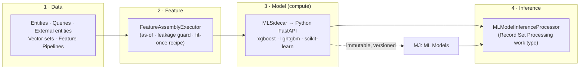

# Predictive Studio

> **Train predictive models on a client's own data — and score records with them — entirely inside MemberJunction.** Member retention/renewal, lapse and lead scoring, and any other tabular yes/no-or-number question, answered by a model trained on *their* data.

Predictive Studio is **core MJ, not an OpenApp**. It is composed onto existing MJ substrates (entities/`RunView`, Record Set Processing, Remote Operations, Agents, vectors) plus a self-managing Python ML sidecar — rather than re-implementing batching, audit, training, or inference. This folder is the three npm packages that make that work.

**Start here, then read the [Predictive Studio Guide](../../../guides/PREDICTIVE_STUDIO_GUIDE.md)** for the full architecture, the data model (`MJ: ML Models` / `Experiments` / …), the dashboard, and end-to-end walkthroughs. The design record is [`plans/predictive-studio.md`](../../../plans/predictive-studio.md).

## The four-layer architecture

Predictive Studio is one pipeline split across four layers. The first three live in TypeScript (this folder); the model-compute layer is a bundled Python service.



| Layer | What happens | Lives in |
|---|---|---|
| **1 · Data** | Pull the training/scoring rows from MJ's existing substrates | `@memberjunction/predictive-studio` (`feature-assembly/data-access`) |
| **2 · Feature** | Assemble the raw matrix **identically** for train / materialize / on-demand; enforce point-in-time (`as-of`) and leakage deny-lists; emit a fit-once preprocessing recipe | `@memberjunction/predictive-studio` (`feature-assembly`) |
| **3 · Model** | The CPU-bound **fit** (`/train`) and **inference** (`/predict`) — Node orchestrates, Python computes | `@memberjunction/predictive-studio-sidecar` (+ bundled Python) |
| **4 · Inference** | Batch + single-record scoring as a Record Set Processing work type, ephemeral or write-back | `@memberjunction/predictive-studio` (`scoring`) |

The cardinal correctness rule runs through all four: **one feature-assembly code path, used identically everywhere**, plus **fit-once / apply-everywhere** preprocessing — so there is no train/serve skew by construction.

## The three packages

| Package | What it is | Read |
|---|---|---|
| **[`@memberjunction/predictive-studio-core`](./Core/README.md)** | The shared **type contracts** — the sidecar `/train`+`/predict` shapes, the declarative pipeline spec, the visual FeatureStep DAG, the Model Development Agent's `ModelingPlanSpec`, plus the zod runtime validators and the metric-direction helper. Defined once; imported by everything; importing (almost) nothing. | [Core/README.md](./Core/README.md) |
| **[`@memberjunction/predictive-studio-sidecar`](./Sidecar/README.md)** | A self-managing TypeScript wrapper (`MLSidecar`) around a **bundled** Python FastAPI ML service. `new MLSidecar(); await s.start()` and you have a live training/inference service — **no Docker required** (managed child-process spawn on an ephemeral port; remote-URL mode for scaled deployments). | [Sidecar/README.md](./Sidecar/README.md) |
| **[`@memberjunction/predictive-studio`](./Engine/README.md)** | The **server-side engine** — `FeatureAssemblyExecutor`, `TrainingEngine`, `MLModelInferenceProcessor`, `ExperimentOrchestrator`, plus feature-pipeline discovery, maintenance, and the **Actions + Remote Operations** invocation surfaces. | [Engine/README.md](./Engine/README.md) |

### Dependency direction

```
predictive-studio-core   (types — no runtime deps except zod)
        │ imported by
        ├── predictive-studio-sidecar   → MLSidecar + bundled Python service
        └── predictive-studio (Engine)  → the four engines + Actions + Remote Operations
                    │ which also depends on
                    └── predictive-studio-sidecar (MLSidecar)
```

Per root `CLAUDE.md` rule 5, types are imported **directly from `-core`** — never re-exported through `-sidecar` or the Engine.

## Getting started (local, Docker-free)

```bash
# 1. Build the packages (from repo root or each package dir)
cd packages/AI/PredictiveStudio/Core    && npm run build
cd ../Sidecar                            && npm run build
cd ../Engine                             && npm run build

# 2. Create the bundled Python environment for the sidecar (one time)
cd ../Sidecar && npm run setup:python    # creates .venv, pip-installs pinned requirements

# macOS only: xgboost/lightgbm need an OpenMP runtime
brew install libomp                      # MLSidecar injects DYLD_LIBRARY_PATH at spawn time
```

Then train + score in TypeScript:

```typescript
import { MLSidecar } from '@memberjunction/predictive-studio-sidecar';

const sidecar = new MLSidecar();   // managed mode — spawns the bundled Python service
await sidecar.start();
const trained = await sidecar.train(/* TrainRequest from @memberjunction/predictive-studio-core */);
const { predictions } = await sidecar.predict(/* PredictRequest */);
await sidecar.stop();
```

For the full path — pipeline → `TrainingEngine` → immutable `MJ: ML Models` row → `MLModelInferenceProcessor` scoring, plus the experiment search and the Studio dashboard — see the [Engine README](./Engine/README.md) and the [guide](../../../guides/PREDICTIVE_STUDIO_GUIDE.md).

## Tests

| Package | Command | Covers |
|---|---|---|
| Core / Sidecar / Engine | `npm run test` (per package) | Vitest unit tests — all seams mocked, no DB, no live process |
| Sidecar (Python) | `npm run test:python` (after `setup:python`) | pytest — per-algorithm train/predict + the anti-skew preprocessing golden tests |
| Engine (live) | `npm run test:integration` with `PS_INTEGRATION=1` | End-to-end against the **real** managed Python sidecar; skips gracefully if the venv is missing |

## Where to go next

- **Architecture, data model, dashboard, walkthroughs** → [Predictive Studio Guide](../../../guides/PREDICTIVE_STUDIO_GUIDE.md)
- **Type contracts** → [Core/README.md](./Core/README.md)
- **The Python sidecar + managed/remote modes** → [Sidecar/README.md](./Sidecar/README.md)
- **The engines + Actions/Remote Operations** → [Engine/README.md](./Engine/README.md)
- **Design record** → [`plans/predictive-studio.md`](../../../plans/predictive-studio.md)
