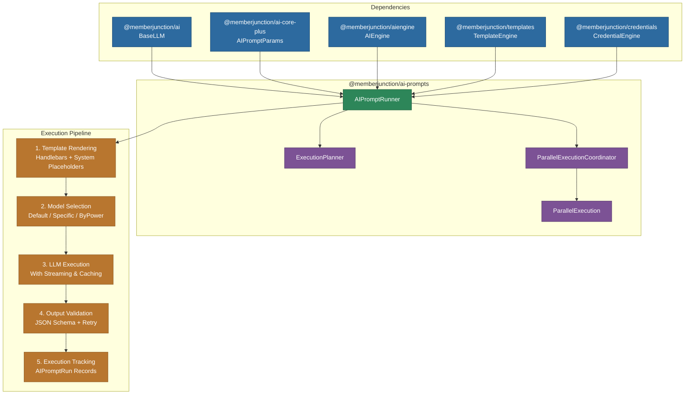

# @memberjunction/ai-prompts

Advanced AI prompt execution engine for MemberJunction. Provides hierarchical template composition, intelligent model selection with failover, parallel execution with judge-based result selection, structured output validation with retry, comprehensive execution tracking, and streaming support. This is the primary interface for executing AI prompts in the MemberJunction framework.

## Architecture



## Installation

```bash
npm install @memberjunction/ai-prompts
```

## Key Features

### Hierarchical Template Composition

Build complex prompts from reusable sub-templates with unlimited nesting depth:

```typescript
import { AIPromptRunner } from '@memberjunction/ai-prompts';
import { AIPromptParams, ChildPromptParam } from '@memberjunction/ai-core-plus';

const runner = new AIPromptRunner();

// Parent template uses {{ analysis }} and {{ summary }} placeholders
const params = new AIPromptParams();
params.prompt = parentPrompt;
params.childPrompts = [
    new ChildPromptParam(analysisParams, 'analysis'),
    new ChildPromptParam(summaryParams, 'summary')
];
params.data = { userInput: 'complex data to process' };

const result = await runner.ExecutePrompt(params);
```

Execution order:
1. Child prompts render depth-first (children before parents)
2. Sibling prompts at each level execute in parallel
3. Child results replace placeholders in parent template
4. Final composed prompt executes as a single LLM call

### Model Selection Strategies

Three strategies for selecting which AI model executes a prompt:

| Strategy | Description |
|---|---|
| `Default` | Uses the AI configuration to determine the model based on priority and availability |
| `Specific` | Uses explicitly associated models from the AIPromptModels table |
| `ByPower` | Selects the highest PowerRank model matching the prompt's model type |

Model selection precedence (highest to lowest):
1. `AIPromptParams.override` -- Runtime model/vendor override
2. `AIPromptParams.modelSelectionPrompt` -- Alternate prompt for model config
3. Prompt's own model configuration (strategy + associations)

### Parallel Execution with Judging

Execute prompts across multiple models simultaneously and select the best result:

- Configurable execution groups with different models
- AI judge prompt evaluates and ranks results
- Automatic selection of best result based on judge scoring
- Full tracking of all parallel results

### Output Validation and Retry

Automatic validation of AI outputs with configurable retry:

- JSON schema validation against `OutputExample` definitions
- Automatic JSON repair via JSON5 parsing and LLM-based repair
- Configurable retry count with the original or repaired prompts
- Validation syntax cleaning (removes `?`, `*`, `:type` markers from JSON keys)
- Detailed validation attempt tracking

### Streaming Support

Real-time streaming of LLM responses:

```typescript
const params = new AIPromptParams();
params.prompt = myPrompt;
params.onStreaming = (chunk) => {
    process.stdout.write(chunk.content);
};

const result = await runner.ExecutePrompt(params);
```

### Execution Tracking

Every prompt execution creates an `AIPromptRun` record with:
- Model and vendor used
- Template rendering results
- Token usage (prompt + completion)
- Cost tracking
- Execution time
- Parent/child relationships for hierarchical prompts
- Agent run linkage via `agentRunId`

### Credential Resolution

Hierarchical credential resolution for API keys:

1. `AIPromptParams.credentialId` (per-request override)
2. `AIPromptModel.CredentialID` (prompt-model specific)
3. `AIModelVendor.CredentialID` (model-vendor specific)
4. `AIVendor.CredentialID` (vendor default)
5. `AIPromptParams.apiKeys[]` (legacy runtime keys)
6. `AI_VENDOR_API_KEY__<DRIVER>` environment variables (legacy)

### Failover

When a model fails due to rate limiting, authentication errors, or other transient issues, the runner can automatically retry with alternate models from the selection candidates.

## Usage

### Basic Prompt Execution

```typescript
import { AIPromptRunner } from '@memberjunction/ai-prompts';
import { AIPromptParams } from '@memberjunction/ai-core-plus';
import { AIEngine } from '@memberjunction/aiengine';

// Get prompt from metadata
await AIEngine.Instance.Config(false, contextUser);
const prompt = AIEngine.Instance.Prompts.find(p => p.Name === 'Summarize Content');

const runner = new AIPromptRunner();
const params = new AIPromptParams();
params.prompt = prompt;
params.data = { content: documentText, maxLength: 500 };
params.contextUser = contextUser;

const result = await runner.ExecutePrompt(params);

if (result.success) {
    console.log(result.result);             // Parsed/validated result
    console.log(result.promptTokens);       // Input tokens used
    console.log(result.completionTokens);   // Output tokens generated
    console.log(result.executionTimeMS);    // Execution duration
}
```

### With Progress Tracking

```typescript
params.onProgress = (progress) => {
    console.log(`[${progress.step}] ${progress.percentage}% - ${progress.message}`);
};
```

### With Effort Level

```typescript
params.effortLevel = 85; // High effort for thorough analysis (1-100 scale)
```

### With Runtime Model Override

```typescript
params.override = {
    modelId: 'specific-model-id',
    vendorId: 'specific-vendor-id'
};
```

## Dependencies

- `@memberjunction/ai` -- Core AI abstractions (BaseLLM, ChatParams)
- `@memberjunction/ai-core-plus` -- AIPromptParams, AIPromptRunResult, extended entities
- `@memberjunction/ai-engine-base` -- AIEngineBase metadata cache
- `@memberjunction/aiengine` -- AIEngine server-side operations
- `@memberjunction/core` -- MJ framework core
- `@memberjunction/core-entities` -- Generated entity classes
- `@memberjunction/credentials` -- Credential resolution
- `@memberjunction/templates` -- Template rendering engine
- `@memberjunction/templates-base-types` -- Template base types
- `json5` -- Lenient JSON parsing for repair
