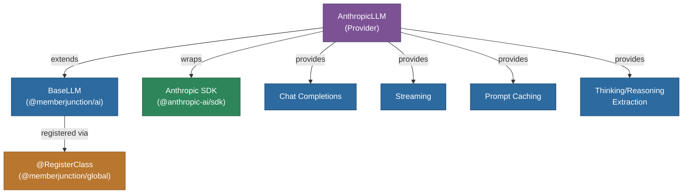

# @memberjunction/ai-anthropic

MemberJunction AI provider for Anthropic's Claude models. This package implements the `BaseLLM` interface from `@memberjunction/ai`, enabling integration with Claude 3 and later model families including Opus, Sonnet, and Haiku variants.

## Architecture



## Features

- **Chat Completions**: Full support for Anthropic's Messages API
- **Streaming**: Real-time response streaming with thinking block extraction
- **Prompt Caching**: Automatic ephemeral cache control on content blocks for reduced latency and cost
- **Multimodal Input**: Support for text, images (base64 and URL), and content block arrays
- **Thinking/Reasoning Models**: Extraction of thinking content from Claude's extended thinking responses
- **Error Analysis**: Integrated error analysis via `ErrorAnalyzer`

## Installation

```bash
npm install @memberjunction/ai-anthropic
```

## Usage

```typescript
import { AnthropicLLM } from '@memberjunction/ai-anthropic';

const llm = new AnthropicLLM('your-anthropic-api-key');

// Non-streaming chat
const result = await llm.ChatCompletion({
    model: 'claude-sonnet-4-20250514',
    messages: [
        { role: 'user', content: 'Explain quantum computing in simple terms.' }
    ],
    temperature: 0.7,
    maxOutputTokens: 1024
});

console.log(result.data.choices[0].message.content);
```

### Streaming

```typescript
const result = await llm.ChatCompletion({
    model: 'claude-sonnet-4-20250514',
    messages: [{ role: 'user', content: 'Write a short story.' }],
    streaming: true,
    streamingCallbacks: {
        OnContent: (content) => process.stdout.write(content),
        OnComplete: (result) => console.log('\nDone!')
    }
});
```

## Supported Parameters

| Parameter | Supported | Notes |
|-----------|-----------|-------|
| temperature | Yes | Controls randomness |
| maxOutputTokens | Yes | Maximum response length |
| topP | Yes | Nucleus sampling |
| topK | Yes | Top-K sampling |
| stopSequences | Yes | Custom stop sequences |
| responseFormat | Yes | JSON mode supported |
| streaming | Yes | Real-time streaming |
| effortLevel | Yes | Maps to thinking budget |

## Class Registration

Registered as `AnthropicLLM` via `@RegisterClass(BaseLLM, 'AnthropicLLM')` for use with MemberJunction's class factory system.

## Dependencies

- `@memberjunction/ai` - Core AI abstractions
- `@memberjunction/global` - Class registration
- `@anthropic-ai/sdk` - Official Anthropic SDK
