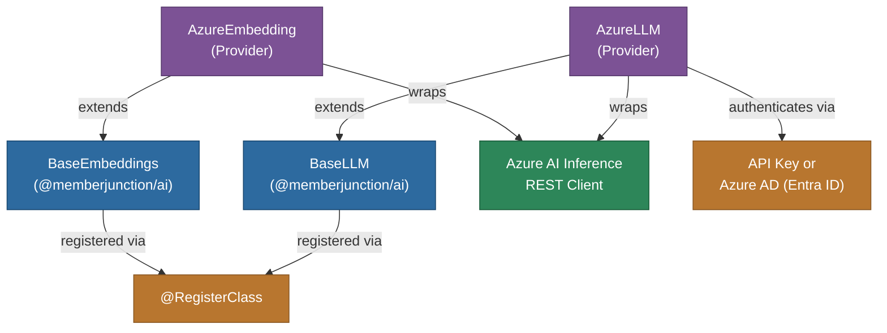

# @memberjunction/ai-azure

MemberJunction AI provider for Azure OpenAI Service. This package provides both LLM and embedding capabilities through Azure's enterprise-grade deployment of OpenAI models, implementing `BaseLLM` and `BaseEmbeddings` from `@memberjunction/ai`.

## Architecture



## Features

- **Chat Completions**: Full support for Azure-hosted language models including GPT-4, GPT-3.5-Turbo, and Phi-4
- **Streaming Support**: Real-time streaming responses for enhanced user experience
- **Text Embeddings**: Generate vector embeddings for semantic search and similarity matching
- **Dual Authentication**: Support for both API key and Azure Active Directory (Entra ID) authentication
- **Text Processing**: Built-in text summarization and classification capabilities
- **Type Safety**: Full TypeScript support with comprehensive type definitions
- **Factory Pattern**: Seamless integration with MemberJunction's AI factory system

## Installation

```bash
npm install @memberjunction/ai-azure
```

## Configuration

### Prerequisites

1. An Azure subscription with Azure AI or Azure OpenAI service deployed
2. Either an API key for your Azure AI resource or Azure AD credentials
3. The endpoint URL for your Azure AI resource

### Authentication Methods

#### API Key Authentication
```typescript
import { AzureLLM } from '@memberjunction/ai-azure';

const azureLLM = new AzureLLM('your-api-key');

azureLLM.SetAdditionalSettings({
    endpoint: 'https://your-resource.openai.azure.com/'
});
```

#### Azure AD Authentication
```typescript
const azureLLM = new AzureLLM('');

azureLLM.SetAdditionalSettings({
    endpoint: 'https://your-resource.openai.azure.com/',
    useAzureAD: true
});
```

## Usage

### Chat Completion

```typescript
const result = await azureLLM.ChatCompletion({
    model: 'gpt-4',
    messages: [
        { role: 'system', content: 'You are a helpful assistant.' },
        { role: 'user', content: 'Explain the theory of relativity.' }
    ],
    maxOutputTokens: 500,
    temperature: 0.7
});

if (result.success) {
    console.log(result.data.choices[0].message.content);
}
```

### Streaming

```typescript
const result = await azureLLM.ChatCompletion({
    model: 'gpt-4',
    messages: [{ role: 'user', content: 'Write a detailed story.' }],
    streaming: true,
    streamingCallbacks: {
        OnContent: (content) => process.stdout.write(content),
        OnComplete: (result) => console.log('\nDone!')
    }
});
```

### Embeddings

```typescript
import { AzureEmbedding } from '@memberjunction/ai-azure';

const embedder = new AzureEmbedding('your-api-key');
embedder.SetAdditionalSettings({
    endpoint: 'https://your-resource.openai.azure.com/'
});

const result = await embedder.EmbedText({
    model: 'text-embedding-ada-002',
    text: 'Sample text for embedding'
});

console.log(`Dimensions: ${result.vector.length}`);
```

## Configuration Options

| Setting | Type | Required | Description |
|---------|------|----------|-------------|
| `endpoint` | `string` | Yes | Azure AI resource endpoint URL |
| `useAzureAD` | `boolean` | No | Use Azure AD authentication instead of API key |

## Supported Parameters

| Parameter | Supported | Notes |
|-----------|-----------|-------|
| temperature | Yes | 0.0 - 2.0 |
| maxOutputTokens | Yes | Maximum tokens to generate |
| topP | Yes | Nucleus sampling (0.0 - 1.0) |
| frequencyPenalty | Yes | -2.0 to 2.0 |
| presencePenalty | Yes | -2.0 to 2.0 |
| seed | Yes | Deterministic outputs |
| stopSequences | Yes | Stop generation sequences |
| responseFormat | Yes | Text, JSON, Markdown |
| streaming | Yes | Real-time streaming |
| topK | No | Not available in Azure OpenAI |
| minP | No | Not available in Azure OpenAI |

## Class Registration

- `AzureLLM` -- Registered via `@RegisterClass(BaseLLM, 'AzureLLM')`
- `AzureEmbedding` -- Registered via `@RegisterClass(BaseEmbeddings, 'AzureEmbedding')`

## Dependencies

- `@memberjunction/ai` - Core AI abstractions
- `@memberjunction/global` - Class registration
- `@azure-rest/ai-inference` - Azure AI inference REST client
- `@azure/core-auth` - Azure authentication core
- `@azure/identity` - Azure identity and credential management
