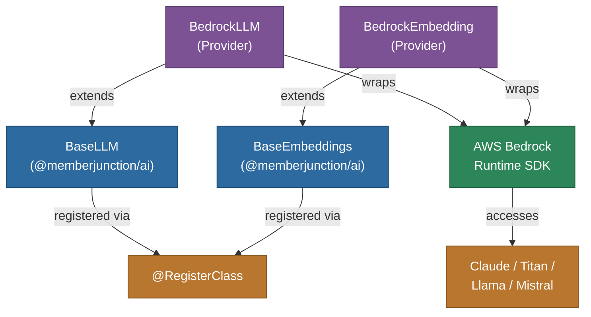

# @memberjunction/ai-bedrock

MemberJunction AI provider for Amazon Bedrock. This package provides both LLM and embedding capabilities through AWS Bedrock's multi-model platform, supporting Claude, Titan, Llama, and other model families available on Bedrock.

## Architecture



## Features

- **Multi-Model Access**: Use Claude, Titan, Llama, Mistral, and other models via a single provider
- **Chat Completions**: Conversational AI through Bedrock's unified API
- **Embeddings**: Text embeddings via Amazon Titan and other embedding models
- **Streaming**: Real-time response streaming support
- **AWS Integration**: Native AWS authentication (IAM roles, access keys, SSO)
- **Private Deployments**: Support for custom and fine-tuned models on Bedrock

## Installation

```bash
npm install @memberjunction/ai-bedrock
```

## Usage

### Chat Completion

```typescript
import { BedrockLLM } from '@memberjunction/ai-bedrock';

const llm = new BedrockLLM('aws-credentials-json');

const result = await llm.ChatCompletion({
    model: 'anthropic.claude-v2',
    messages: [
        { role: 'user', content: 'Explain machine learning.' }
    ]
});
```

### Embeddings

```typescript
import { BedrockEmbedding } from '@memberjunction/ai-bedrock';

const embeddings = new BedrockEmbedding('aws-credentials-json');

const result = await embeddings.EmbedText({
    text: 'Text to embed',
    model: 'amazon.titan-embed-text-v1'
});
```

## Configuration

AWS credentials are passed as a JSON string containing:

| Field | Description |
|-------|-------------|
| `region` | AWS region (e.g., `us-east-1`) |
| `accessKeyId` | AWS access key ID |
| `secretAccessKey` | AWS secret access key |
| `sessionToken` | Optional session token for temporary credentials |

## Class Registration

- `BedrockLLM` -- Registered via `@RegisterClass(BaseLLM, 'BedrockLLM')`
- `BedrockEmbedding` -- Registered via `@RegisterClass(BaseEmbeddings, 'BedrockEmbedding')`

## Dependencies

- `@memberjunction/ai` - Core AI abstractions
- `@memberjunction/global` - Class registration
- `@aws-sdk/client-bedrock-runtime` - AWS Bedrock Runtime SDK
