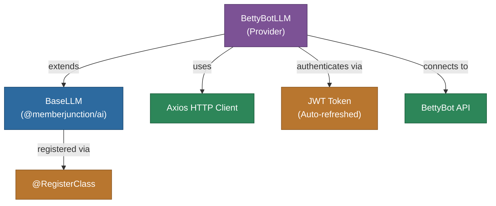

# @memberjunction/ai-betty-bot

MemberJunction AI provider for the BettyBot conversational AI platform. This package implements the `BaseLLM` interface to integrate with BettyBot's customer-service-focused API, providing JWT-authenticated chat completions.

## Architecture



## Features

- **Chat Completions**: Integration with BettyBot's conversational response API
- **JWT Authentication**: Automatic token management with refresh capability
- **Settings Retrieval**: Query BettyBot configuration and settings
- **Customer Service Focus**: Designed for customer-facing conversational scenarios

## Installation

```bash
npm install @memberjunction/ai-betty-bot
```

## Usage

```typescript
import { BettyBotLLM } from '@memberjunction/ai-betty-bot';

const llm = new BettyBotLLM('your-bettybot-api-key');

const result = await llm.ChatCompletion({
    model: 'default',
    messages: [
        { role: 'user', content: 'How can I reset my password?' }
    ]
});

if (result.success) {
    console.log(result.data.choices[0].message.content);
}
```

## Limitations

- Does not support streaming (`SupportsStreaming` returns `false`)
- `SummarizeText` and `ClassifyText` are not implemented

## Class Registration

Registered as `BettyBotLLM` via `@RegisterClass(BaseLLM, 'BettyBotLLM')`.

## Dependencies

- `@memberjunction/ai` - Core AI abstractions
- `@memberjunction/global` - Class registration
- `axios` - HTTP client for API communication
