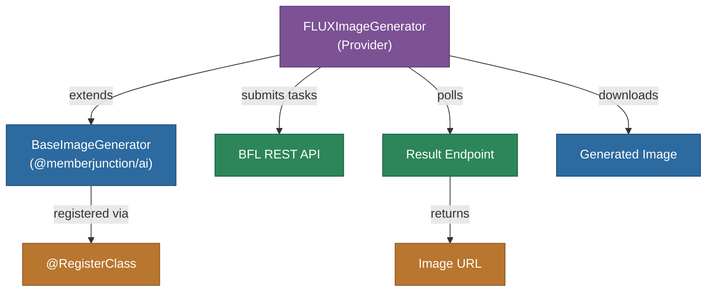
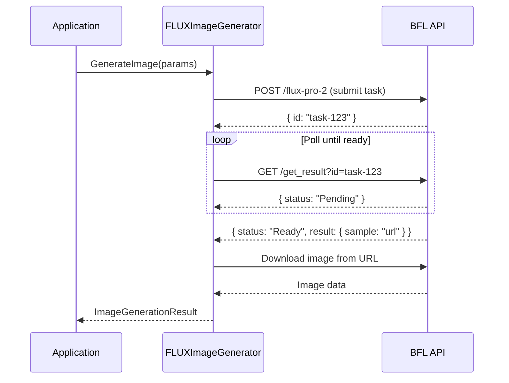

# @memberjunction/ai-blackforestlabs

MemberJunction AI provider for Black Forest Labs' FLUX image generation models. This package implements the `BaseImageGenerator` interface to provide text-to-image generation, image editing (inpainting/outpainting), and image variations through BFL's async task-based API.

## Architecture



## Async Task Flow



## Features

- **Text-to-Image Generation**: Generate photorealistic images using FLUX.2 Pro, FLUX 1.1 Pro, and other FLUX models
- **Image Editing**: Inpainting and outpainting via FLUX Fill model with mask support
- **Image Variations**: Create variations using FLUX Kontext Pro for image-to-image generation
- **Async Task Polling**: Configurable polling with adjustable interval and timeout
- **Multiple Models**: Support for FLUX.2 Pro (32B), FLUX 1.1 Pro, FLUX Dev, FLUX Schnell, and FLUX Ultra
- **Seed Reproducibility**: Deterministic generation with seed parameter support
- **Resolution Control**: Custom width/height and aspect ratio settings up to 4MP

## Installation

```bash
npm install @memberjunction/ai-blackforestlabs
```

## Usage

```typescript
import { FLUXImageGenerator } from '@memberjunction/ai-blackforestlabs';

const generator = new FLUXImageGenerator('your-bfl-api-key');

const result = await generator.GenerateImage({
    prompt: 'A serene mountain landscape at sunset',
    model: 'flux-2-pro',
    size: '1536x1024'
});

if (result.success) {
    const image = result.images[0];
    console.log('Image generated, base64 length:', image.base64.length);
}
```

### Configure Polling

```typescript
generator.setPollingConfig({
    maxWaitTime: 180000,  // 3 minutes
    pollInterval: 3000     // 3 seconds
});
```

## Supported Models

| Model | ID | Description |
|-------|-----|-------------|
| FLUX.2 Pro | `flux-2-pro` | 32B parameter, photorealistic 4MP images |
| FLUX 1.1 Pro | `flux-1.1-pro` | Production-ready, high-volume workloads |
| FLUX.1 Dev | `flux-dev` | Open-weights 12B for development |
| FLUX Schnell | `flux-schnell` | Fast generation |
| FLUX Ultra | `flux-ultra` | Ultra-high quality |

## Class Registration

Registered as `FLUXImageGenerator` via `@RegisterClass(BaseImageGenerator, 'FLUXImageGenerator')`.

## Dependencies

- `@memberjunction/ai` - Core AI abstractions (BaseImageGenerator, GeneratedImage)
- `@memberjunction/global` - Class registration
