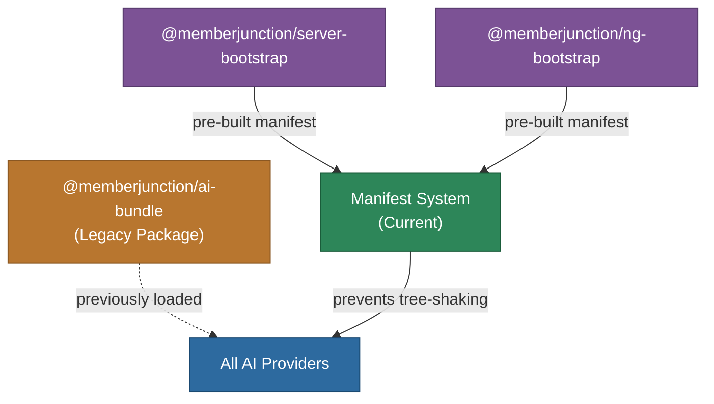

# @memberjunction/ai-provider-bundle

Legacy AI provider bundle package for MemberJunction. This package previously contained tree-shaking prevention functions for all standard MemberJunction AI providers.

## Status

This package is effectively a no-op. Tree-shaking prevention is now handled by the MemberJunction manifest system (see `CLASS_MANIFEST_GUIDE.md` in the CodeGenLib package).

The package is retained solely for backward compatibility with existing imports. No new functionality should be added here.

## Architecture

## Migration

If you are importing from this package, you can safely remove the import. The manifest system now handles class registration automatically via `@RegisterClass` decorators and the `CLASS_REGISTRATIONS` array generated by `mj codegen manifest`.

## Dependencies

None (no-op package).
