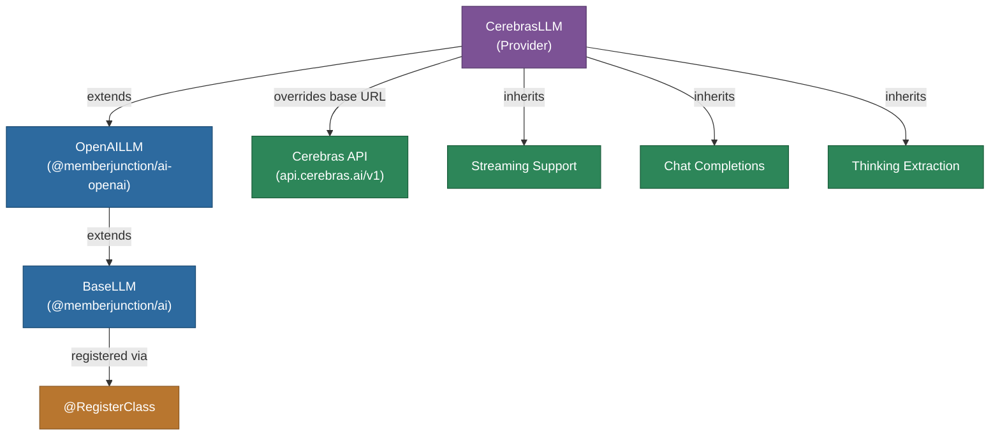

# @memberjunction/ai-cerebras

MemberJunction AI provider for Cerebras' ultra-fast inference platform. This package extends the OpenAI provider to work with Cerebras' OpenAI-compatible API, providing access to high-performance LLM inference with extremely low latency powered by Cerebras' wafer-scale engine.

## Architecture



## Features

- **Ultra-Fast Inference**: Leverages Cerebras' wafer-scale engine for extremely low latency
- **OpenAI Compatible**: Inherits all features from the OpenAI provider (chat, streaming, response formats)
- **Streaming**: Full streaming support inherited from OpenAI provider
- **Thinking/Reasoning**: Thinking block extraction support for reasoning models
- **Token Usage Tracking**: Track token consumption for monitoring

## Installation

```bash
npm install @memberjunction/ai-cerebras
```

## Usage

```typescript
import { CerebrasLLM } from '@memberjunction/ai-cerebras';

const llm = new CerebrasLLM('your-cerebras-api-key');

const result = await llm.ChatCompletion({
    model: 'llama3.1-70b',
    messages: [
        { role: 'system', content: 'You are a helpful assistant.' },
        { role: 'user', content: 'Explain the benefits of specialized AI hardware.' }
    ],
    temperature: 0.7,
    maxOutputTokens: 1000
});

if (result.success) {
    console.log(result.data.choices[0].message.content);
}
```

### Streaming

```typescript
const result = await llm.ChatCompletion({
    model: 'llama3.1-8b',
    messages: [{ role: 'user', content: 'Write a poem about AI.' }],
    streaming: true,
    streamingCallbacks: {
        OnContent: (content) => process.stdout.write(content),
        OnComplete: () => console.log('\nDone!')
    }
});
```

## How It Works

`CerebrasLLM` is a thin subclass of `OpenAILLM` that redirects API calls to Cerebras' endpoint at `https://api.cerebras.ai/v1`. All chat, streaming, and parameter handling logic is inherited from the OpenAI provider.

## Supported Parameters

All parameters supported by the OpenAI provider are available, including `temperature`, `maxOutputTokens`, `topP`, `frequencyPenalty`, `presencePenalty`, `seed`, `stopSequences`, and `responseFormat`.

## Class Registration

Registered as `CerebrasLLM` via `@RegisterClass(BaseLLM, 'CerebrasLLM')`.

## Dependencies

- `@memberjunction/ai` - Core AI abstractions
- `@memberjunction/ai-openai` - OpenAI provider (parent class)
- `@memberjunction/global` - Class registration
