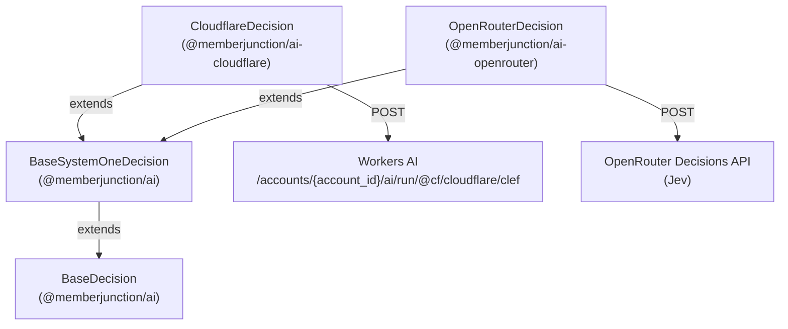

# @memberjunction/ai-cloudflare

MemberJunction AI provider for Cloudflare Workers AI. It ships one driver, `CloudflareDecision`, a `BaseDecision` driver for Cloudflare's open-weight Clef decision models:

| Model | Workers AI model | Size | Input price | Median latency (Cloudflare's figure) |
|---|---|---|---|---|
| `Clef` | `@cf/cloudflare/clef` | 27B | $0.24 per million tokens | 209 ms |
| `Clef-flash` | `@cf/cloudflare/clef-flash` | 9B | $0.09 per million tokens | 39 ms |

Output tokens are free. Both models answer Likelihood, Choice (2 to 255 options) and Score (2 to 10 levels) questions, up to 64 per call, about a state of up to 65,536 tokens, with a probability for every allowed option. Workers AI is the only cloud that serves them. The weights are on Hugging Face (`Cloudflare/clef`, `Cloudflare/clef-flash`, Apache-2.0).

## Architecture



Clef speaks the System One decisions format, the one TypeSafe's Jev speaks: `{ model, state, questions }` in, typed `noul` / `choice` / `score` answers out. `BaseSystemOneDecision` in `@memberjunction/ai` owns that mapping for both drivers. `CloudflareDecision` adds only the Workers AI parts:

- the URL, with the account ID in it;
- the API token as a bearer token;
- the body's `model` field, which is the short name (`clef` or `clef-flash`) taken from the model's `APIName`;
- unwrapping Cloudflare's v4 envelope (`{ result, success, errors, messages }`). A bare response is accepted too.

## Usage

Most callers reach Clef through `AIDecisionRunner` (`@memberjunction/ai-prompts`). The shipped `Default Decision` prompt does **not** bind Clef: it still asks Jev first, then `LLM Decision`. To ask Clef, name it in the call, or bind it in a prompt of your own.

**As a fallback.** Like every active `Decision` model, Clef (and Clef-flash) joins the power-matched fallback candidates of any Decision prompt that does not set `RequireSpecificModels`, ranked by closeness to the prompt's `PowerRank`, and only when its Cloudflare key resolves. For the shipped `Default Decision` that means after Jev and `LLM Decision`. `LLM Decision` needs no credential and `Default Decision` has no failover strategy, so in practice Clef is reached there only when `LLM Decision` is unavailable or failover is turned on.

Naming Clef in the call:

```typescript
import { AIEngine } from '@memberjunction/aiengine';
import { AIDecisionParams, AIDecisionRunner } from '@memberjunction/ai-prompts';

await AIEngine.Instance.Config(false, contextUser);
const clef = AIEngine.Instance.Models.find(m => m.Name === 'Clef');          // or 'Clef-flash'
const cloudflare = AIEngine.Instance.Vendors.find(v => v.Name === 'Cloudflare');

const params = new AIDecisionParams();
params.prompt = AIEngine.Instance.Prompts.find(p => p.Name === 'Default Decision');
params.contextUser = contextUser;
params.override = { modelId: clef.ID, vendorId: cloudflare.ID };
params.State = 'Checkout has been failing for every customer for the last hour.';
params.Questions = {
    urgent: { Kind: 'Likelihood', Instructions: 'Is this support request urgent?' },
};
const result = await new AIDecisionRunner().ExecuteDecision(params);
// result.Answers.urgent → { Kind: 'Likelihood', Probability: 0.9 }
```

Or call the driver directly:

```typescript
import { CloudflareDecision } from '@memberjunction/ai-cloudflare';

const clef = new CloudflareDecision('<accountId>:<apiToken>');
const result = await clef.Decide({
    Model: '@cf/cloudflare/clef',
    State: 'I was charged twice for March. Please refund the duplicate.',
    Questions: {
        refund: { Kind: 'Likelihood', Instructions: 'Is the customer asking for money back?' },
        team: {
            Kind: 'Choice',
            Instructions: 'Which team should handle this?',
            Options: [
                { Value: 'billing', Description: 'Payments, invoices and refunds' },
                { Value: 'technical', Description: 'Outages, errors and configuration' },
            ],
        },
    },
});
```

## Credentials

Workers AI needs two things: the Cloudflare **account ID**, which goes in the URL, and an **API token** with Workers AI permission. `AIDecisionRunner` hands a decision driver one string, so the account ID travels in one of two ways:

1. **In the key**, as `"<accountId>:<apiToken>"`. This is the simplest, and the only way to use two accounts in one process.
2. **In the environment**, as `CLOUDFLARE_ACCOUNT_ID`, with the key holding the token alone.

A key that names an account wins over the variable. If neither gives an account ID, the call fails without a request, with a `NoCredentials` error that names both options. It allows failover, so a misconfigured Clef does not stop the runner from trying the next decision model.

The key resolves like any model's: an AI Credential Binding (on the prompt-model, model-vendor or vendor row, or a default credential of the `Cloudflare` vendor's `API Key` type), or else the legacy environment variable, which is keyed by driver class. A bound credential reaches the driver as its values in JSON (`{"apiKey":"…"}`); the driver reads its `apiKey` the same way, so `"<accountId>:<apiToken>"` works there too. A credential that also has an `accountId` field wins over both, and an `endpoint` field sets the base URL (see AI Gateway below).

```bash
AI_VENDOR_API_KEY__CLOUDFLAREDECISION=0123456789abcdef0123456789abcdef:your-api-token
# or
AI_VENDOR_API_KEY__CLOUDFLAREDECISION=your-api-token
CLOUDFLARE_ACCOUNT_ID=0123456789abcdef0123456789abcdef
```

## AI Gateway

To send the calls through a Cloudflare AI Gateway, set `CLOUDFLARE_WORKERS_AI_BASE_URL` (or pass a base URL as the constructor's second argument) to the URL the model is appended to:

```bash
CLOUDFLARE_WORKERS_AI_BASE_URL=https://gateway.ai.cloudflare.com/v1/{account_id}/my-gateway/workers-ai
```

A credential's `endpoint` does the same. The constructor wins, then the credential, then the variable. `{account_id}` is replaced with the account ID. A base URL without the placeholder needs no account ID.

## Errors and failover

- A `429` or a `5xx` is thrown with its HTTP status, so `AIDecisionRunner` fails over to the next decision model. The message names Cloudflare's `errors[].message`.
- A missing token or account ID fails before any request with a `NoCredentials` error that allows failover.
- A `401` is an `Authentication` error. `ErrorAnalyzer` rates it fatal, which stops the failover loop.
- A `200` whose envelope says `success: false` fails with the envelope's messages.
- A response that cannot be mapped (a missing answer, a choice that is not an option, probabilities that sum to 0) fails with a `ModelError` that allows failover.

## Not supported yet

- **Images.** Workers AI accepts up to four images with the state (`images`, a Clef extension to the System One format). MJ's `DecisionParams` has no images, so the driver does not send them.
- **Self-hosted Clef.** The weights are open, but this driver speaks Workers AI's URL and envelope. A server with a `/v1/systemone` route is reached through `SystemOneDecision` in [`@memberjunction/ai-systemone`](../SystemOne/README.md); llama.cpp's Clef support is planned. Clef is not on OpenRouter yet.

## Class Registration

Registered as `CloudflareDecision` via `@RegisterClass(BaseDecision, 'CloudflareDecision')`. The `Clef` and `Clef-flash` model-vendor rows name it as their `DriverClass`.

## Dependencies

- `@memberjunction/ai` - Core AI abstractions, including `BaseSystemOneDecision`
- `@memberjunction/global` - Class registration
