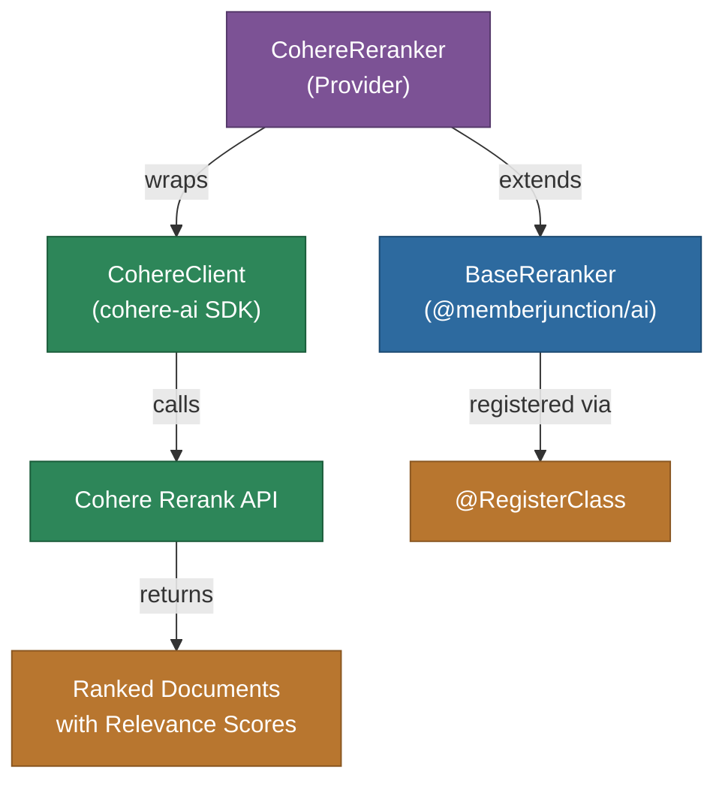

# @memberjunction/ai-cohere

MemberJunction AI provider for Cohere's reranking capabilities. This package implements the `BaseReranker` interface to provide semantic document reranking using Cohere's Rerank API, useful for improving search result relevance in RAG (Retrieval-Augmented Generation) pipelines.

## Architecture



## Features

- **Semantic Reranking**: Reorder documents by relevance to a query using neural models
- **Multiple Models**: Support for `rerank-v3.5` (English) and `rerank-multilingual-v3.0` (100+ languages)
- **Relevance Scoring**: Documents scored 0-1 with fine-grained relevance ranking
- **RAG Pipeline Integration**: Designed for use in retrieval-augmented generation workflows
- **Context-Aware**: Enhanced query processing for better relevance evaluation

## Installation

```bash
npm install @memberjunction/ai-cohere
```

## Usage

```typescript
import { CohereReranker } from '@memberjunction/ai-cohere';

const reranker = new CohereReranker('your-cohere-api-key', 'rerank-v3.5');

const results = await reranker.Rerank({
    query: 'What is the capital of France?',
    documents: [
        { id: '1', text: 'Paris is the capital of France.' },
        { id: '2', text: 'London is the capital of England.' },
        { id: '3', text: 'France is a country in Europe.' }
    ],
    topK: 5
});

// Results sorted by relevance score (0-1)
for (const result of results) {
    console.log(`${result.documentId}: ${result.relevanceScore}`);
}
```

## Supported Models

| Model | Description |
|-------|-------------|
| `rerank-v3.5` | Latest English reranker with best accuracy (default) |
| `rerank-multilingual-v3.0` | Supports 100+ languages |

## Class Registration

Registered as `CohereLLM` via `@RegisterClass(BaseReranker, 'CohereLLM')`.

## Dependencies

- `@memberjunction/ai` - Core AI abstractions (BaseReranker)
- `@memberjunction/global` - Class registration
- `cohere-ai` - Official Cohere SDK
