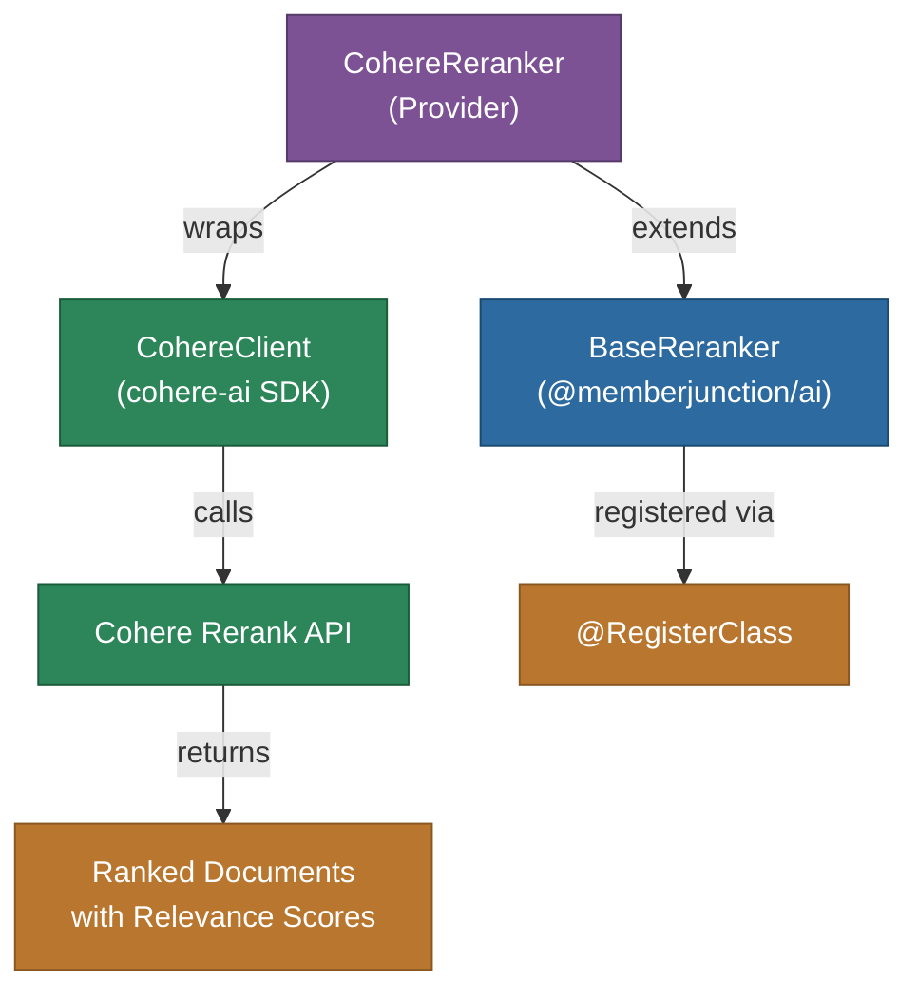

# @memberjunction/ai-cohere

MemberJunction AI provider for Cohere. It implements `BaseReranker` for semantic document reranking (Cohere Rerank API) and `BaseEmbeddings` for text and multimodal embeddings (Cohere Embed v4), useful for improving relevance and powering retrieval in RAG (Retrieval-Augmented Generation) pipelines.

## Architecture


```mermaid
graph TD
    A["CohereReranker<br/>(Provider)"] -->|extends| B["BaseReranker<br/>(@memberjunction/ai)"]
    A -->|wraps| C["CohereClient<br/>(cohere-ai SDK)"]
    C -->|calls| D["Cohere Rerank API"]
    D -->|returns| E["Ranked Documents<br/>with Relevance Scores"]
    B -->|registered via| F["@RegisterClass"]

    style A fill:#7c5295,stroke:#563a6b,color:#fff
    style B fill:#2d6a9f,stroke:#1a4971,color:#fff
    style C fill:#2d8659,stroke:#1a5c3a,color:#fff
    style D fill:#2d8659,stroke:#1a5c3a,color:#fff
    style E fill:#b8762f,stroke:#8a5722,color:#fff
    style F fill:#b8762f,stroke:#8a5722,color:#fff
```

## Features

- **Semantic Reranking**: Reorder documents by relevance to a query using neural models
- **Multiple Models**: Support for `rerank-v3.5` (English) and `rerank-multilingual-v3.0` (100+ languages)
- **Relevance Scoring**: Documents scored 0-1 with fine-grained relevance ranking
- **RAG Pipeline Integration**: Designed for use in retrieval-augmented generation workflows
- **Context-Aware**: Enhanced query processing for better relevance evaluation

### Embeddings (CohereEmbedding)
- **Multimodal Embeddings**: Embed text and images into a shared vector space (Cohere Embed v4)
- **Text and Batch**: Single and batch text embedding (1536-dim default)
- **Configurable Input Type**: Optimize embeddings for document storage or query retrieval

## Installation

```bash
npm install @memberjunction/ai-cohere
```

## Usage

```typescript
import { CohereReranker } from '@memberjunction/ai-cohere';

const reranker = new CohereReranker('your-cohere-api-key', 'rerank-v3.5');

const results = await reranker.Rerank({
    query: 'What is the capital of France?',
    documents: [
        { id: '1', text: 'Paris is the capital of France.' },
        { id: '2', text: 'London is the capital of England.' },
        { id: '3', text: 'France is a country in Europe.' }
    ],
    topK: 5
});

// Results sorted by relevance score (0-1)
for (const result of results) {
    console.log(`${result.documentId}: ${result.relevanceScore}`);
}
```

### Embeddings

```typescript
import { CohereEmbedding } from '@memberjunction/ai-cohere';

const embedding = new CohereEmbedding('your-cohere-api-key');

// Text (1536-dim vector)
const text = await embedding.EmbedText({ text: 'a golden retriever in the snow' });

// Multimodal: text + image fused into ONE vector
const multimodal = await embedding.EmbedContent({
    content: [
        { type: 'text', content: 'product photo:' },
        { type: 'image_url', content: '<base64-image>', mimeType: 'image/png' },
    ],
});
console.log(multimodal.vector.length); // 1536
```

## Supported Models

| Model | Description |
|-------|-------------|
| `rerank-v3.5` | Latest English reranker with best accuracy (default) |
| `rerank-multilingual-v3.0` | Supports 100+ languages |

## Class Registration

- `CohereReranker` -- Registered as `CohereLLM` via `@RegisterClass(BaseReranker, 'CohereLLM')`.
- `CohereEmbedding` -- Registered via `@RegisterClass(BaseEmbeddings, 'CohereEmbedding')`.

## Dependencies

- `@memberjunction/ai` - Core AI abstractions (BaseReranker)
- `@memberjunction/global` - Class registration
- `cohere-ai` - Official Cohere SDK
