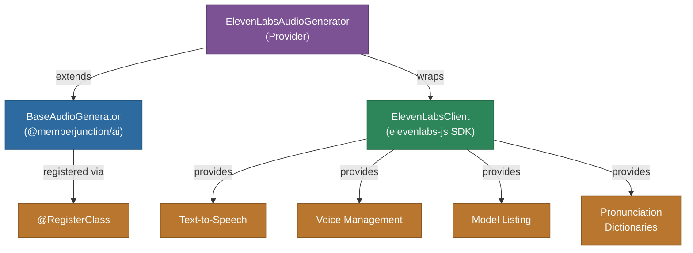

# @memberjunction/ai-elevenlabs

MemberJunction AI provider for ElevenLabs text-to-speech services. This package implements the `BaseAudioGenerator` interface to provide high-quality voice synthesis, voice management, and pronunciation dictionary support.

## Architecture



## Features

- **Text-to-Speech**: High-quality voice synthesis with customizable voice settings
- **Voice Management**: List and browse available voices with labels and preview URLs
- **Model Discovery**: Query available audio models with capability metadata
- **Pronunciation Dictionaries**: Manage custom pronunciation dictionaries with paginated retrieval
- **Streaming Audio**: Audio output returned as base64-encoded buffers
- **Text Normalization**: Optional text normalization for improved speech output

## Installation

```bash
npm install @memberjunction/ai-elevenlabs
```

## Usage

### Text-to-Speech

```typescript
import { ElevenLabsAudioGenerator } from '@memberjunction/ai-elevenlabs';

const tts = new ElevenLabsAudioGenerator('your-elevenlabs-api-key');

const result = await tts.CreateSpeech({
    text: 'Hello, welcome to MemberJunction!',
    voice: 'voice-id-here',
    model_id: 'eleven_turbo_v2'
});

if (result.success) {
    // result.content contains base64-encoded audio
    // result.data contains raw Buffer
    console.log('Audio generated successfully');
}
```

### List Voices

```typescript
const voices = await tts.GetVoices();
for (const voice of voices) {
    console.log(`${voice.name} (${voice.id}): ${voice.category}`);
}
```

### List Models

```typescript
const models = await tts.GetModels();
for (const model of models) {
    console.log(`${model.name}: TTS=${model.supportsTextToSpeech}`);
}
```

## Supported Methods

| Method | Description |
|--------|-------------|
| `CreateSpeech` | Convert text to speech audio |
| `GetVoices` | List available voices |
| `GetModels` | List available audio models |
| `GetPronounciationDictionaries` | List pronunciation dictionaries |

## Limitations

- `SpeechToText` is not yet implemented

## Class Registration

Registered as `ElevenLabsAudioGenerator` via `@RegisterClass(BaseAudioGenerator, 'ElevenLabsAudioGenerator')`.

## Dependencies

- `@memberjunction/ai` - Core AI abstractions (BaseAudioGenerator)
- `@memberjunction/global` - Class registration
- `@elevenlabs/elevenlabs-js` - Official ElevenLabs SDK
