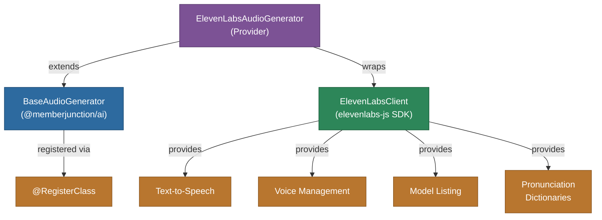

# @memberjunction/ai-elevenlabs

MemberJunction AI provider for ElevenLabs. The package ships two drivers:

- **`ElevenLabsAudioGenerator`** — `BaseAudioGenerator` implementation for text-to-speech, voice management, and pronunciation dictionaries (documented below).
- **`ElevenLabsRealtime`** — `BaseRealtimeModel` driver for the **ElevenLabs Agents Platform**, powering realtime full-duplex voice sessions (see the next section).

## Realtime driver — `ElevenLabsRealtime` (Agents Platform)

`ElevenLabsRealtime` (`src/elevenLabsRealtime.ts`, registered via `@RegisterClass(BaseRealtimeModel, 'ElevenLabsRealtime')`) exposes ElevenLabs' orchestrated STT→LLM→TTS **Agents** stack as a standard MJ realtime model, resolved for `MJ: AI Models` rows typed `Realtime`. `ElevenLabsRealtimeSession` is the `IRealtimeSession` backing the server-bridged topology; the matching **browser-direct client driver** (`ElevenLabsRealtimeClient`, ClassFactory key `'elevenlabs'`) ships in `@memberjunction/ai-realtime-client`.

### Provider characteristics

| Concern | How this provider does it |
| --- | --- |
| What you connect to | A pre-configured server-side **agent** — there is no bare-model realtime socket |
| Managed-agent strategy | `RealtimeSessionParams.Model` starting with `agent_` is used **verbatim** (a deployment-managed agent); any other value is the **name** of the driver-managed agent: find-by-name → create-if-missing (with the session's client-tool set + per-session prompt-override enablement) → PATCH on order-insensitive tool-fingerprint drift; cached per name + fingerprint. The seeded metadata row's APIName is `MJ Realtime Co-Agent` |
| Prompt authority | Per-session: the managed agent stores only a placeholder prompt and enables the `conversation_config_override.agent.prompt.prompt` override; every session sends the real system prompt in its `conversation_initiation_client_data` frame |
| Client-direct | Supported — the **signed websocket URL** minted via `GET /v1/convai/conversation/get-signed-url` *is* the ephemeral credential (~15-minute open window; no API key leaves the server) |
| Session-ready gate | `StartSession`/`Connect` resolve only after `conversation_initiation_metadata` confirms the config is applied |
| Transcripts | **Finals only** (whole-utterance `user_transcript` / `agent_response`); `agent_response_correction` re-finalizes a barged-in agent turn with the text actually spoken |
| Tool calling | Inline **client** tools on the agent config (`expects_response: true`, 120 s timeout); `client_tool_result` carries structured JSON when parseable |
| Tools mid-session | **Not re-declarable** on an open conversation — an identical `RegisterTools` set no-ops; a different set warns and is ignored (the next session's ensure flow picks it up) |
| Context notes (`SendContextNote`) | **Native** — `contextual_update`, the platform's purpose-built non-interrupting channel |
| Narration (`RequestSpokenUpdate`) | Emulated as a `user_message` turn, queued behind in-flight responses (fidelity caveat: the model may reference the instruction as a user message) |
| Audio | Base64 PCM16; rates negotiated from the initiation metadata (`pcm_<rate>`, platform default 16 kHz) |
| Usage events | **None** — the Agents websocket reports no token usage; `OnUsage` never fires (accounting lives in the platform dashboard) |

### Configuration

- API key env alias: `AI_VENDOR_API_KEY__ElevenLabsRealtime`
- `RealtimeSessionParams.Config.llm` (string) selects the managed agent's underlying LLM; for full provider-side control, use a verbatim `agent_…` id
- `InitialContext` is injected as a `contextual_update` once the session is confirmed (the protocol has no history-seeding channel)

For the full architecture (topologies, co-agent model, capability matrix across all four realtime providers), see [guides/REALTIME_CO_AGENTS_GUIDE.md](../../../../guides/REALTIME_CO_AGENTS_GUIDE.md).

---

## Audio generation — `ElevenLabsAudioGenerator`

This driver implements the `BaseAudioGenerator` interface to provide high-quality voice synthesis, voice management, and pronunciation dictionary support.

## Architecture



## Features

- **Text-to-Speech**: High-quality voice synthesis with customizable voice settings
- **Voice Management**: List and browse available voices with labels and preview URLs
- **Model Discovery**: Query available audio models with capability metadata
- **Pronunciation Dictionaries**: Manage custom pronunciation dictionaries with paginated retrieval
- **Streaming Audio**: Audio output returned as base64-encoded buffers
- **Text Normalization**: Optional text normalization for improved speech output

## Installation

```bash
npm install @memberjunction/ai-elevenlabs
```

## Usage

### Text-to-Speech

```typescript
import { ElevenLabsAudioGenerator } from '@memberjunction/ai-elevenlabs';

const tts = new ElevenLabsAudioGenerator('your-elevenlabs-api-key');

const result = await tts.CreateSpeech({
    text: 'Hello, welcome to MemberJunction!',
    voice: 'voice-id-here',
    model_id: 'eleven_turbo_v2'
});

if (result.success) {
    // result.content contains base64-encoded audio
    // result.data contains raw Buffer
    console.log('Audio generated successfully');
}
```

### List Voices

```typescript
const voices = await tts.GetVoices();
for (const voice of voices) {
    console.log(`${voice.name} (${voice.id}): ${voice.category}`);
}
```

### List Models

```typescript
const models = await tts.GetModels();
for (const model of models) {
    console.log(`${model.name}: TTS=${model.supportsTextToSpeech}`);
}
```

## Supported Methods

| Method | Description |
|--------|-------------|
| `CreateSpeech` | Convert text to speech audio |
| `GetVoices` | List available voices |
| `GetModels` | List available audio models |
| `GetPronounciationDictionaries` | List pronunciation dictionaries |

## Limitations

- `SpeechToText` is not yet implemented

## Class Registration

- `ElevenLabsAudioGenerator` via `@RegisterClass(BaseAudioGenerator, 'ElevenLabsAudioGenerator')`
- `ElevenLabsRealtime` via `@RegisterClass(BaseRealtimeModel, 'ElevenLabsRealtime')`

## Dependencies

- `@memberjunction/ai` - Core AI abstractions (BaseAudioGenerator, BaseRealtimeModel)
- `@memberjunction/global` - Class registration
- `@elevenlabs/elevenlabs-js` - Official ElevenLabs SDK (REST agent management + TTS; the realtime conversation websocket is spoken raw — the SDK's high-level wrapper owns audio devices, which a server bridge must not)
