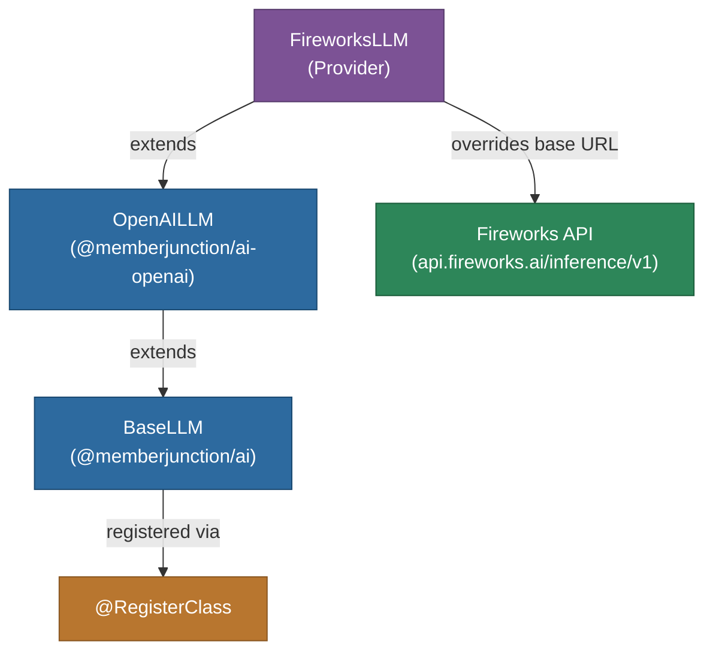

# @memberjunction/ai-fireworks

MemberJunction AI provider for Fireworks AI inference platform. This package extends the OpenAI provider to work with Fireworks' OpenAI-compatible API, providing access to a variety of open-source and fine-tuned models with fast inference.

## Architecture



## Features

- **Fast Inference**: Access to Fireworks' optimized inference infrastructure
- **OpenAI Compatible**: Inherits all features from the OpenAI provider
- **Streaming**: Full streaming support inherited from OpenAI provider
- **Open-Source Models**: Access to Llama, Mixtral, and other open models
- **Fine-Tuned Models**: Support for custom fine-tuned model deployments

## Installation

```bash
npm install @memberjunction/ai-fireworks
```

## Usage

```typescript
import { FireworksLLM } from '@memberjunction/ai-fireworks';

const llm = new FireworksLLM('your-fireworks-api-key');

const result = await llm.ChatCompletion({
    model: 'accounts/fireworks/models/llama-v3p1-70b-instruct',
    messages: [
        { role: 'user', content: 'What are the benefits of open-source AI models?' }
    ],
    temperature: 0.7
});

if (result.success) {
    console.log(result.data.choices[0].message.content);
}
```

## How It Works

`FireworksLLM` is a thin subclass of `OpenAILLM` that redirects API calls to Fireworks' endpoint at `https://api.fireworks.ai/inference/v1`. All chat, streaming, and parameter handling logic is inherited from the OpenAI provider.

## Class Registration

Registered as `FireworksLLM` via `@RegisterClass(BaseLLM, 'FireworksLLM')`.

## Dependencies

- `@memberjunction/ai` - Core AI abstractions
- `@memberjunction/ai-openai` - OpenAI provider (parent class)
- `@memberjunction/global` - Class registration
