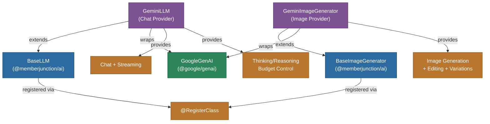

# @memberjunction/ai-gemini

MemberJunction AI provider for Google Gemini models. This package provides both LLM and image generation capabilities, supporting Gemini Pro, Flash, and advanced image generation models with native multimodal support, thinking/reasoning, and streaming.

## Architecture



## Features

### LLM (GeminiLLM)
- **Chat Completions**: Full conversational AI with system instructions
- **Streaming**: Real-time response streaming with chunk processing
- **Thinking/Reasoning**: Configurable thinking budget for Gemini 2.5+ and thinking levels for Gemini 3+
- **Multimodal Input**: Native support for text, images, audio, video, and file inputs
- **Message Alternation**: Automatic handling of Gemini's role alternation requirements
- **Safety Handling**: Detection and reporting of content blocking with detailed safety ratings
- **Effort Level Mapping**: Maps MJ effort levels (1-100) to Gemini thinking budgets (0-24576)

### Image Generation (GeminiImageGenerator)
- **Text-to-Image**: Generate images using Gemini 3 Pro Image model
- **Image Editing**: Edit existing images using multimodal context
- **Image Variations**: Create variations of existing images
- **Resolution Control**: Support for sizes up to 4K (3840x2160)
- **Style and Quality**: Configurable style and quality parameters

## Installation

```bash
npm install @memberjunction/ai-gemini
```

## Usage

### Chat Completion

```typescript
import { GeminiLLM } from '@memberjunction/ai-gemini';

const llm = new GeminiLLM('your-google-api-key');

const result = await llm.ChatCompletion({
    model: 'gemini-2.5-flash',
    messages: [
        { role: 'system', content: 'You are a helpful assistant.' },
        { role: 'user', content: 'Explain quantum computing.' }
    ],
    temperature: 0.7
});
```

### Streaming with Thinking

```typescript
const result = await llm.ChatCompletion({
    model: 'gemini-2.5-pro',
    messages: [{ role: 'user', content: 'Solve this math problem step by step.' }],
    effortLevel: '75', // High thinking budget
    streaming: true,
    streamingCallbacks: {
        OnContent: (content) => process.stdout.write(content)
    }
});

// Access thinking content
console.log('Thinking:', result.data.choices[0].message.thinking);
```

### Image Generation

```typescript
import { GeminiImageGenerator } from '@memberjunction/ai-gemini';

const generator = new GeminiImageGenerator('your-google-api-key');

const result = await generator.GenerateImage({
    prompt: 'A futuristic city at night',
    model: 'gemini-3-pro-image-preview',
    size: '2048x2048'
});
```

## Thinking Budget / Effort Level

The provider maps MJ effort levels to Gemini's thinking system:

| Effort Level | Gemini 2.5 (Budget) | Gemini 3+ (Level) |
|-------------|---------------------|-------------------|
| 1-5 (Flash only) | 0 (disabled) | MINIMAL |
| 1-33 | 1024-4096 | LOW |
| 34-66 | 4097-12288 | MEDIUM |
| 67-100 | 12289-24576 | HIGH |

## Supported Parameters

| Parameter | Supported | Notes |
|-----------|-----------|-------|
| temperature | Yes | Default 0.5 |
| topP | Yes | Nucleus sampling |
| topK | Yes | Top-K sampling |
| seed | Yes | Deterministic outputs |
| stopSequences | Yes | Custom stop sequences |
| effortLevel | Yes | Maps to thinking budget/level |
| responseFormat | Yes | JSON and text modes |
| streaming | Yes | Real-time streaming |
| frequencyPenalty | No | Not supported by Gemini |
| presencePenalty | No | Not supported by Gemini |
| minP | No | Not supported by Gemini |

## Class Registration

- `GeminiLLM` -- Registered via `@RegisterClass(BaseLLM, 'GeminiLLM')`
- `GeminiImageGenerator` -- Registered via `@RegisterClass(BaseImageGenerator, 'GeminiImageGenerator')`

## Dependencies

- `@memberjunction/ai` - Core AI abstractions
- `@memberjunction/global` - Class registration
- `@google/genai` - Google GenAI SDK
