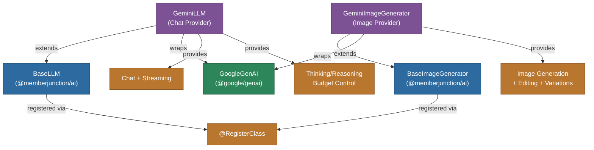

[Back to AI Framework Overview](../../README.md) | [All Providers](../README.md)

# @memberjunction/ai-gemini

MemberJunction AI provider for Google Gemini models. Provides LLM, image generation, embedding and realtime (Gemini Live) capabilities, supporting Gemini 2.5, Gemini 3, and Flash model families with native multimodal support, thinking/reasoning, and streaming.

## Architecture



## Features

### LLM (GeminiLLM)
- **Chat Completions**: Full conversational AI with system instructions
- **Streaming**: Real-time response streaming with chunk processing
- **Thinking/Reasoning**: Configurable thinking budget for Gemini 2.5+ and thinking levels for Gemini 3+
- **Multimodal Input**: Native support for text, images, audio, video, and file inputs
- **Message Alternation**: Automatic handling of Gemini's role alternation requirements
- **Safety Handling**: Detection and reporting of content blocking with detailed safety ratings
- **Effort Level Mapping**: Maps MJ effort levels (1-100) to Gemini thinking budgets (0-24576)

### Image Generation (GeminiImageGenerator)
- **Text-to-Image**: Generate images using Gemini image models
- **Image Editing**: Edit existing images using multimodal context
- **Image Variations**: Create variations of existing images
- **Resolution Control**: Support for sizes up to 4K (3840x2160)
- **Style and Quality**: Configurable style and quality parameters

### Embeddings (GeminiEmbedding)
- **Multimodal Embeddings**: Map text, images, video, audio, and PDF into one shared 3072-dimensional vector space
- **Cross-Modal Retrieval**: Embed text and media together so a text query can match an image, audio, or video
- **Text and Batch**: Single and batch text embedding

### Realtime (GeminiRealtime)
- **Gemini Live sessions** on the Gemini Developer API: server-side sessions and browser sessions minted with an ephemeral token
- **Per-model, per-endpoint profiles**: what each Live model accepts, and what it renders on each endpoint
- **Live avatars** where the endpoint renders them (Gemini Enterprise, through `@memberjunction/ai-vertex`'s `GeminiEnterpriseRealtime`)
- **Video in**: camera and screen frames as JPEG at the model's rate
- **Session resumption** and default context-window compression
- **The relay pieces** MJAPI's realtime relay uses: the setup writer and the frame policy

See [Gemini Live (realtime)](#gemini-live-realtime) below.

## Installation

```bash
npm install @memberjunction/ai-gemini
```

## Usage

### Chat Completion

```typescript
import { GeminiLLM } from "@memberjunction/ai-gemini";

const llm = new GeminiLLM("your-google-api-key");

const result = await llm.ChatCompletion({
    model: "gemini-2.5-flash",
    messages: [
        { role: "system", content: "You are a helpful assistant." },
        { role: "user", content: "Explain quantum computing." },
    ],
    temperature: 0.7,
});
```

### Streaming with Thinking

```typescript
const result = await llm.ChatCompletion({
    model: "gemini-2.5-pro",
    messages: [{ role: "user", content: "Solve this math problem step by step." }],
    effortLevel: "75",
    streaming: true,
    streamingCallbacks: {
        OnContent: (content) => process.stdout.write(content),
    },
});

console.log("Thinking:", result.data.choices[0].message.thinking);
```

### Image Generation

```typescript
import { GeminiImageGenerator } from "@memberjunction/ai-gemini";

const generator = new GeminiImageGenerator("your-google-api-key");

const result = await generator.GenerateImage({
    prompt: "A futuristic city at night",
    model: "gemini-3-pro-image-preview",
    size: "2048x2048",
});
```

### Embeddings

```typescript
import { GeminiEmbedding } from "@memberjunction/ai-gemini";

const embedding = new GeminiEmbedding("your-google-api-key");

// Text (3072-dim vector)
const text = await embedding.EmbedText({ text: "a golden retriever in the snow" });

// Multimodal: text + image fused into ONE vector (cross-modal retrieval)
const multimodal = await embedding.EmbedContent({
    content: [
        { type: "text", content: "product photo:" },
        { type: "image_url", content: "<base64-image>", mimeType: "image/png" },
    ],
});
console.log(multimodal.vector.length); // 3072
```

## Thinking Budget / Effort Level

The provider maps MJ effort levels to Gemini's thinking system:

| Effort Level | Gemini 2.5 (Budget) | Gemini 3+ (Level) |
|-------------|---------------------|-------------------|
| 1-5 (Flash only) | 0 (disabled) | MINIMAL |
| 1-33 | 1024-4096 | LOW |
| 34-66 | 4097-12288 | MEDIUM |
| 67-100 | 12289-24576 | HIGH |

## Supported Parameters

| Parameter | Supported | Notes |
|-----------|-----------|-------|
| temperature | Yes | Default 0.5 |
| topP | Yes | Nucleus sampling |
| topK | Yes | Top-K sampling |
| seed | Yes | Deterministic outputs |
| stopSequences | Yes | Custom stop sequences |
| effortLevel | Yes | Maps to thinking budget/level |
| responseFormat | Yes | JSON and text modes |
| streaming | Yes | Real-time streaming |
| frequencyPenalty | No | Not supported by Gemini |
| presencePenalty | No | Not supported by Gemini |
| minP | No | Not supported by Gemini |

## Gemini Live (realtime)

`GeminiRealtime` (`@RegisterClass(BaseRealtimeModel, 'GeminiRealtime')`, key `AI_VENDOR_API_KEY__GeminiRealtime`) runs Gemini Live on the Gemini Developer API. `GeminiEnterpriseRealtime` in `@memberjunction/ai-vertex` extends it for Gemini Enterprise (Vertex AI) and overrides only the endpoint, the credentials and how the browser connects. The realtime architecture is in [the Real-Time Co-Agents Guide](../../../../guides/REALTIME_CO_AGENTS_GUIDE.md); its §12 covers video-capable providers, with Gemini as the reference.

### Sessions

- **Server-side** (`StartSession`): the node SDK's `live.connect`, used by bridged meetings and phone calls.
- **Browser** (`CreateClientSession`): an ephemeral token from the `v1alpha` `auth_tokens` API (open within 10 minutes, usable for 30), locking the mask-safe part of the config (`responseModalities`, `speechConfig`, generation parameters, `sessionResumption`) with `liveConnectConstraints`. The system prompt and tools can't be locked in the token; they ride the private `SessionConfig` pact, which the `'gemini'` browser driver applies verbatim. The pact also carries the model's facts on its endpoint (idle signal, tooling, inbound video limits) and, for a granted avatar, an `avatar` block.

Every session's config comes from `BuildConnectConfig`: AUDIO output, input and output transcription, the system prompt, sliding-window context compression (`DefaultContextWindowCompression`), session resumption (left off a zero-data-retention session), the tools, the neutral `voice` mapped to `speechConfig`, then the open config bag. The model's legality rules, zero data retention and the avatar rule run last, so the bag can't reintroduce what they remove.

**Session length.** Without compression, Google ends a session when its context fills: about 15 minutes for audio and about 2 for audio plus video. With compression on (the default) the server drops the oldest turns. Resumption handles a different limit: one connection lasts about 10 minutes (on Vertex AI, `goAway` came about 9 minutes after a connection opened, with 30 s left), so when Google announces the end (`goAway`) or the socket drops, the session moves to a new connection with Google's resumption handle, server-side and in the browser.

### Model profiles

`src/geminiLiveProfiles.ts` holds what each Live model accepts, as data rather than branches. Metadata (`ModelConfiguration.Realtime`) is the authority; the table is the fallback for a model whose rows are missing or stale.

| Model row | Thinking level | Tool scheduling | Idle signal | Video in | Provider default turn coverage |
|---|---|---|---|---|---|
| `gemini-3.8-live-extended-thinking` | `low` / `medium` / `high` (default `medium`) | no; blocking is an error | `interactionStatus` | 1 stream, 1 fps | all video |
| `gemini-3.8-live` | not accepted (thinkingConfig omitted) | yes; blocking allowed | `turnComplete` | 1 stream, 1 fps | all video |
| `gemini-3.1-flash-live` | `minimal` to `high` | no | `turnComplete` | none | audio activity |
| any other model | not sent | no | `turnComplete` | none | audio activity |

A model id matches the longest prefix. `MJ_GEMINI_LIVE_MODEL_ALIASES` (`<model id>=<known model id>`, comma-separated, read on each resolution) gives a model id the table doesn't know the profile of one it does; the catalog's `APIName` is still what Google is sent.

**Per endpoint.** `ResolveGeminiLiveProfile(model, endpoint)` resolves a row for `'developer'` (the default) or `'enterprise'`, adding:

- what the model renders there (`GEMINI_LIVE_ENDPOINT_OVERLAYS`): `SupportsAvatarOutput`, `AvatarOutputEncoding`, `AvatarAudioMuxed`. Only `gemini-3.8-live` on Gemini Enterprise renders a live avatar (`video/mp4; codecs="avc1.42c01f, mp4a.40.2"`, voice inside the MP4). An overlay matches one row exactly, so Extended Thinking never inherits it. On the Developer API, `gemini-3.8-live` refuses every avatar field and returns audio for a VIDEO request.
- what the endpoint accepts whatever the model (`GEMINI_LIVE_ENDPOINT_PROFILES`): `AcceptedTurnCoverages`. The Developer API accepts `audioActivityOnly` and `audioActivityAndAllVideo`; Gemini Enterprise accepts only `audioActivityOnly` (Vertex AI closes the setup on `TURN_INCLUDES_AUDIO_ACTIVITY_AND_ALL_VIDEO`).

**Turn coverage** is stated on every session, never inherited: the catalog's `Realtime.TurnDetection.Coverage` when the endpoint accepts it, else `audioActivityOnly` with one log line naming what was asked for and what was sent; `audioActivityOnly` when nothing is configured. The Google rows of Gemini 3.8 Live and Extended Thinking ask for all video; the Vertex AI row of Gemini 3.8 Live asks for `audioActivityOnly`.

### Live avatars

`BuildConnectConfig` applies the session's avatar request (`RealtimeSessionParams.Avatar`) last:

- **Granted** where the profile renders avatars: the VIDEO response modality and `avatarConfig.avatarName`, with `videoBitrateBps` from `MJ_GEMINI_AVATAR_VIDEO_BITRATE_BPS` (2,000,000 when unset; `0` leaves the field out and lets Google choose; anything else logs once and uses the default). The variable is read each time a config is built, so a restart applies it to browser mints, the relay's setup and server-side sessions.
- **Refused** anywhere else, with one log line and an audio-only session: `endpoint` (the model renders none here), `custom-disabled`, `unknown-avatar`, and on a server-side session whose host doesn't publish video into a room (`Delivery` other than `'room'`), `bridged`. A VIDEO modality or `avatarConfig` from the config bag is removed: an avatar comes only from the avatar request.
- The mint returns the decision as `ClientRealtimeSessionConfig.AvatarStatus`; a server-side session reports it as `IRealtimeSession.AvatarStatus`.

**A server-side avatar** (a meeting bot that publishes it, `Delivery: 'room'`) sends the model's MP4 pieces to the host as `RealtimeVideoFrame`s through `OnVideoFrame` (`src/geminiBridgedAvatar.ts`). A part that opens with an MP4 box is a piece of the avatar whatever MIME type it names; a `video/*` part that isn't MP4 is dropped and reported once; PCM plays as the voice only while the turn has no video yet (the MP4 carries the voice); any other part is dropped and reported once. From `interrupted` until that turn's `turnComplete`, media parts are dropped. The seconds of video generated in a turn go to `OnUsage` (`OutputTokenDetails.VideoSeconds`) at the turn's end; video after `generationComplete` is forwarded but not counted.

### Usage

Each `usageMetadata` Google sends becomes one `OnUsage` update: the prompt and response token counts, and their per-modality split (`TEXT`, `AUDIO`, `IMAGE`, `VIDEO` into `TextTokens`, `AudioTokens`, `ImageTokens`, `VideoTokens`). Google reports usage per turn, not as running totals, so consumers add the updates up. A generated avatar's tokens arrive as the response's VIDEO.

### The relay pieces

A browser session on Gemini Enterprise runs through MJAPI's realtime relay (see `@memberjunction/ai-vertex`). This package provides the Gemini half:

- **`BuildGeminiLiveSetup(target, config)`** writes the Live `setup` message from a connect config the way `@google/genai` would inside `live.connect`, for both endpoints (`GeminiLiveSetupTarget`: `Endpoint`, `Model`, `Project`, `Location`, or `UsesApiKey` for an API key on Google's global route). A key the SDK would refuse on an endpoint is left out and named in one log line. A parity test runs the installed SDK's `live.connect` against a local socket in both modes and compares, which catches a mapping an SDK upgrade changes. `BuildGeminiLiveModelPath(target)` writes the model's resource name (`models/<id>`, `projects/<p>/locations/<l>/publishers/google/models/<id>`, or `publishers/google/models/<id>` on the API-key global route).
- **`GeminiLiveRelayPolicy`** is the relay's frame policy (`IRealtimeRelayPolicy`): every upstream connection opens with the server's setup and the headers `UpstreamHeaders` mints for it; from the browser's own setup it reads only a resumption handle and a request for audio only (a downgrade, never an upgrade); after that it forwards only `realtimeInput` (audio, video, text, activity markers), `clientContent` whose turns are all `user`, and `toolResponse`, with known keys and media types only, and drops everything else under a short label the relay counts. It finds resumption handles in server frames with a byte search before any parse. Widening what passes lets a browser change the agent mid-session, so any widening is a security change.

## Class Registration

- `GeminiLLM` -- Registered via `@RegisterClass(BaseLLM, 'GeminiLLM')`
- `GeminiImageGenerator` -- Registered via `@RegisterClass(BaseImageGenerator, 'GeminiImageGenerator')`
- `GeminiEmbedding` -- Registered via `@RegisterClass(BaseEmbeddings, 'GeminiEmbedding')`
- `GeminiRealtime` -- Registered via `@RegisterClass(BaseRealtimeModel, 'GeminiRealtime')`

## Dependencies

- `@memberjunction/ai` - Core AI abstractions
- `@memberjunction/global` - Class registration
- `@google/genai` - Google GenAI SDK
