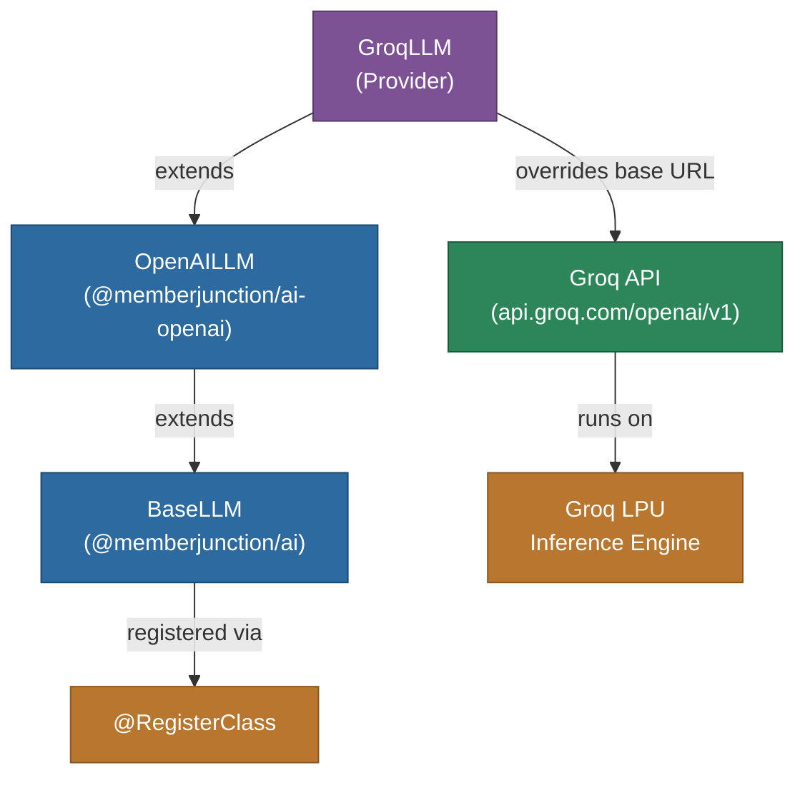

# @memberjunction/ai-groq

MemberJunction AI provider for Groq's ultra-fast inference platform. This package extends the OpenAI provider to work with Groq's OpenAI-compatible API, providing access to LLM inference powered by Groq's custom Language Processing Units (LPUs) for industry-leading inference speed.

## Architecture



## Features

- **Ultra-Fast Inference**: Groq's custom LPU hardware delivers extremely low latency
- **OpenAI Compatible**: Inherits all features from the OpenAI provider
- **Streaming**: Full streaming support for real-time responses
- **Thinking/Reasoning**: Thinking block extraction for reasoning models
- **Multiple Models**: Access to Llama, Mixtral, Gemma, and other open models optimized for Groq

## Installation

```bash
npm install @memberjunction/ai-groq
```

## Usage

```typescript
import { GroqLLM } from '@memberjunction/ai-groq';

const llm = new GroqLLM('your-groq-api-key');

const result = await llm.ChatCompletion({
    model: 'llama-3.1-70b-versatile',
    messages: [
        { role: 'system', content: 'You are a helpful assistant.' },
        { role: 'user', content: 'Explain neural networks.' }
    ],
    temperature: 0.7,
    maxOutputTokens: 1000
});

if (result.success) {
    console.log(result.data.choices[0].message.content);
}
```

### Streaming

```typescript
const result = await llm.ChatCompletion({
    model: 'llama-3.1-8b-instant',
    messages: [{ role: 'user', content: 'Write a haiku about speed.' }],
    streaming: true,
    streamingCallbacks: {
        OnContent: (content) => process.stdout.write(content),
        OnComplete: () => console.log('\nDone!')
    }
});
```

## How It Works

`GroqLLM` is a thin subclass of `OpenAILLM` that redirects API calls to Groq's endpoint at `https://api.groq.com/openai/v1`. Since Groq implements an OpenAI-compatible API, all chat, streaming, and parameter handling logic is inherited from the OpenAI provider.

## Supported Parameters

All parameters supported by the OpenAI provider are available, including `temperature`, `maxOutputTokens`, `topP`, `frequencyPenalty`, `presencePenalty`, `seed`, `stopSequences`, and `responseFormat`.

## Class Registration

Registered as `GroqLLM` via `@RegisterClass(BaseLLM, 'GroqLLM')`.

## Dependencies

- `@memberjunction/ai` - Core AI abstractions
- `@memberjunction/ai-openai` - OpenAI provider (parent class)
- `@memberjunction/global` - Class registration
