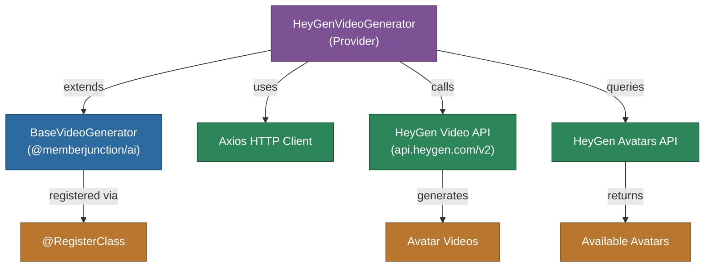

# @memberjunction/ai-heygen

MemberJunction AI provider for HeyGen's AI video generation platform. This package implements the `BaseVideoGenerator` interface to create avatar-based videos with customizable characters, voices, and backgrounds.

## Architecture



## Features

- **Avatar Video Generation**: Create videos with AI avatars synchronized to audio
- **Avatar Management**: Browse available avatars with preview images and videos
- **Customizable Layout**: Control avatar scale, position (offset X/Y), and style
- **Custom Backgrounds**: Use image assets as video backgrounds
- **Audio Integration**: Sync avatar lip movements with audio assets
- **Resolution Control**: Set custom output width and height

## Installation

```bash
npm install @memberjunction/ai-heygen
```

## Usage

### Create Avatar Video

```typescript
import { HeyGenVideoGenerator } from '@memberjunction/ai-heygen';

const generator = new HeyGenVideoGenerator('your-heygen-api-key');

const result = await generator.CreateAvatarVideo({
    avatarId: 'avatar-id',
    avatarStyle: 'normal',
    scale: 1.0,
    offsetX: 0,
    offsetY: 0,
    audioAssetId: 'audio-asset-id',
    imageAssetId: 'background-asset-id',
    outputWidth: 1920,
    outputHeight: 1080
});

if (result.success) {
    console.log('Video ID:', result.videoId);
}
```

### List Avatars

```typescript
const avatars = await generator.GetAvatars();
for (const avatar of avatars) {
    console.log(`${avatar.name} (${avatar.gender}): ${avatar.previewImageUrl}`);
}
```

## Supported Methods

| Method | Description |
|--------|-------------|
| `CreateAvatarVideo` | Generate an avatar video with audio and background |
| `GetAvatars` | List available avatars with preview media |
| `CreateVideoTranslation` | Translate existing video (not yet implemented) |

## Class Registration

Registered as `HeyGenVideoGenerator` via `@RegisterClass(BaseVideoGenerator, 'HeyGenVideoGenerator')`.

## Dependencies

- `@memberjunction/ai` - Core AI abstractions (BaseVideoGenerator)
- `@memberjunction/global` - Class registration
- `axios` - HTTP client for API communication
