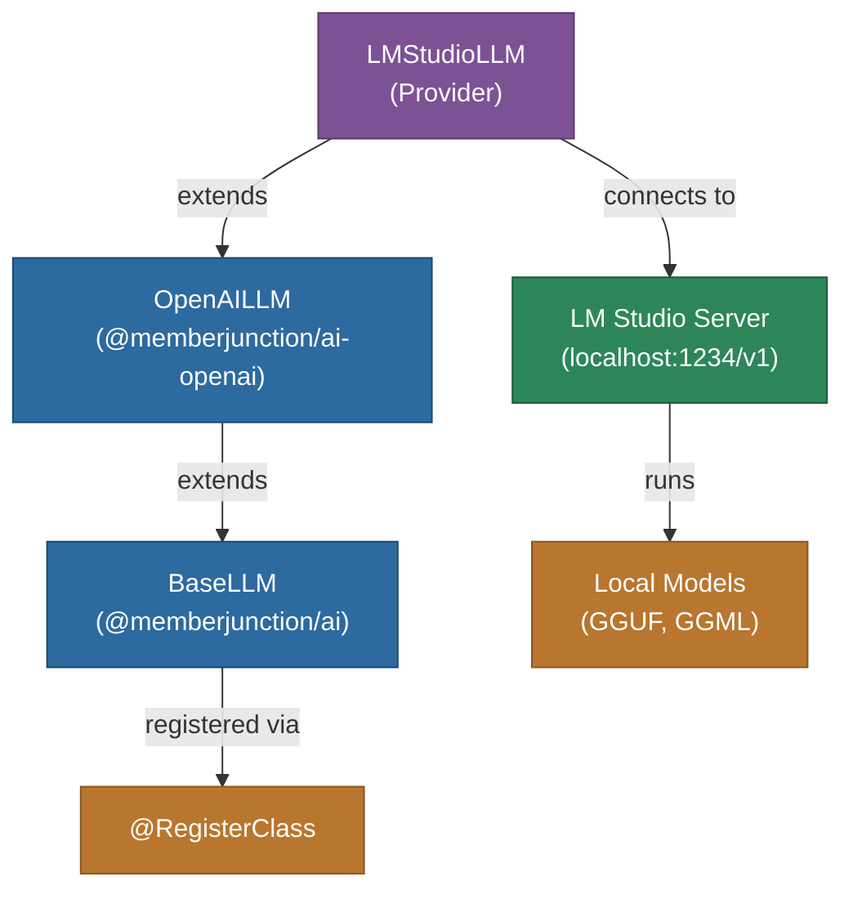

# @memberjunction/ai-lm-studio

MemberJunction AI provider for LM Studio, enabling integration with locally-hosted models through LM Studio's OpenAI-compatible API. This package extends the OpenAI provider to connect to LM Studio's local inference server.

## Architecture



## Features

- **Local Model Hosting**: Run AI models locally without cloud dependencies
- **OpenAI Compatible**: Inherits all features from the OpenAI provider
- **Streaming**: Full streaming support for real-time responses
- **No API Key Required**: Connects to local server (API key parameter ignored)
- **Model Flexibility**: Use any model loaded in LM Studio (GGUF, GGML formats)
- **Privacy**: All data stays on your local machine
- **Configurable Endpoint**: Support for custom host and port settings

## Installation

```bash
npm install @memberjunction/ai-lm-studio
```

## Usage

```typescript
import { LMStudioLLM } from '@memberjunction/ai-lm-studio';

// API key is not used but required by the interface
const llm = new LMStudioLLM('not-used');

const result = await llm.ChatCompletion({
    model: 'local-model', // Model loaded in LM Studio
    messages: [
        { role: 'system', content: 'You are a helpful assistant.' },
        { role: 'user', content: 'Explain how local inference works.' }
    ],
    temperature: 0.7
});

if (result.success) {
    console.log(result.data.choices[0].message.content);
}
```

## Configuration

The default endpoint is `http://localhost:1234/v1`. Configure via `SetAdditionalSettings` if using a different host/port.

## How It Works

`LMStudioLLM` is a thin subclass of `OpenAILLM` that redirects API calls to LM Studio's local server endpoint. LM Studio provides an OpenAI-compatible API, so all chat, streaming, and parameter handling is inherited from the OpenAI provider.

## Prerequisites

1. Install [LM Studio](https://lmstudio.ai/)
2. Download and load a model in LM Studio
3. Start the local server (default: port 1234)
4. Configure the provider in your MemberJunction application

## Class Registration

Registered as `LMStudioLLM` via `@RegisterClass(BaseLLM, 'LMStudioLLM')`.

## Dependencies

- `@memberjunction/ai` - Core AI abstractions
- `@memberjunction/ai-openai` - OpenAI provider (parent class)
- `@memberjunction/global` - Class registration
