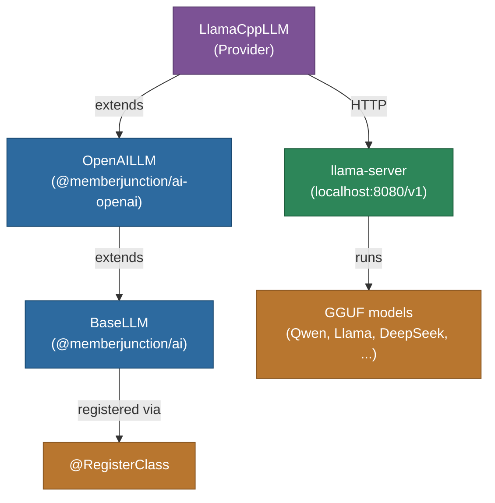

# @memberjunction/ai-llamacpp

MemberJunction AI provider for [llama.cpp](https://github.com/ggml-org/llama.cpp), enabling MJ agents and prompts to run against a local `llama-server` process. Because `llama-server` exposes an OpenAI-compatible `/v1/chat/completions` API, this package is a thin subclass of `@memberjunction/ai-openai` that simply points the client at your local endpoint.

## Architecture



## Features

- **Fully local inference** — no cloud dependencies, works offline / in airplane mode
- **OpenAI-compatible** — inherits chat, streaming, JSON mode, and parameter handling from `OpenAILLM`
- **Any GGUF model** — run whatever you loaded into `llama-server` (Qwen3, Llama 3.x, DeepSeek-R1, Phi, Gemma, etc.)
- **No API key required by default** — a placeholder is supplied; pass a real key if you started `llama-server --api-key <key>`
- **Configurable endpoint** — defaults to `http://localhost:8080/v1` but accepts any host/port via constructor args or env vars

## Environment variables

The endpoint and API key can be overridden without changing code. Precedence is **constructor argument → env var → hardcoded default**.

| Variable | Purpose | Default |
|---|---|---|
| `LLAMACPP_BASE_URL` | Full endpoint URL. Wins over host/port if set. | — |
| `LLAMACPP_HOST` | Host component. Combined with port to build the URL. | `localhost` |
| `LLAMACPP_PORT` | Port component. | `8080` |
| `LLAMACPP_API_KEY` | API key for `llama-server --api-key` setups. | placeholder |

Examples:

```bash
# Point every LlamaCppLLM instance at a different port
export LLAMACPP_PORT=9090

# Point at a box elsewhere on the LAN
export LLAMACPP_HOST=10.0.0.5
export LLAMACPP_PORT=8080

# Full URL override (e.g. a reverse-proxied endpoint)
export LLAMACPP_BASE_URL=https://llama.internal.example.com/v1

# Authenticated llama-server
export LLAMACPP_API_KEY=my-secret
```

## Installation

```bash
npm install @memberjunction/ai-llamacpp
```

## Setting up `llama-server`

This package is a client. Before it can do anything you need a running `llama-server` process with a model loaded. The four steps below get you from zero to a working endpoint.

### 1. Install llama.cpp

Pick the path that matches your platform:

**macOS (Apple Silicon or Intel)**
```bash
brew install llama.cpp
```
This gives you `llama-server`, `llama-cli`, and friends on your `PATH`, with Metal GPU support built in.

**Linux**
```bash
# Homebrew on Linux (simplest, CPU-only by default)
brew install llama.cpp

# Or prebuilt releases (pick the one matching your CUDA / ROCm / Vulkan stack):
#   https://github.com/ggml-org/llama.cpp/releases
```

**Windows**
Download a prebuilt zip from the [releases page](https://github.com/ggml-org/llama.cpp/releases) (pick `win-cuda` for NVIDIA, `win-vulkan` for AMD/Intel, or the plain `win-avx2` CPU build).

**Build from source (any platform, latest features, custom GPU backend)**
```bash
git clone https://github.com/ggml-org/llama.cpp
cd llama.cpp
# Pick ONE backend:
cmake -B build -DGGML_CUDA=ON        # NVIDIA
cmake -B build -DGGML_METAL=ON       # Apple Silicon (default on macOS)
cmake -B build -DGGML_VULKAN=ON      # AMD / Intel GPUs, cross-platform
cmake -B build -DGGML_HIPBLAS=ON     # AMD ROCm
cmake -B build                        # CPU only
cmake --build build --config Release -j
# Binaries land in ./build/bin/
```

Verify the install:
```bash
llama-server --version
```

### 2. Get a GGUF model

llama.cpp only loads models in the GGUF format. [Hugging Face](https://huggingface.co/models?library=gguf&sort=trending) has thousands. Some sensible starting points:

| Use case | Model | Approx. VRAM at Q4_K_M |
|---|---|---|
| Coding agent (laptop) | [Qwen2.5-Coder-7B-Instruct-GGUF](https://huggingface.co/bartowski/Qwen2.5-Coder-7B-Instruct-GGUF) | ~5 GB |
| Coding agent (workstation) | [Qwen2.5-Coder-32B-Instruct-GGUF](https://huggingface.co/bartowski/Qwen2.5-Coder-32B-Instruct-GGUF) | ~20 GB |
| General reasoning | [Llama-3.3-70B-Instruct-GGUF](https://huggingface.co/bartowski/Llama-3.3-70B-Instruct-GGUF) | ~42 GB |
| Small / fast | [Phi-4-mini-instruct-GGUF](https://huggingface.co/bartowski/Phi-4-mini-instruct-GGUF) | ~3 GB |

**Quantization cheat sheet.** The suffix on the filename (e.g. `Q4_K_M`) is the quantization. Rules of thumb:

- `Q4_K_M` — best size/quality tradeoff for most users. Start here.
- `Q5_K_M` / `Q6_K` — higher quality, ~25–50% more VRAM.
- `Q8_0` — near-lossless, about half the size of full precision.
- `IQ3_XXS` / `IQ2_M` — squeeze a bigger model into less VRAM at real quality cost.

Download with `curl` or the `huggingface-cli`:

```bash
# Raw download
curl -L -o qwen2.5-coder-7b-q4.gguf \
  https://huggingface.co/bartowski/Qwen2.5-Coder-7B-Instruct-GGUF/resolve/main/Qwen2.5-Coder-7B-Instruct-Q4_K_M.gguf

# Or with the HF CLI
huggingface-cli download bartowski/Qwen2.5-Coder-7B-Instruct-GGUF \
  Qwen2.5-Coder-7B-Instruct-Q4_K_M.gguf --local-dir ./models
```

### 3. Start the server

Minimal command:

```bash
llama-server -m ./models/qwen2.5-coder-7b-q4.gguf --port 8080
```

Realistic command with the flags that actually matter for agent workloads:

```bash
llama-server \
  -m ./models/qwen2.5-coder-7b-q4.gguf \
  --host 0.0.0.0 --port 8080 \
  -c 32768 \
  -ngl 99 \
  -np 4 \
  --flash-attn
```

| Flag | What it does | When to change it |
|---|---|---|
| `-m <path>` | GGUF model file to load | Required |
| `--host` | Bind address (default `127.0.0.1`) | Use `0.0.0.0` to allow LAN access |
| `--port` | HTTP port (default `8080`) | Change if 8080 is taken |
| `-c <N>` | Context window in tokens | Raise for long agent histories. 32k is a good default; cap at the model's max |
| `-ngl <N>` | Layers to offload to GPU | `99` = everything. Lower it if you OOM on VRAM |
| `-np <N>` | Parallel request slots | `4–8` lets multiple MJ agents hit the server concurrently |
| `--flash-attn` | Flash attention kernel | Big speedup on CUDA / Metal |
| `--api-key <key>` | Require `Authorization: Bearer <key>` | Enable when exposing to a network |
| `-t <N>` | CPU threads | Auto-detected; override only if needed |

### 4. Verify it's running

```bash
# Health check
curl http://localhost:8080/health

# Sanity chat request
curl http://localhost:8080/v1/chat/completions \
  -H "Content-Type: application/json" \
  -d '{
    "model": "local",
    "messages": [{"role": "user", "content": "Say hi in one word."}]
  }'
```

`llama-server` also exposes a web UI at `http://localhost:8080` for interactive testing.

### Running as a long-lived service

For anything beyond a dev session, don't run `llama-server` in a terminal window. Options:

- **systemd** (Linux) — write a unit file pointing at `llama-server` with the flags above and `Restart=on-failure`.
- **launchd** (macOS) — same idea with a `.plist`.
- **Docker** — `ghcr.io/ggml-org/llama.cpp:server` (CUDA variant: `:server-cuda`). Mount your models directory and map port 8080.
- **tmux / screen** — fine for a dev box.

### Common gotchas

- **"Context length exceeded" errors** — raise `-c` or shrink your prompts. The default is whatever's baked into the model, often much smaller than you want.
- **Slow / CPU-only inference despite having a GPU** — `-ngl` was 0 (the default) or the llama.cpp build doesn't have your GPU backend compiled in. Check startup logs for `CUDA` / `Metal` / `Vulkan` detection.
- **Model won't load / "failed to open"** — wrong path, or the file is a `.safetensors` / `.bin` instead of `.gguf`. Only GGUF loads.
- **429 / queued requests under load** — raise `-np` (parallel slots). Each slot needs its own KV cache, so VRAM usage scales with it.
- **First request is very slow** — the model is being loaded into VRAM. Subsequent requests are fast. Keep the process running.

## Usage

```typescript
import { LlamaCppLLM } from '@memberjunction/ai-llamacpp';

// API key is ignored unless llama-server was started with --api-key
const llm = new LlamaCppLLM();

const result = await llm.ChatCompletion({
    model: 'qwen2.5-coder-32b', // the name reported by llama-server (any value works for most builds)
    messages: [
        { role: 'system', content: 'You are a helpful assistant.' },
        { role: 'user', content: 'Write a TypeScript function that reverses a linked list.' }
    ],
    temperature: 0.2,
});

if (result.success) {
    console.log(result.data.choices[0].message.content);
}
```

### Connecting to a remote or non-default endpoint

```typescript
// Custom host/port (e.g. another box on your LAN, or a container)
const llm = new LlamaCppLLM('', 'http://192.168.1.42:9090/v1');
```

### Using an authenticated endpoint

If you started `llama-server --api-key my-secret`:

```typescript
const llm = new LlamaCppLLM('my-secret');
```

## Streaming

Streaming is inherited from `OpenAILLM`:

```typescript
await llm.StreamingChatCompletion({
    model: 'qwen2.5-coder-32b',
    messages: [{ role: 'user', content: 'Explain quicksort.' }],
}, {
    OnContent: (chunk) => process.stdout.write(chunk),
    OnComplete: (final) => console.log('\n\nDone:', final.data.usage),
});
```

## Configuration via MJ Metadata

Register llama.cpp as a vendor and add a model record pointing at it:

| Field | Value |
|---|---|
| `AI Vendor.Name` | `llama.cpp` |
| `AI Model.DriverClass` | `LlamaCppLLM` |
| `AI Model.APIName` | model name your llama-server exposes (e.g. `qwen2.5-coder-32b`) |
| Additional settings (on vendor or model) | `{ "baseUrl": "http://localhost:8080/v1" }` if non-default |

## How It Works

`LlamaCppLLM` is a ~15-line subclass of `OpenAILLM` that:

1. Defaults `baseURL` to `http://localhost:8080/v1`.
2. Substitutes a placeholder API key when none is provided, since the OpenAI SDK requires a non-empty string but `llama-server` runs unauthenticated by default.

All chat, streaming, tool-call, and parameter-handling logic is inherited — there's no duplicated code. This mirrors how `xAILLM` and `OpenRouterLLM` wrap their respective OpenAI-compatible endpoints.

## Class Registration

Registered as `LlamaCppLLM` via `@RegisterClass(BaseLLM, 'LlamaCppLLM')`, which is how the MJ `ClassFactory` discovers it at runtime.

## llama.cpp vs. Ollama / LM Studio

MJ ships providers for all three. Quick comparison:

- **llama.cpp (this package)** — direct access to `llama-server`. Best performance ceiling, fine-grained sampler control, latest features. You manage GGUF files yourself.
- **Ollama** (`@memberjunction/ai-ollama`) — friendlier model management (`ollama pull ...`), automatic load/unload, better default concurrency. Uses llama.cpp internally.
- **LM Studio** (`@memberjunction/ai-lmstudio`) — GUI model management on macOS/Windows, also uses llama.cpp internally.

Use this package when you want to talk to `llama-server` directly — no daemon, no extra process, no model manager in between.

## Dependencies

- `@memberjunction/ai` — core AI abstractions
- `@memberjunction/ai-openai` — parent class providing OpenAI-compatible behaviour
- `@memberjunction/global` — class registration system
