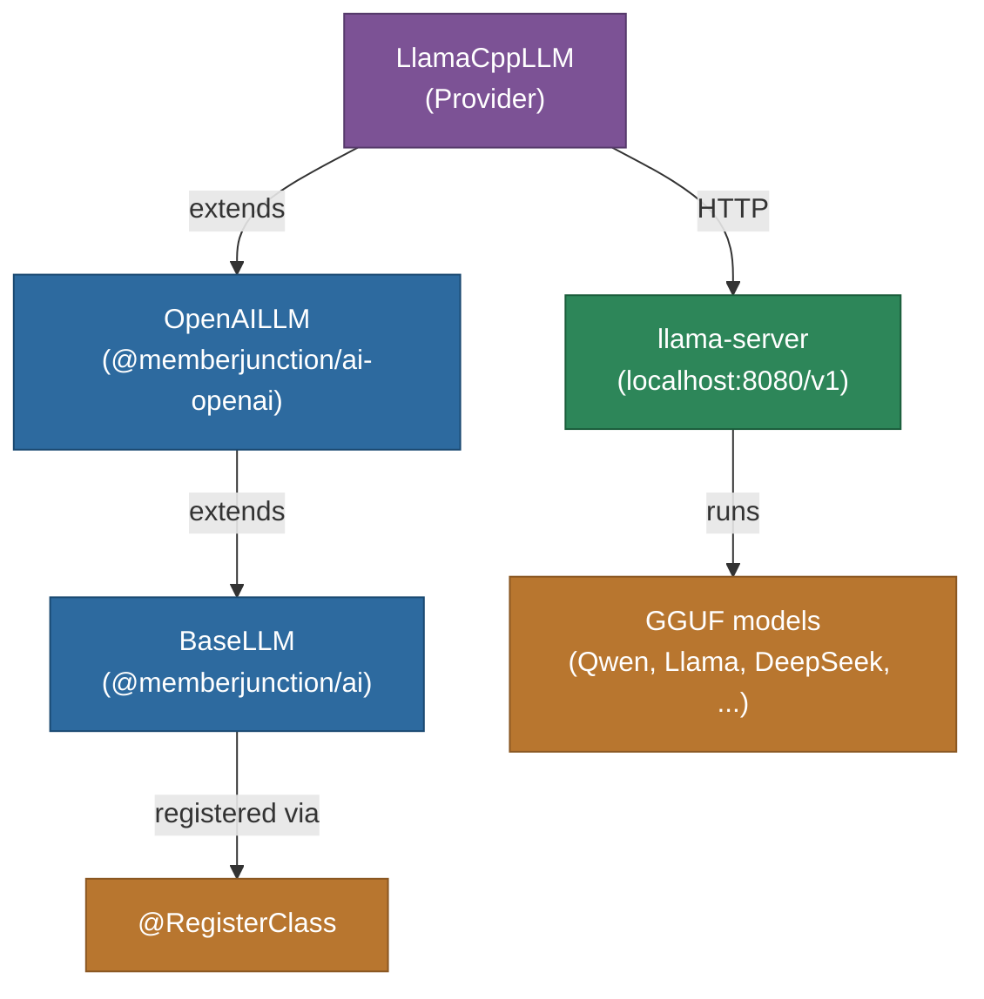

# @memberjunction/ai-llamacpp

MemberJunction AI provider for [llama.cpp](https://github.com/ggml-org/llama.cpp), enabling MJ agents and prompts to run against a local `llama-server` process. Because `llama-server` exposes an OpenAI-compatible `/v1/chat/completions` API, this package is a thin subclass of `@memberjunction/ai-openai` that simply points the client at your local endpoint.

## Architecture



## Features

- **Fully local inference** — no cloud dependencies, works offline / in airplane mode
- **OpenAI-compatible** — inherits chat, streaming, JSON mode, and parameter handling from `OpenAILLM`
- **Any GGUF model** — run whatever you loaded into `llama-server` (Qwen3, Llama 3.x, DeepSeek-R1, Phi, Gemma, etc.)
- **No API key required by default** — a placeholder is supplied; pass a real key if you started `llama-server --api-key <key>`
- **Configurable endpoint** — defaults to `http://localhost:8080/v1` but accepts any host/port

## Installation

```bash
npm install @memberjunction/ai-llamacpp
```

## Prerequisites

1. Build or install llama.cpp — see the [upstream README](https://github.com/ggml-org/llama.cpp).
2. Download a GGUF model. Hugging Face has thousands of quantized GGUFs ready to use.
3. Start the server:
   ```bash
   llama-server -m ./models/qwen2.5-coder-32b-instruct-q4_k_m.gguf \
                --host 0.0.0.0 --port 8080 \
                -ngl 99
   ```
   The `-ngl` flag offloads layers to GPU (use `99` to offload as many as possible).

## Usage

```typescript
import { LlamaCppLLM } from '@memberjunction/ai-llamacpp';

// API key is ignored unless llama-server was started with --api-key
const llm = new LlamaCppLLM();

const result = await llm.ChatCompletion({
    model: 'qwen2.5-coder-32b', // the name reported by llama-server (any value works for most builds)
    messages: [
        { role: 'system', content: 'You are a helpful assistant.' },
        { role: 'user', content: 'Write a TypeScript function that reverses a linked list.' }
    ],
    temperature: 0.2,
});

if (result.success) {
    console.log(result.data.choices[0].message.content);
}
```

### Connecting to a remote or non-default endpoint

```typescript
// Custom host/port (e.g. another box on your LAN, or a container)
const llm = new LlamaCppLLM('', 'http://192.168.1.42:9090/v1');
```

### Using an authenticated endpoint

If you started `llama-server --api-key my-secret`:

```typescript
const llm = new LlamaCppLLM('my-secret');
```

## Streaming

Streaming is inherited from `OpenAILLM`:

```typescript
await llm.StreamingChatCompletion({
    model: 'qwen2.5-coder-32b',
    messages: [{ role: 'user', content: 'Explain quicksort.' }],
}, {
    OnContent: (chunk) => process.stdout.write(chunk),
    OnComplete: (final) => console.log('\n\nDone:', final.data.usage),
});
```

## Configuration via MJ Metadata

Register llama.cpp as a vendor and add a model record pointing at it:

| Field | Value |
|---|---|
| `AI Vendor.Name` | `llama.cpp` |
| `AI Model.DriverClass` | `LlamaCppLLM` |
| `AI Model.APIName` | model name your llama-server exposes (e.g. `qwen2.5-coder-32b`) |
| Additional settings (on vendor or model) | `{ "baseUrl": "http://localhost:8080/v1" }` if non-default |

## How It Works

`LlamaCppLLM` is a ~15-line subclass of `OpenAILLM` that:

1. Defaults `baseURL` to `http://localhost:8080/v1`.
2. Substitutes a placeholder API key when none is provided, since the OpenAI SDK requires a non-empty string but `llama-server` runs unauthenticated by default.

All chat, streaming, tool-call, and parameter-handling logic is inherited — there's no duplicated code. This mirrors how `xAILLM` and `OpenRouterLLM` wrap their respective OpenAI-compatible endpoints.

## Class Registration

Registered as `LlamaCppLLM` via `@RegisterClass(BaseLLM, 'LlamaCppLLM')`, which is how the MJ `ClassFactory` discovers it at runtime.

## llama.cpp vs. Ollama / LM Studio

MJ ships providers for all three. Quick comparison:

- **llama.cpp (this package)** — direct access to `llama-server`. Best performance ceiling, fine-grained sampler control, latest features. You manage GGUF files yourself.
- **Ollama** (`@memberjunction/ai-ollama`) — friendlier model management (`ollama pull ...`), automatic load/unload, better default concurrency. Uses llama.cpp internally.
- **LM Studio** (`@memberjunction/ai-lmstudio`) — GUI model management on macOS/Windows, also uses llama.cpp internally.

Use this package when you want to talk to `llama-server` directly — no daemon, no extra process, no model manager in between.

## Dependencies

- `@memberjunction/ai` — core AI abstractions
- `@memberjunction/ai-openai` — parent class providing OpenAI-compatible behaviour
- `@memberjunction/global` — class registration system
