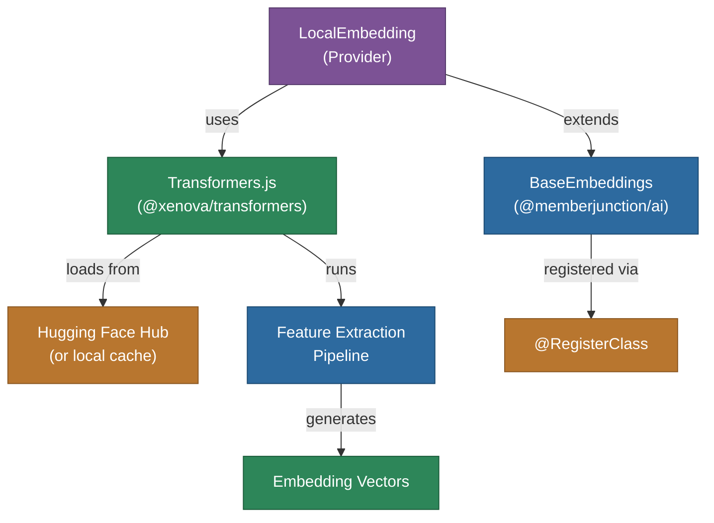

# @memberjunction/ai-local-embeddings

MemberJunction AI provider for local text embeddings using Transformers.js. This package runs embedding models directly on your machine, eliminating the need for external API calls, API keys, or per-token charges.

## Architecture



## Features

- **Offline Operation**: Run embedding models locally without internet (after initial download)
- **No API Keys Required**: Eliminate dependency on external services
- **Cost-Effective**: No per-token charges for embeddings
- **Privacy-Focused**: Data never leaves your infrastructure
- **Multiple Models**: Support for various sentence-transformer models from Hugging Face
- **Automatic Caching**: Models are downloaded once and cached locally
- **Batch Processing**: Efficient batch embedding with configurable batch sizes (default 32)
- **Model Preloading**: Warm up models before first inference
- **Quantized Models**: Use quantized models for better performance

## Supported Models

| Model | Dimensions | Description |
|-------|------------|-------------|
| `all-MiniLM-L6-v2` | 384 | Lightweight general-purpose embeddings |
| `all-MiniLM-L12-v2` | 384 | Higher quality with more layers |
| `all-mpnet-base-v2` | 768 | Best quality general-purpose embeddings |
| `paraphrase-multilingual-MiniLM-L12-v2` | 384 | Multilingual support (50+ languages) |
| `gte-small` | 384 | General Text Embeddings (efficient) |
| `bge-small-en-v1.5` | 384 | BAAI General Embeddings (English) |

## Installation

```bash
npm install @memberjunction/ai-local-embeddings
```

## Usage

### Single Text Embedding

```typescript
import { LocalEmbedding } from '@memberjunction/ai-local-embeddings';

const embedder = new LocalEmbedding();

const result = await embedder.EmbedText({
    text: 'Your text to embed',
    model: 'Xenova/all-MiniLM-L6-v2'
});

console.log(result.vector); // Float32Array of embedding values
```

### Batch Embedding

```typescript
const results = await embedder.EmbedTexts({
    texts: ['First text', 'Second text', 'Third text'],
    model: 'Xenova/all-MiniLM-L6-v2'
});

console.log(results.vectors.length); // 3 embedding vectors
```

### Configuration

```typescript
embedder.SetAdditionalSettings({
    cacheDir: '/path/to/model/cache',
    useQuantized: true
});
```

### Model Management

```typescript
// Preload a model for faster first inference
await embedder.preloadModel('Xenova/all-mpnet-base-v2');

// Clear model cache to free memory
embedder.clearCache();
LocalEmbedding.clearSharedCache(); // Static method
```

## Environment Variables

| Variable | Default | Description |
|----------|---------|-------------|
| `TRANSFORMERS_CACHE_DIR` | `./.cache/transformers` | Directory for storing downloaded models |
| `TRANSFORMERS_LOCAL_URL` | (empty) | Optional local URL for model files |

## ESM/CommonJS Compatibility

This package is built as CommonJS. The underlying `@xenova/transformers` library is ESM-only, so dynamic imports are used as a workaround (the official recommended approach by HuggingFace for CommonJS environments).

## Class Registration

Registered as `LocalEmbedding` via `@RegisterClass(BaseEmbeddings, 'LocalEmbedding')`.

## Dependencies

- `@memberjunction/ai` - Core AI abstractions
- `@memberjunction/global` - Class registration
- `@xenova/transformers` - Hugging Face Transformers.js runtime
