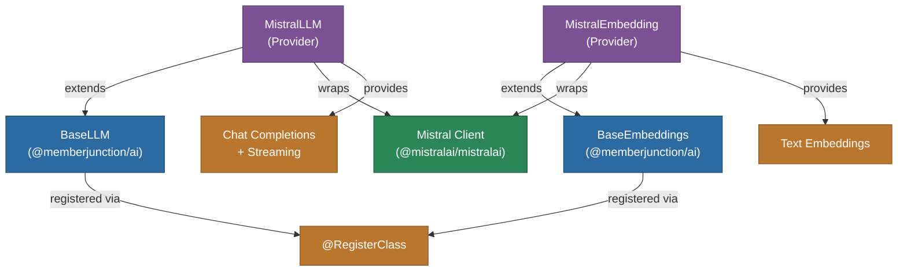

# @memberjunction/ai-mistral

MemberJunction AI provider for Mistral AI. This package provides both LLM and embedding capabilities using Mistral's models, implementing `BaseLLM` and `BaseEmbeddings` from `@memberjunction/ai`.

## Architecture



## Features

- **Chat Completions**: Conversational AI with Mistral Large, Medium, Small, and open models
- **Streaming**: Real-time response streaming support
- **Text Embeddings**: Vector embeddings via Mistral's embedding models
- **Thinking/Reasoning**: Extraction of thinking content from reasoning models
- **JSON Mode**: Response format control for structured outputs
- **Multimodal Support**: Handling of image content in messages

## Installation

```bash
npm install @memberjunction/ai-mistral
```

## Usage

### Chat Completion

```typescript
import { MistralLLM } from '@memberjunction/ai-mistral';

const llm = new MistralLLM('your-mistral-api-key');

const result = await llm.ChatCompletion({
    model: 'mistral-large-latest',
    messages: [
        { role: 'user', content: 'Explain transformers in machine learning.' }
    ],
    temperature: 0.7
});

if (result.success) {
    console.log(result.data.choices[0].message.content);
}
```

### Streaming

```typescript
const result = await llm.ChatCompletion({
    model: 'mistral-small-latest',
    messages: [{ role: 'user', content: 'Write a poem.' }],
    streaming: true,
    streamingCallbacks: {
        OnContent: (content) => process.stdout.write(content),
        OnComplete: () => console.log('\nDone!')
    }
});
```

### Embeddings

```typescript
import { MistralEmbedding } from '@memberjunction/ai-mistral';

const embedder = new MistralEmbedding('your-mistral-api-key');

const result = await embedder.EmbedText({
    text: 'Sample text for embedding',
    model: 'mistral-embed'
});

console.log(`Dimensions: ${result.vector.length}`);
```

## Supported Parameters

| Parameter | Supported | Notes |
|-----------|-----------|-------|
| temperature | Yes | Controls randomness |
| maxOutputTokens | Yes | Maximum response length |
| topP | Yes | Nucleus sampling |
| seed | Yes | Deterministic outputs |
| responseFormat | Yes | JSON mode support |
| streaming | Yes | Real-time streaming |

## Class Registration

- `MistralLLM` -- Registered via `@RegisterClass(BaseLLM, 'MistralLLM')`
- `MistralEmbedding` -- Registered via `@RegisterClass(BaseEmbeddings, 'MistralEmbedding')`

## Dependencies

- `@memberjunction/ai` - Core AI abstractions
- `@memberjunction/global` - Class registration
- `@mistralai/mistralai` - Official Mistral AI SDK
