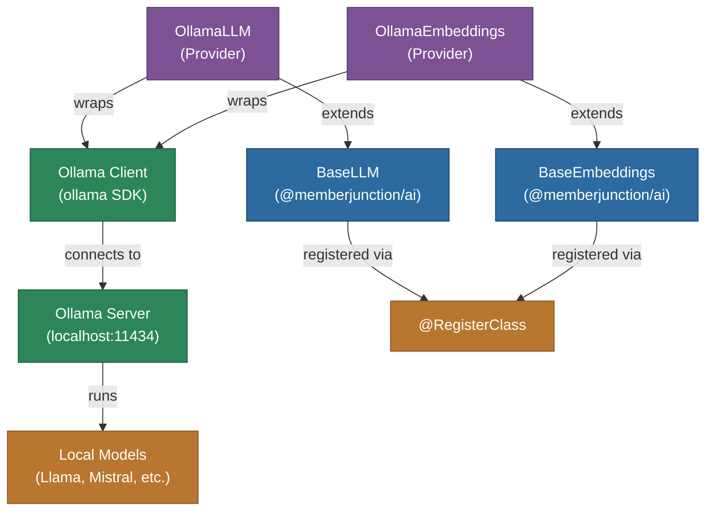

# @memberjunction/ai-ollama

MemberJunction AI provider for Ollama, enabling integration with locally-hosted open-source models. This package provides both LLM and embedding capabilities through Ollama's local inference server.

## Architecture



## Features

- **Local Model Hosting**: Run AI models locally via Ollama without cloud dependencies
- **Chat Completions**: Full conversational AI with any Ollama-hosted model
- **Embeddings**: Local text embeddings through Ollama's embedding API
- **Streaming**: Real-time response streaming
- **Multimodal Support**: Image input support for vision-capable models
- **Privacy**: All data stays on your local infrastructure
- **No API Key Required**: Connects to local Ollama server
- **Configurable Endpoint**: Support for custom host configuration

## Installation

```bash
npm install @memberjunction/ai-ollama
```

## Usage

### Chat Completion

```typescript
import { OllamaLLM } from '@memberjunction/ai-ollama';

const llm = new OllamaLLM('not-used'); // API key not needed for local

const result = await llm.ChatCompletion({
    model: 'llama3.1',
    messages: [
        { role: 'system', content: 'You are a helpful assistant.' },
        { role: 'user', content: 'Explain how Ollama works.' }
    ],
    temperature: 0.7
});

if (result.success) {
    console.log(result.data.choices[0].message.content);
}
```

### Streaming

```typescript
const result = await llm.ChatCompletion({
    model: 'llama3.1',
    messages: [{ role: 'user', content: 'Write a short story.' }],
    streaming: true,
    streamingCallbacks: {
        OnContent: (content) => process.stdout.write(content),
        OnComplete: () => console.log('\nDone!')
    }
});
```

### Embeddings

```typescript
import { OllamaEmbeddings } from '@memberjunction/ai-ollama';

const embedder = new OllamaEmbeddings('not-used');

const result = await embedder.EmbedText({
    text: 'Sample text for embedding',
    model: 'nomic-embed-text'
});

console.log(`Dimensions: ${result.vector.length}`);
```

## Prerequisites

1. Install [Ollama](https://ollama.ai/)
2. Pull a model: `ollama pull llama3.1`
3. Ollama server starts automatically on port 11434

## Configuration

The default endpoint is `http://localhost:11434`. Configure via `SetAdditionalSettings` for custom hosts.

## Class Registration

- `OllamaLLM` -- Registered via `@RegisterClass(BaseLLM, 'OllamaLLM')`
- `OllamaEmbeddings` -- Registered via `@RegisterClass(BaseEmbeddings, 'OllamaEmbeddings')`

## Dependencies

- `@memberjunction/ai` - Core AI abstractions
- `@memberjunction/global` - Class registration
- `ollama` - Official Ollama SDK
