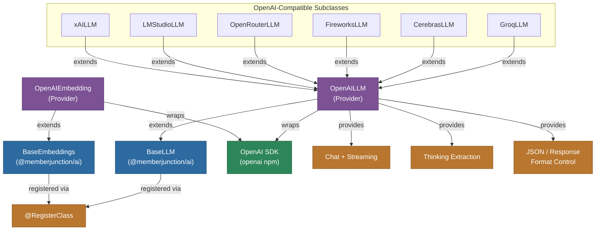

[Back to AI Framework Overview](../../README.md) | [All Providers](../README.md)

# @memberjunction/ai-openai

MemberJunction AI provider for OpenAI. Implements `BaseLLM`, `BaseEmbeddings`, `BaseImageGenerator`, and `BaseAudio` from `@memberjunction/ai`. This is the foundational LLM provider in MemberJunction -- many other providers (Groq, Cerebras, Fireworks, OpenRouter, LMStudio, xAI) extend this package since they use OpenAI-compatible APIs.

## Architecture



## Features

- **Chat Completions**: Full support for GPT-4.1, GPT-4o, o1, o3, o4-mini, and other OpenAI models
- **Streaming**: Real-time response streaming with chunk processing
- **Thinking/Reasoning**: Extraction of thinking content from reasoning model responses
- **Embeddings**: Text embedding generation via text-embedding-3-small/large and other models
- **Image Generation**: DALL-E integration via `BaseImageGenerator`
- **Audio**: Text-to-speech and speech-to-text via `BaseAudio`
- **Multimodal Input**: Support for text, image, audio, and file content in messages
- **Response Formats**: JSON mode, text, and structured output controls
- **Effort Level**: Maps MJ effort levels to OpenAI reasoning effort parameters
- **Error Analysis**: Integrated error analysis via `ErrorAnalyzer`
- **Extensible Base**: Designed as the foundation for any OpenAI-compatible provider

## Installation

```bash
npm install @memberjunction/ai-openai
```

## Usage

### Chat Completion

```typescript
import { OpenAILLM } from "@memberjunction/ai-openai";

const llm = new OpenAILLM("your-openai-api-key");

const result = await llm.ChatCompletion({
    model: "gpt-4.1",
    messages: [
        { role: "system", content: "You are a helpful assistant." },
        { role: "user", content: "Explain quantum computing." },
    ],
    temperature: 0.7,
    maxOutputTokens: 1000,
});

if (result.success) {
    console.log(result.data.choices[0].message.content);
}
```

### Streaming

```typescript
const result = await llm.ChatCompletion({
    model: "gpt-4.1",
    messages: [{ role: "user", content: "Write a detailed essay." }],
    streaming: true,
    streamingCallbacks: {
        OnContent: (content) => process.stdout.write(content),
        OnComplete: (result) => console.log("\nDone!"),
    },
});
```

### Embeddings

```typescript
import { OpenAIEmbedding } from "@memberjunction/ai-openai";

const embedder = new OpenAIEmbedding("your-openai-api-key");

const result = await embedder.EmbedText({
    text: "Sample text for embedding",
    model: "text-embedding-3-small",
});

console.log(`Dimensions: ${result.vector.length}`);
```

## Supported Parameters

| Parameter | Supported | Notes |
|-----------|-----------|-------|
| temperature | Yes | 0.0 - 2.0 |
| maxOutputTokens | Yes | Maximum tokens to generate |
| topP | Yes | Nucleus sampling |
| frequencyPenalty | Yes | -2.0 to 2.0 |
| presencePenalty | Yes | -2.0 to 2.0 |
| seed | Yes | Deterministic outputs |
| stopSequences | Yes | Custom stop sequences |
| responseFormat | Yes | JSON, text modes |
| streaming | Yes | Real-time streaming |
| effortLevel | Yes | Maps to reasoning_effort |
| topK | No | Not supported by OpenAI |
| minP | No | Not supported by OpenAI |

## Extending for Compatible APIs

This provider is designed as a base class for any OpenAI-compatible API. Override the base URL to point to a different service:

```typescript
import { OpenAILLM } from "@memberjunction/ai-openai";
import { RegisterClass } from "@memberjunction/global";
import { BaseLLM } from "@memberjunction/ai";
import OpenAI from "openai";

@RegisterClass(BaseLLM, "MyProviderLLM")
export class MyProviderLLM extends OpenAILLM {
    constructor(apiKey: string) {
        super(apiKey);
        this._openai = new OpenAI({
            apiKey,
            baseURL: "https://api.my-provider.com/v1",
        });
    }
}
```

## Class Registration

- `OpenAILLM` -- Registered via `@RegisterClass(BaseLLM, OpenAILLM)`
- `OpenAIEmbedding` -- Registered via `@RegisterClass(BaseEmbeddings, OpenAIEmbedding)`

## Dependencies

- `@memberjunction/ai` - Core AI abstractions
- `@memberjunction/global` - Class registration
- `openai` - Official OpenAI SDK
