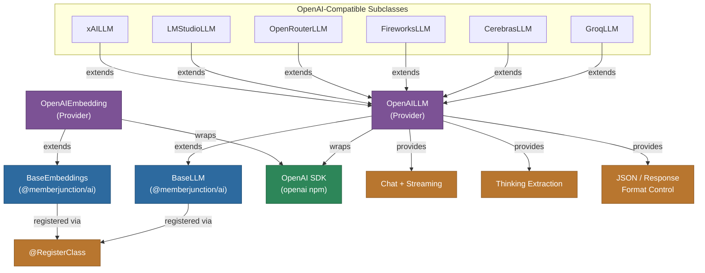

[Back to AI Framework Overview](../../README.md) | [All Providers](../README.md)

# @memberjunction/ai-openai

MemberJunction AI provider for OpenAI. Implements `BaseLLM`, `BaseEmbeddings`, `BaseImageGenerator`, `BaseAudio`, and `BaseDecision` (OpenAI's Decisions API) from `@memberjunction/ai`. This is the foundational LLM provider in MemberJunction -- many other providers (Groq, Cerebras, Fireworks, OpenRouter, LMStudio, xAI) extend this package since they use OpenAI-compatible APIs.

## Architecture


```mermaid
graph TD
    A["OpenAILLM<br/>(Provider)"] -->|extends| B["BaseLLM<br/>(@memberjunction/ai)"]
    C["OpenAIEmbedding<br/>(Provider)"] -->|extends| D["BaseEmbeddings<br/>(@memberjunction/ai)"]
    A -->|wraps| E["OpenAI SDK<br/>(openai npm)"]
    C -->|wraps| E
    A -->|provides| F["Chat + Streaming"]
    A -->|provides| G["Thinking Extraction"]
    A -->|provides| H["JSON / Response<br/>Format Control"]
    B -->|registered via| I["@RegisterClass"]
    D -->|registered via| I

    subgraph Subclasses["OpenAI-Compatible Subclasses"]
        J["GroqLLM"]
        K["CerebrasLLM"]
        L["FireworksLLM"]
        M["OpenRouterLLM"]
        N["LMStudioLLM"]
        O["xAILLM"]
    end
    J -->|extends| A
    K -->|extends| A
    L -->|extends| A
    M -->|extends| A
    N -->|extends| A
    O -->|extends| A

    style A fill:#7c5295,stroke:#563a6b,color:#fff
    style C fill:#7c5295,stroke:#563a6b,color:#fff
    style B fill:#2d6a9f,stroke:#1a4971,color:#fff
    style D fill:#2d6a9f,stroke:#1a4971,color:#fff
    style E fill:#2d8659,stroke:#1a5c3a,color:#fff
    style F fill:#b8762f,stroke:#8a5722,color:#fff
    style G fill:#b8762f,stroke:#8a5722,color:#fff
    style H fill:#b8762f,stroke:#8a5722,color:#fff
    style I fill:#b8762f,stroke:#8a5722,color:#fff
```

## Features

- **Chat Completions**: Full support for GPT-4.1, GPT-4o, o1, o3, o4-mini, and other OpenAI models
- **Streaming**: Real-time response streaming with chunk processing
- **Thinking/Reasoning**: Extraction of thinking content from reasoning model responses
- **Embeddings**: Text embedding generation via text-embedding-3-small/large and other models
- **Image Generation**: DALL-E integration via `BaseImageGenerator`
- **Audio**: Text-to-speech and speech-to-text (Whisper) via `OpenAIAudioGenerator`, which implements both `BaseTextToSpeech` and `BaseSpeechToText`
- **Multimodal Input**: Support for text, image, audio, and file content in messages
- **Response Formats**: JSON mode, text, and structured output controls
- **Effort Level**: Maps MJ effort levels to OpenAI reasoning effort parameters
- **Error Analysis**: Integrated error analysis via `ErrorAnalyzer`
- **Typed Decisions**: OpenAI's Decisions API (`gpt-6-luna`, public beta) via `OpenAIDecision`; see [Typed decisions](#typed-decisions-gpt-6-luna-decisions)
- **Extensible Base**: Designed as the foundation for any OpenAI-compatible provider

## Installation

```bash
npm install @memberjunction/ai-openai
```

## Usage

### Chat Completion

```typescript
import { OpenAILLM } from "@memberjunction/ai-openai";

const llm = new OpenAILLM("your-openai-api-key");

const result = await llm.ChatCompletion({
    model: "gpt-4.1",
    messages: [
        { role: "system", content: "You are a helpful assistant." },
        { role: "user", content: "Explain quantum computing." },
    ],
    temperature: 0.7,
    maxOutputTokens: 1000,
});

if (result.success) {
    console.log(result.data.choices[0].message.content);
}
```

### Streaming

```typescript
const result = await llm.ChatCompletion({
    model: "gpt-4.1",
    messages: [{ role: "user", content: "Write a detailed essay." }],
    streaming: true,
    streamingCallbacks: {
        OnContent: (content) => process.stdout.write(content),
        OnComplete: (result) => console.log("\nDone!"),
    },
});
```

### Embeddings

```typescript
import { OpenAIEmbedding } from "@memberjunction/ai-openai";

const embedder = new OpenAIEmbedding("your-openai-api-key");

const result = await embedder.EmbedText({
    text: "Sample text for embedding",
    model: "text-embedding-3-small",
});

console.log(`Dimensions: ${result.vector.length}`);
```

## Typed decisions (GPT-6 Luna Decisions)

`OpenAIDecision` is a `BaseDecision` driver for OpenAI's **Decisions API** (`POST https://api.openai.com/v1/decisions`), which OpenAI announced at DevDay on September 29, 2026. **The API is in public beta** (OpenAI says GA is coming in the next few weeks), so expect changes. It serves one model, `gpt-6-luna`, which MJ's catalog lists as the `GPT-6 Luna Decisions` model. That model has the `Decision` type and is separate from the `GPT-6 Luna` LLM. It answers Likelihood, Choice and Score questions with a probability for every allowed option and writes no text. OpenAI charges $0.10 per million input tokens, with no output or cache charge, and reports a latency of about 150 ms.

```typescript
import { OpenAIDecision } from "@memberjunction/ai-openai";

const luna = new OpenAIDecision("your-openai-api-key");
const result = await luna.Decide({
    Model: "gpt-6-luna",
    State: "I was charged twice for March. Please refund the duplicate.",
    Questions: {
        refund: { Kind: "Likelihood", Instructions: "Is the customer asking for money back?" },
        team: {
            Kind: "Choice",
            Instructions: "Which team should handle this?",
            Options: [
                { Value: "billing", Description: "Payments, invoices and refunds" },
                { Value: "technical", Description: "Outages and errors" },
            ],
        },
    },
});
// result.Answers.refund → { Kind: 'Likelihood', Probability: … }
```

Most callers reach it through `AIDecisionRunner` (`@memberjunction/ai-prompts`) with `override.modelId` naming `GPT-6 Luna Decisions`, or a Decision prompt bound to it.

**Two routes.** The model has two Inference Provider rows:

| Vendor | Driver | `APIName` | Priority |
|---|---|---|---|
| OpenAI | `OpenAIDecision` (this package) | `gpt-6-luna` | 2 (preferred) |
| OpenRouter | `OpenRouterDecision` ([`@memberjunction/ai-openrouter`](../OpenRouter/README.md)) | `openai/gpt-6-luna-decisions-20261006` (pinned), 1,050,000-token context | 1 |

OpenRouter serves the model through its own Decisions API, which speaks the System One format, so the OpenRouter route needs no new code. The runner picks the higher-priority row that has a credential and fails over to the other when that call fails with an error that allows failover.

**The wire format.** The format is OpenAI's own, not System One, so `OpenAIDecision` extends `BaseDecision` directly. Its shape comes from OpenAI's Node SDK (`openai` 7.30.0, `client.decisions.create`). MJ's `openai` dependency is 6.18.0, which has no `decisions` resource, so the driver calls the endpoint with `fetch`.
- The request is `{ model, input, questions }`. `questions` is an ordered array, and each entry is named by its MJ question key:
  - a Likelihood is `{ type: 'predicate' }`;
  - a Choice has `choices: [{ value, description }]`;
  - a Score has `levels: [{ label }]`.
- The state is sent as `input`. An object state is sent as JSON text.
- Answers come back in question order and carry the question's `name`. The driver matches them by name, and by position only when an answer has no name.
- A Choice's probabilities are keyed by option value, and a Score's by level label. Both are renormalised.
- A Score's `score` is mapped onto MJ's 0-based level positions through each level's numeric `value`.
- Usage comes from `input_tokens` and `output_tokens`. The response carries no cost, so `AIDecisionRunner` prices the run from the model's cost row.

**Refusals.** OpenAI can decline any question, and returns `{ type: 'refusal', name }` for it. The result then fails with an error that names the question (`Question 'team': OpenAI declined to answer it (refusal)`). That error allows failover, so the runner tries the next candidate, such as the OpenRouter row.

**Configuration.**
- **Key.** Bind an `API Key` credential to the OpenAI vendor or to the model's OpenAI row, or set the legacy variable `AI_VENDOR_API_KEY__OPENAIDECISION`. A bound credential reaches the driver as JSON (`{"apiKey":"…"}`); the driver sends its `apiKey` as the bearer token, never the JSON.
- **No key.** With no key, the runner skips this route. A driver built with an empty key fails before any request with a `NoCredentials` error that allows failover. The same happens when the key starts with `{` but is not valid JSON.
- **Endpoint.** The default is `https://api.openai.com/v1/decisions`. To change it, pass a second constructor argument or give the credential an `endpoint`. A URL that does not end in `/decisions`, such as an SDK-style base ending in `/v1`, gets `/decisions` appended.
- **Errors.** A non-2xx response throws an error that carries the HTTP status and OpenAI's `error.message`, with the key redacted if the body ever echoes it. `ErrorAnalyzer` classifies it: a 429 or 5xx fails over, and a 401 stops the failover loop.

**Not documented by OpenAI yet.** OpenAI has not published per-request limits (questions per call, options per Choice, levels per Score, context) or Azure OpenAI availability. So the model's `Decision` limits are left unset, and the OpenAI row has no input-token limit. The API also accepts images, as data URLs only and at most 128 per request; MJ sends the state as text and does not use them yet.

**Default Decision.** `Default Decision` does not bind this model, and its bindings are unchanged. As an active `Decision` model, it is one of the power-matched fallbacks of any Decision prompt that does not require specific models. Its PowerRank is 57, below Jev (60) and Clef (58) because it is unmeasured on MJ's data, and that puts it first among `Default Decision`'s fallbacks, after Jev and `LLM Decision`. A call reaches it only when every credentialed candidate ahead of it has failed with an error that allows failover, and only when one of its rows has a credential. An OpenRouter key set for Jev also works for its OpenRouter row.

## Supported Parameters

| Parameter | Supported | Notes |
|-----------|-----------|-------|
| temperature | Yes | 0.0 - 2.0 |
| maxOutputTokens | Yes | Maximum tokens to generate |
| topP | Yes | Nucleus sampling |
| frequencyPenalty | Yes | -2.0 to 2.0 |
| presencePenalty | Yes | -2.0 to 2.0 |
| seed | Yes | Deterministic outputs |
| stopSequences | Yes | Custom stop sequences |
| responseFormat | Yes | JSON, text modes |
| streaming | Yes | Real-time streaming |
| effortLevel | Yes | Maps to reasoning_effort |
| topK | No | Not supported by OpenAI |
| minP | No | Not supported by OpenAI |

## Extending for Compatible APIs

This provider is designed as a base class for any OpenAI-compatible API. Override the base URL to point to a different service:

```typescript
import { OpenAILLM } from "@memberjunction/ai-openai";
import { RegisterClass } from "@memberjunction/global";
import { BaseLLM } from "@memberjunction/ai";
import OpenAI from "openai";

@RegisterClass(BaseLLM, "MyProviderLLM")
export class MyProviderLLM extends OpenAILLM {
    constructor(apiKey: string) {
        super(apiKey);
        this._openai = new OpenAI({
            apiKey,
            baseURL: "https://api.my-provider.com/v1",
        });
    }
}
```

## Class Registration

- `OpenAILLM` -- Registered via `@RegisterClass(BaseLLM, OpenAILLM)`
- `OpenAIEmbedding` -- Registered via `@RegisterClass(BaseEmbeddings, OpenAIEmbedding)`
- `OpenAIAudioGenerator` -- Registered under the key `'OpenAIAudioGenerator'` against `BaseTextToSpeech`, `BaseSpeechToText` and the deprecated `BaseAudioGenerator`, so the TTS and speech-to-text runners and older callers all resolve it
- `OpenAIDecision` -- Registered via `@RegisterClass(BaseDecision, 'OpenAIDecision')`. The `GPT-6 Luna Decisions` model's OpenAI row names it as its `DriverClass`

## Dependencies

- `@memberjunction/ai` - Core AI abstractions
- `@memberjunction/global` - Class registration
- `openai` - Official OpenAI SDK

## Realtime driver family (`OpenAIRealtime`)

`OpenAIRealtime` / `OpenAIRealtimeSession` implement the OpenAI **GA Realtime API** wire protocol ONCE, parameterized by an `OpenAIRealtimeProfile` (transcription model, turn detection, config timing, live-reconfigure support, GA feature gates, effort mapping). OpenAI-compatible providers **subclass** this driver with their own profile instead of cloning it — xAI Grok Voice (`@memberjunction/ai-xai`) via the same SDK socket, and self-hosted HuggingFace (`@memberjunction/ai-huggingface`) via the exported `RawRealtimeWebSocketConnection` adapter (raw WS speaking OpenAI frames → `IOpenAIRealtimeConnection`, with send-buffering until open and SDK-mirroring dual error channels).

### Session `Config` bag keys

MJ-idiomatic keys are extracted (`ExtractRealtimeFeatures`), translated to provider-native fields **only when the profile confirms support**, and always scrubbed so raw keys never reach a provider:

| Key | Meaning |
|---|---|
| `effortLevel` | MJ-normalized effort (`ChatParams.effortLevel` vocabulary: numeric 1–100 or named). Mapped per provider via the profile's `mapEffortLevel` seam — OpenAI: quintiles over `minimal/low/medium/high/xhigh` (`MapEffortLevelToOpenAIRealtime`). |
| `reasoningEffort` | Provider-native effort literal — explicit override, wins over `effortLevel`. |
| `parallelToolCalls` | → `parallel_tool_calls`. |
| `mcpTools` | Remote MCP server tools appended to `session.tools`. **No approval UX exists yet — approval requests are AUTO-DENIED** (the model voices the refusal); declare servers with `require_approval: 'never'`. |
| `inputTranscriptionModel` | Per-session ASR override (falls back to the profile's model; natively-transcribing profiles send no block). |
| `voice` / `disableAutoResponse` | Output voice / meeting-mode gating (as before). |
| `endpoint`, `sampleRate`, `proxyBaseUrl` | MJ-side transport settings — always scrubbed. |

**Protected wire fields**: `type`, `instructions`, and `tools` can never be overridden through the bag (scrubbed with a diag log); `audio` remains the one documented override channel. Residual provider-native keys (`tool_choice`, `output_modalities`, …) spread into the session payload **identically on both topologies** (server-bridged `session.update` and the client-direct minted `SessionConfig`).

### Readiness, usage, and lifecycle

- `WaitForConfigApplied()` resolves once the initial config is on the socket (deferred to `session.created` on OpenAI). A **15s readiness deadline** (`configReadinessTimeoutMs`, overridable) rejects awaiting callers on a silent endpoint WITHOUT cancelling the deferred apply.
- `response.done` usage surfaces **per-modality token detail** (`RealtimeUsage.InputTokenDetails`/`OutputTokenDetails`: text/audio/image/cached) — required for multi-channel cost attribution (audio-in bills ~8× text-in on GPT Realtime 2.1).
- `Capabilities.CanReconfigureTurnMode` is profile-gated (`supportsLiveReconfigure`); `Reconfigure` no-ops on profiles that declare no support.

## OpenAI Live driver (`OpenAILiveRealtime`)

`OpenAILiveRealtime` (`@RegisterClass(BaseRealtimeModel, 'OpenAILiveRealtime')`) implements the server model driver for the **OpenAI Live API (`gpt-live-1`)**:
- **Endpoint**: `https://api.openai.com/v1/realtime/calls` WebRTC SDP exchange and session minting.
- **Client Session Minting**: Generates client session configurations for browser WebRTC direct connection via `OpenAILiveClient`.
- **Wire Event Compliance**: Enforces OpenAI Live wire protocol — tool outputs are delivered as `response.item.create` (type `function_call_output`), followed by `response.create` coordinated by `RealtimeToolBatchBarrier`. Does not emit `conversation.item.create` (which is rejected by OpenAI Live).
- **Tool Projection & Execution**: Direct actions and subagent delegations (`invoke-target-agent`) are projected directly into the Live session tools schema, allowing the model to invoke direct tools and target agents concurrently.
