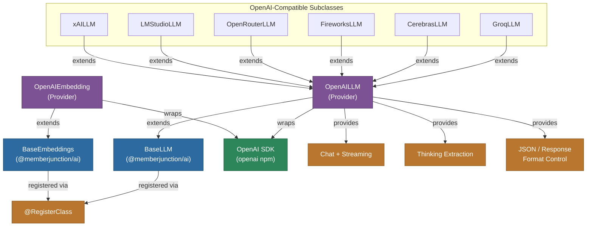

# @memberjunction/ai-openai

MemberJunction AI provider for OpenAI. This is the foundational LLM provider in MemberJunction, implementing `BaseLLM` and `BaseEmbeddings` from `@memberjunction/ai`. Many other providers (Groq, Cerebras, Fireworks, OpenRouter, LMStudio, xAI) extend this package since they use OpenAI-compatible APIs.

## Architecture



## Features

- **Chat Completions**: Full support for GPT-4, GPT-4o, o1, o3, and other OpenAI models
- **Streaming**: Real-time response streaming with chunk processing
- **Thinking/Reasoning**: Extraction of thinking content from `<think>` blocks in reasoning model responses
- **Embeddings**: Text embedding generation via OpenAI embedding models
- **Multimodal Input**: Support for text and image content in messages
- **Response Formats**: JSON mode, text, and other format controls
- **Effort Level**: Maps MJ effort levels to OpenAI reasoning effort parameters
- **Error Analysis**: Integrated error analysis via `ErrorAnalyzer`
- **Extensible Base**: Designed as the foundation for OpenAI-compatible providers

## Installation

```bash
npm install @memberjunction/ai-openai
```

## Usage

### Chat Completion

```typescript
import { OpenAILLM } from '@memberjunction/ai-openai';

const llm = new OpenAILLM('your-openai-api-key');

const result = await llm.ChatCompletion({
    model: 'gpt-4o',
    messages: [
        { role: 'system', content: 'You are a helpful assistant.' },
        { role: 'user', content: 'Explain quantum computing.' }
    ],
    temperature: 0.7,
    maxOutputTokens: 1000
});

if (result.success) {
    console.log(result.data.choices[0].message.content);
}
```

### Streaming

```typescript
const result = await llm.ChatCompletion({
    model: 'gpt-4o',
    messages: [{ role: 'user', content: 'Write a detailed essay.' }],
    streaming: true,
    streamingCallbacks: {
        OnContent: (content) => process.stdout.write(content),
        OnComplete: (result) => console.log('\nDone!')
    }
});
```

### Embeddings

```typescript
import { OpenAIEmbedding } from '@memberjunction/ai-openai';

const embedder = new OpenAIEmbedding('your-openai-api-key');

const result = await embedder.EmbedText({
    text: 'Sample text for embedding',
    model: 'text-embedding-3-small'
});

console.log(`Dimensions: ${result.vector.length}`);
```

## Supported Parameters

| Parameter | Supported | Notes |
|-----------|-----------|-------|
| temperature | Yes | 0.0 - 2.0 |
| maxOutputTokens | Yes | Maximum tokens to generate |
| topP | Yes | Nucleus sampling |
| frequencyPenalty | Yes | -2.0 to 2.0 |
| presencePenalty | Yes | -2.0 to 2.0 |
| seed | Yes | Deterministic outputs |
| stopSequences | Yes | Custom stop sequences |
| responseFormat | Yes | JSON, text modes |
| streaming | Yes | Real-time streaming |
| effortLevel | Yes | Maps to reasoning_effort |
| topK | No | Not supported by OpenAI |
| minP | No | Not supported by OpenAI |

## Extending for Compatible APIs

This provider is designed as a base class for any OpenAI-compatible API. To create a new provider, override the base URL:

```typescript
import { OpenAILLM } from '@memberjunction/ai-openai';
import { RegisterClass } from '@memberjunction/global';
import { BaseLLM } from '@memberjunction/ai';

@RegisterClass(BaseLLM, 'MyProviderLLM')
export class MyProviderLLM extends OpenAILLM {
    constructor(apiKey: string) {
        super(apiKey);
        // Override the base URL
        this._openai = new OpenAI({
            apiKey: apiKey,
            baseURL: 'https://api.my-provider.com/v1'
        });
    }
}
```

## Class Registration

- `OpenAILLM` -- Registered via `@RegisterClass(BaseLLM, 'OpenAILLM')`
- `OpenAIEmbedding` -- Registered via `@RegisterClass(BaseEmbeddings, 'OpenAIEmbedding')`

## Dependencies

- `@memberjunction/ai` - Core AI abstractions
- `@memberjunction/global` - Class registration
- `openai` - Official OpenAI SDK
