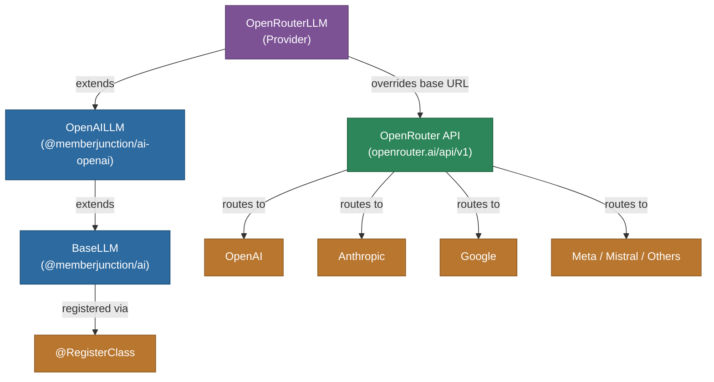

# @memberjunction/ai-openrouter

MemberJunction AI provider for OpenRouter, a unified API gateway that provides access to 100+ AI models from multiple providers (OpenAI, Anthropic, Google, Meta, Mistral, and more) through a single endpoint.

## Architecture



## Features

- **Multi-Model Access**: Access models from OpenAI, Anthropic, Google, Meta, Mistral, xAI, and many more
- **Automatic Routing**: OpenRouter handles provider selection and failover
- **OpenAI Compatible**: Inherits all features from the OpenAI provider
- **Streaming**: Full streaming support for real-time responses
- **Thinking/Reasoning**: Thinking block extraction for reasoning models
- **Response Formats**: JSON mode support for compatible models

## Installation

```bash
npm install @memberjunction/ai-openrouter
```

## Usage

```typescript
import { OpenRouterLLM } from '@memberjunction/ai-openrouter';

const llm = new OpenRouterLLM('your-openrouter-api-key');

const result = await llm.ChatCompletion({
    model: 'anthropic/claude-sonnet-4-20250514',
    messages: [
        { role: 'user', content: 'Explain quantum computing in simple terms.' }
    ]
});

console.log(result.data.choices[0].message.content);
```

## How It Works

`OpenRouterLLM` is a thin subclass of `OpenAILLM` that redirects all API calls to OpenRouter's endpoint at `https://openrouter.ai/api/v1`. Since OpenRouter implements an OpenAI-compatible API, all chat, streaming, and parameter handling logic is inherited from the OpenAI provider.

## Supported Models

OpenRouter provides access to models from many providers. Use the provider-prefixed model names:

- `openai/gpt-4`, `openai/gpt-4-turbo`
- `anthropic/claude-sonnet-4-20250514`, `anthropic/claude-3-opus`
- `google/gemini-pro`, `google/gemini-flash`
- `meta-llama/llama-3.1-70b`
- `mistralai/mistral-large`
- And 100+ more at [openrouter.ai/models](https://openrouter.ai/models)

## Class Registration

Registered as `OpenRouterLLM` via `@RegisterClass(BaseLLM, 'OpenRouterLLM')`.

## Dependencies

- `@memberjunction/ai` - Core AI abstractions
- `@memberjunction/ai-openai` - OpenAI provider (parent class)
- `@memberjunction/global` - Class registration
