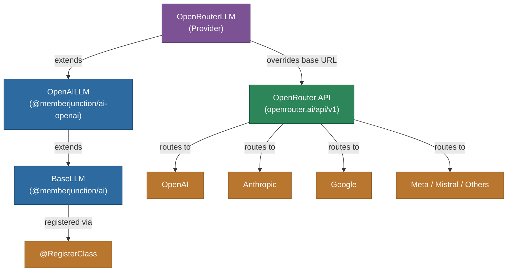

# @memberjunction/ai-openrouter

MemberJunction AI provider for OpenRouter, a unified API gateway that provides access to 100+ AI models from multiple providers (OpenAI, Anthropic, Google, Meta, Mistral, and more) through a single endpoint.

## Architecture


```mermaid
graph TD
    A["OpenRouterLLM<br/>(Provider)"] -->|extends| B["OpenAILLM<br/>(@memberjunction/ai-openai)"]
    B -->|extends| C["BaseLLM<br/>(@memberjunction/ai)"]
    A -->|overrides base URL| D["OpenRouter API<br/>(openrouter.ai/api/v1)"]
    D -->|routes to| E["OpenAI"]
    D -->|routes to| F["Anthropic"]
    D -->|routes to| G["Google"]
    D -->|routes to| H["Meta / Mistral / Others"]
    C -->|registered via| I["@RegisterClass"]

    style A fill:#7c5295,stroke:#563a6b,color:#fff
    style B fill:#2d6a9f,stroke:#1a4971,color:#fff
    style C fill:#2d6a9f,stroke:#1a4971,color:#fff
    style D fill:#2d8659,stroke:#1a5c3a,color:#fff
    style E fill:#b8762f,stroke:#8a5722,color:#fff
    style F fill:#b8762f,stroke:#8a5722,color:#fff
    style G fill:#b8762f,stroke:#8a5722,color:#fff
    style H fill:#b8762f,stroke:#8a5722,color:#fff
    style I fill:#b8762f,stroke:#8a5722,color:#fff
```

## Features

- **Multi-Model Access**: Access models from OpenAI, Anthropic, Google, Meta, Mistral, xAI, and many more
- **Automatic Routing**: OpenRouter handles provider selection and failover
- **OpenAI Compatible**: Inherits all features from the OpenAI provider
- **Streaming**: Full streaming support for real-time responses
- **Thinking/Reasoning**: Thinking block extraction for reasoning models
- **Response Formats**: JSON mode support for compatible models

## Installation

```bash
npm install @memberjunction/ai-openrouter
```

## Usage

```typescript
import { OpenRouterLLM } from '@memberjunction/ai-openrouter';

const llm = new OpenRouterLLM('your-openrouter-api-key');

const result = await llm.ChatCompletion({
    model: 'anthropic/claude-sonnet-4-20250514',
    messages: [
        { role: 'user', content: 'Explain quantum computing in simple terms.' }
    ]
});

console.log(result.data.choices[0].message.content);
```

## Typed decisions (Jev)

`OpenRouterDecision` is a `BaseDecision` driver for OpenRouter's Decisions API
(`POST https://openrouter.ai/api/alpha/decisions`), which serves TypeSafe's Jev decision model.
It answers Likelihood, Choice and Score questions with typed probabilities, so nothing is parsed
from prose. Most callers reach it through `AIDecisionRunner` (`@memberjunction/ai-prompts`) and the
`Default Decision` prompt, where the `Jev` model is the first choice.

```typescript
import { OpenRouterDecision } from '@memberjunction/ai-openrouter';

const jev = new OpenRouterDecision('your-openrouter-api-key');
const result = await jev.Decide({
    Model: 'typesafe/jev-1.13-20260917',
    State: 'I was charged twice for March. Please refund the duplicate.',
    Questions: {
        refund: { Kind: 'Likelihood', Instructions: 'Is the customer asking for money back?' },
    },
});
// result.Answers.refund → { Kind: 'Likelihood', Probability: 0.97 }
```

**Credentials.** When it runs through `AIDecisionRunner`, the key resolves like any model's: an AI
Credential Binding on the `Default Decision` prompt's Jev row or on the Jev model-vendor row, or else
the legacy environment variable. The legacy variable is keyed by driver class, so Jev needs its own:

```bash
AI_VENDOR_API_KEY__OPENROUTERDECISION=sk-or-...   # the same OpenRouter key as AI_VENDOR_API_KEY__OPENROUTERLLM
```

Without a key the runner skips Jev and falls back to the next decision model (`LLM Decision`), and
logs that once per process.

## How It Works

`OpenRouterLLM` is a thin subclass of `OpenAILLM` that redirects all API calls to OpenRouter's endpoint at `https://openrouter.ai/api/v1`. Since OpenRouter implements an OpenAI-compatible API, all chat, streaming, and parameter handling logic is inherited from the OpenAI provider.

## Supported Models

OpenRouter provides access to models from many providers. Use the provider-prefixed model names:

- `openai/gpt-4`, `openai/gpt-4-turbo`
- `anthropic/claude-sonnet-4-20250514`, `anthropic/claude-3-opus`
- `google/gemini-pro`, `google/gemini-flash`
- `meta-llama/llama-3.1-70b`
- `mistralai/mistral-large`
- And 100+ more at [openrouter.ai/models](https://openrouter.ai/models)

## Class Registration

Registered as `OpenRouterLLM` via `@RegisterClass(BaseLLM, 'OpenRouterLLM')`, and `OpenRouterDecision` via `@RegisterClass(BaseDecision, 'OpenRouterDecision')`.

## Dependencies

- `@memberjunction/ai` - Core AI abstractions
- `@memberjunction/ai-openai` - OpenAI provider (parent class)
- `@memberjunction/global` - Class registration
