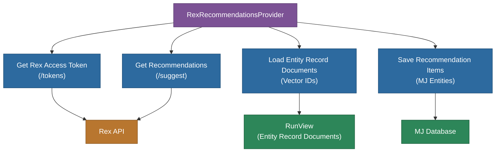

# @memberjunction/ai-recommendations-rex

MemberJunction recommendation provider for the rasa.io Rex recommendation engine. Retrieves content recommendations from Rex and saves them into MJ Recommendation/Recommendation Item entities.

## Overview

This package implements `RecommendationProviderBase` for the rasa.io Rex engine. It authenticates with the Rex API, looks up vector IDs from MJ Entity Record Documents, requests content-based recommendations via Rex's `/suggest` endpoint, and persists the results as `RecommendationItem` entities in the MemberJunction database.



## Features

- **Rex API integration**: Authenticates and retrieves recommendations from the rasa.io Rex engine
- **Batch processing**: Processes recommendations in configurable batch sizes (default 200)
- **Vector ID resolution**: Looks up Pinecone vector IDs from MJ Entity Record Documents
- **Type mapping**: Configurable mapping from Rex content types to MJ entity names
- **Score clamping**: Normalizes recommendation scores to a 0-1 probability range
- **Error tracking**: Optionally logs errors to a MJ List for review
- **Auto-registration**: Registers with MJ class factory as `"rasa.io Rex"`

## Installation

```bash
npm install @memberjunction/ai-recommendations-rex
```

## Configuration

Set the following environment variables:

| Variable | Required | Description |
|---|---|---|
| `REX_API_HOST` | Yes | Rex API base URL for authentication |
| `REX_RECOMMEND_HOST` | Yes | Rex recommendation service URL |
| `REX_USERNAME` | Yes | Rex API username |
| `REX_PASSWORD` | Yes | Rex API password |
| `REX_API_KEY` | Yes | Rex API key |
| `REX_BATCH_SIZE` | No | Batch size for processing (default: 200) |

## Usage

```typescript
import { RexRecommendationsProvider } from '@memberjunction/ai-recommendations-rex';
import { RecommendationRequest } from '@memberjunction/ai-recommendations';

// The provider is auto-registered as "rasa.io Rex" via @RegisterClass.
// It can also be instantiated directly:
const provider = new RexRecommendationsProvider();

const request: RecommendationRequest = {
  Recommendations: recommendationEntities,  // Array of RecommendationEntity
  RunID: 'run-id',
  CurrentUser: contextUser,
  Options: {
    EntityDocumentID: 'entity-doc-id',  // Required
    type: 'course',                     // Rex content type
    filters: [{ type: 'course', max_results: 10 }],
    TypeMap: {                          // Optional: custom type-to-entity mapping
      'course': 'Contents',
      'person': 'Contributors'
    }
  }
};

const result = await provider.Recommend(request);

if (result.Success) {
  console.log('Recommendations generated successfully');
} else {
  console.error('Errors:', result.Errors);
}
```

## Key Dependencies

| Dependency | Purpose |
|---|---|
| `@memberjunction/ai-recommendations` | `RecommendationProviderBase` abstract class |
| `@memberjunction/core` | `Metadata`, `RunView`, `LogError`, `LogStatus` |
| `@memberjunction/core-entities` | Entity types (`RecommendationEntity`, `RecommendationItemEntity`, etc.) |
| `@memberjunction/global` | `@RegisterClass` decorator |
| `axios` | HTTP client for Rex API calls |

## Related Packages

- [`@memberjunction/ai-recommendations`](../../Recommendations) - Base recommendation provider abstraction
- [`@memberjunction/ai-vectors-pinecone`](../Vectors-Pinecone) - Pinecone vector database provider (source of vector IDs)

## License

ISC
