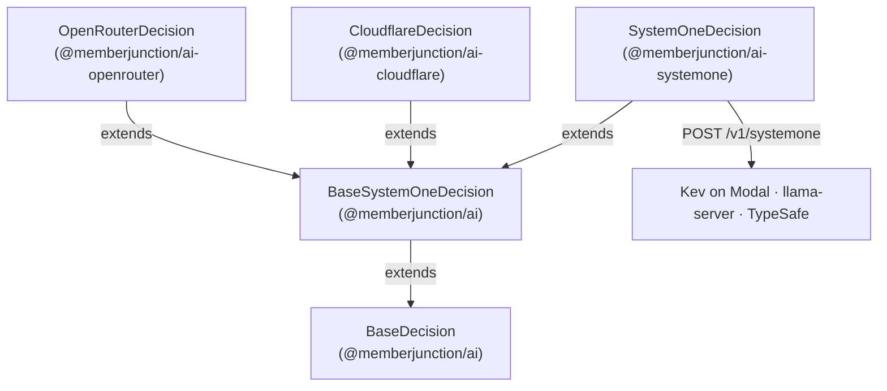

# @memberjunction/ai-systemone

MemberJunction driver for any server that speaks TypeSafe's System One decisions API, `POST {base}/v1/systemone`. It ships one driver, `SystemOneDecision`, a `BaseDecision` driver that covers three kinds of server:

| Server | How you run it | Auth |
|---|---|---|
| **Kev's own server** | `modal deploy kev_serve.py` gives `https://<workspace>--kev-api.modal.run`. One deployment serves one Kev size; it scales to zero, and the first request after 5 idle minutes waits 35 to 55 seconds for a container. | A bearer token when `KEV_API_KEY` is set on the server |
| **llama.cpp's `llama-server`** | `llama-server -hf ggml-org/Kev-4B-GGUF` (other sizes exist), on any machine, cloud VM or Hugging Face Inference Endpoint | Open by default; a bearer token with `--api-key` |
| **TypeSafe's own API** | Hosted by TypeSafe | A bearer token |

The models it serves in MJ's catalog are Jared Palmer's open-weight Kev 1.0 decision models: `Kev-0.8B`, `Kev-4B`, `Kev-9B` and `Kev-27B`, each with a row on the `System One Endpoint` vendor. `Kev-4B` is also on OpenRouter, through `OpenRouterDecision` in `@memberjunction/ai-openrouter`; that row has the higher priority, so a host with an OpenRouter key uses it first.

## Architecture



`BaseSystemOneDecision` owns the System One request and answer mapping. `SystemOneDecision` adds the endpoint, the optional token and error messages that name what the server said.

## Configuration

**The endpoint** is read in this order:

1. the constructor's second argument;
2. the credential's `endpoint`: bind an AI Credential of type **API Key with Endpoint** to the model's `System One Endpoint` row;
3. the `SYSTEMONE_BASE_URL` environment variable.

`/v1/systemone` is appended unless the URL already ends with it (a URL ending in `/v1` gets `/systemone`). With no endpoint, the call fails before any request with a `NoCredentials` error naming both options. It allows failover, so an unconfigured Kev size does not stop the runner from trying the next decision model, including another Kev size with its own endpoint.

**One server per model.** A Kev deployment serves exactly one size, and every Kev size's row shares the one `System One Endpoint` vendor, so bind each credential to a **model-vendor row**: one `API Key with Endpoint` credential on `Kev-4B`'s `System One Endpoint` row, another on `Kev-27B`'s. The runner looks for a binding on the prompt-model row first, then the model-vendor row, then the vendor, then a default credential of the vendor's type, then the legacy environment variable.

> **Do not bind a Kev endpoint at the vendor level, or as the type's default credential, or through `SYSTEMONE_BASE_URL` alone, unless you run one Kev size only.** Each of those resolves for *every* Kev row, so every size would be sent to the same server, and the runs would be recorded against sizes that never answered. The server cannot tell you: Kev's server accepts the same model names (`kev-latest`, `jev-latest`) whatever size it serves, and echoes the name it was sent. If you do run one size only, deactivate the other sizes' `System One Endpoint` rows.

**The token** is optional. With one, the request carries `Authorization: Bearer <token>`. With none, it carries no `Authorization` header, because a local `llama-server` or Kev server is open by default. Leave the credential's `apiKey` empty for an open server.

**Legacy environment variables.** `AIDecisionRunner` only selects a candidate it has a credential for, so an environment-only setup needs the key variable too, even for an open server (an open server ignores the header):

```bash
SYSTEMONE_BASE_URL=https://acme--kev-api.modal.run
AI_VENDOR_API_KEY__SYSTEMONEDECISION=your-kev-api-key   # any placeholder for an open server
```

**The model.** The body's `model` is the model-vendor row's `APIName`, `kev-latest` by default. Kev's server accepts `kev-latest` and `jev-latest`; one deployment serves whichever Kev size it was started with.

**Timeouts.** The driver sets none of its own, so a cold start is not cut short. The caller's cancellation and timeout (`AIDecisionParams.cancellationToken`, `timeoutMS`) apply.

## Usage

```typescript
import { SystemOneDecision } from '@memberjunction/ai-systemone';

// An open llama-server on this machine.
const kev = new SystemOneDecision('', 'http://127.0.0.1:8080');
const result = await kev.Decide({
    Model: 'kev-latest',
    State: 'Checkout has been failing for every customer for the last hour.',
    Questions: {
        urgent: { Kind: 'Likelihood', Instructions: 'Is this support request urgent?' },
    },
});
// result.Answers.urgent → { Kind: 'Likelihood', Probability: 0.87 }
```

Through `AIDecisionRunner`, name the model and the vendor:

```typescript
params.override = { modelId: kev4b.ID, vendorId: systemOneEndpoint.ID };
```

The shipped `Default Decision` prompt does not bind any Kev model.

**As a fallback.** Like every active `Decision` model, each Kev size joins the power-matched fallback candidates of any Decision prompt that does not set `RequireSpecificModels`, ranked by closeness to the prompt's `PowerRank`, and only when its credential resolves. For the shipped `Default Decision` that means after Jev and `LLM Decision`. `LLM Decision` needs no credential and `Default Decision` has no failover strategy, so in practice Kev is reached there only when `LLM Decision` is unavailable or failover is turned on. `Kev-4B`'s OpenRouter row uses the same OpenRouter key as Jev, so a host already set up for Jev has Kev-4B among those fallbacks with no further setup.

## Errors and failover

- A `429` or a `5xx` is thrown with its HTTP status, so `AIDecisionRunner` fails over to the next decision model.
- A missing endpoint fails before any request with a `NoCredentials` error that allows failover.
- A `401` is an `Authentication` error. `ErrorAnalyzer` rates it fatal, which stops the failover loop.
- The message names the server's own text: Kev's `detail` (a string, or a list of `{ msg }`) or llama.cpp's `error.message`.
- A response that cannot be mapped fails with a `ModelError` that allows failover.

## Not supported yet

- **Images.** llama.cpp and Clef accept images with the state; MJ's `DecisionParams` has none, so the driver does not send them.

## Class Registration

Registered as `SystemOneDecision` via `@RegisterClass(BaseDecision, 'SystemOneDecision')`. The Kev models' `System One Endpoint` rows name it as their `DriverClass`.

## Dependencies

- `@memberjunction/ai` - Core AI abstractions, including `BaseSystemOneDecision`
- `@memberjunction/global` - Class registration
