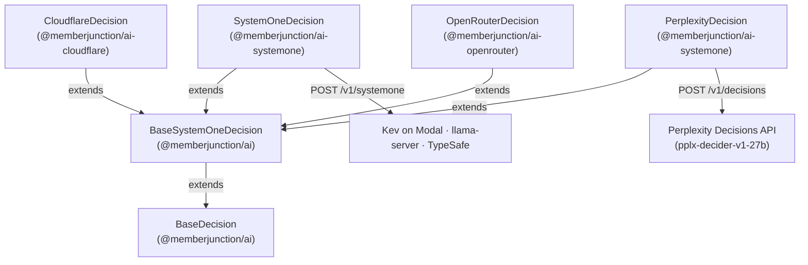

# @memberjunction/ai-systemone

MemberJunction drivers for decision APIs that speak TypeSafe's System One decisions format. It ships two `BaseDecision` drivers:

- **`SystemOneDecision`**, for any server that answers `POST {base}/v1/systemone` (below);
- **`PerplexityDecision`**, for Perplexity's Decisions API and its `pplx-decider-v1-27b` model (see [Perplexity's Decider](#perplexitydecision-perplexitys-decider)).

`SystemOneDecision` covers three kinds of server:

| Server | How you run it | Auth |
|---|---|---|
| **Kev's own server** | `modal deploy kev_serve.py` gives `https://<workspace>--kev-api.modal.run`. One deployment serves one Kev size; it scales to zero, and the first request after 5 idle minutes waits 35 to 55 seconds for a container. | A bearer token when `KEV_API_KEY` is set on the server |
| **llama.cpp's `llama-server`** | `llama-server -hf ggml-org/Kev-4B-GGUF` (other sizes exist), on any machine, cloud VM or Hugging Face Inference Endpoint | Open by default; a bearer token with `--api-key` |
| **TypeSafe's own API** | Hosted by TypeSafe | A bearer token |

With `llama-server`, pass `--alias <name>` (for example `--alias kev-4b`), so runs record that name as the resolved model rather than the server's GGUF file path.
As of 2026-10-02 no llama.cpp release includes `/v1/systemone` (release b11349 predates the merge), so build `llama-server` from source until one does.

The models it serves in MJ's catalog are Jared Palmer's open-weight Kev 1.0 decision models: `Kev-0.8B`, `Kev-4B`, `Kev-9B` and `Kev-27B`, each with a row on the `System One Endpoint` vendor. `Kev-4B` is also on OpenRouter, through `OpenRouterDecision` in `@memberjunction/ai-openrouter`; that row has the higher priority, so a host with an OpenRouter key uses it first.

## Architecture



`BaseSystemOneDecision` owns the System One request and answer mapping. `SystemOneDecision` adds the endpoint, the optional token and error messages that name what the server said. `PerplexityDecision` adds Perplexity's endpoint, the key check and Perplexity's error messages.

## Configuration

**The endpoint** is read in this order:

1. the constructor's second argument;
2. the credential's `endpoint`: bind an AI Credential of type **API Key with Endpoint** to the model's `System One Endpoint` row;
3. the `SYSTEMONE_BASE_URL` environment variable.

`/v1/systemone` is appended unless the URL already ends with it (a URL ending in `/v1` gets `/systemone`). With no endpoint, the call fails before any request with a `NoCredentials` error naming both options. It allows failover, so an unconfigured Kev size does not stop the runner from trying the next decision model, including another Kev size with its own endpoint.

**One server per model.** A Kev deployment serves exactly one size, and every Kev size's row shares the one `System One Endpoint` vendor, so bind each credential to a **model-vendor row**: one `API Key with Endpoint` credential on `Kev-4B`'s `System One Endpoint` row, another on `Kev-27B`'s. The runner looks for a binding on the prompt-model row first, then the model-vendor row, then the vendor, then a default credential of the vendor's type, then the legacy environment variable.

> **Do not bind a Kev endpoint at the vendor level, or as the type's default credential, or through `SYSTEMONE_BASE_URL` alone, unless you run one Kev size only.** Each of those resolves for *every* Kev row, so every size would be sent to the same server, and the runs would be recorded against sizes that never answered. The server cannot tell you: Kev's server accepts the same model names (`kev-latest`, `jev-latest`) whatever size it serves, and echoes the name it was sent. If you do run one size only, deactivate the other sizes' `System One Endpoint` rows.

**The token** is optional. With one, the request carries `Authorization: Bearer <token>`. With none, it carries no `Authorization` header, because a local `llama-server` or Kev server is open by default. Leave the credential's `apiKey` empty for an open server.

**Legacy environment variables.** `AIDecisionRunner` only selects a candidate it has a credential for, so an environment-only setup needs the key variable too, even for an open server (an open server ignores the header):

```bash
SYSTEMONE_BASE_URL=https://acme--kev-api.modal.run
AI_VENDOR_API_KEY__SYSTEMONEDECISION=your-kev-api-key   # any placeholder for an open server
```

**The model.** The body's `model` is the model-vendor row's `APIName`, `kev-latest` by default. Kev's server accepts `kev-latest` and `jev-latest`; one deployment serves whichever Kev size it was started with.

**Timeouts.** The driver sets none of its own, so a cold start is not cut short. The caller's cancellation and timeout (`AIDecisionParams.cancellationToken`, `timeoutMS`) apply.

## Usage

```typescript
import { SystemOneDecision } from '@memberjunction/ai-systemone';

// An open llama-server on this machine.
const kev = new SystemOneDecision('', 'http://127.0.0.1:8080');
const result = await kev.Decide({
    Model: 'kev-latest',
    State: 'Checkout has been failing for every customer for the last hour.',
    Questions: {
        urgent: { Kind: 'Likelihood', Instructions: 'Is this support request urgent?' },
    },
});
// result.Answers.urgent → { Kind: 'Likelihood', Probability: 0.87 }
```

Through `AIDecisionRunner`, name the model and the vendor:

```typescript
params.override = { modelId: kev4b.ID, vendorId: systemOneEndpoint.ID };
```

The shipped `Default Decision` prompt does not bind any Kev model.

**As a fallback.** Like every active `Decision` model, each Kev size joins the power-matched fallback candidates of any Decision prompt that does not set `RequireSpecificModels`, ranked by closeness to the prompt's `PowerRank`, and only when its credential resolves. For the shipped `Default Decision` that means after Jev and `LLM Decision`. `Default Decision` sets no `FailoverStrategy`, so it has the column default, `SameModelDifferentVendor`, and failover is on. `AIDecisionRunner` reads any strategy but `None` as "walk the whole candidate list": it moves from model to model, not only between vendors of one model, and skips candidates with no credential. So a `Default Decision` call reaches a Kev size only when every credentialed candidate ahead of it has failed with an error that allows failover. `LLM Decision` needs no credential, so in practice that means `LLM Decision` has failed too. A `401` stops the loop before it gets that far. To keep Kev out of a prompt's fallbacks, set `RequireSpecificModels` on it. `Kev-4B`'s OpenRouter row uses the same OpenRouter key as Jev, so a host already set up for Jev has Kev-4B among those fallbacks with no further setup.

## Errors and failover

- A `429` or a `5xx` is thrown with its HTTP status, so `AIDecisionRunner` fails over to the next decision model.
- A missing endpoint fails before any request with a `NoCredentials` error that allows failover.
- A `401` is an `Authentication` error. `ErrorAnalyzer` rates it fatal, which stops the failover loop.
- The message names the server's own text: Kev's `detail` (a string, or a list of `{ msg }`) or llama.cpp's `error.message`.
- A response that cannot be mapped fails with a `ModelError` that allows failover.

## `PerplexityDecision`: Perplexity's Decider

`PerplexityDecision` calls Perplexity's Decisions API, `POST https://api.perplexity.ai/v1/decisions`, which serves Perplexity's open-weight decision model `pplx-decider-v1-27b` (Apache-2.0, released 2026-10-01, fine-tuned from Qwen3.8-27B). In MJ's catalog it is the `Perplexity Decider v1 27B` model on the `Perplexity` vendor.

That API is the model's only managed host. As of 2026-10-02 it is not on OpenRouter or any Hugging Face inference provider, and llama.cpp cannot run it. Running the weights yourself takes a CUDA GPU with about 49 GiB for the weights, plus Perplexity's own Python inference code, which has no HTTP server.

The API speaks the System One format and returns the response bare, so the driver adds only the endpoint, a check that there is a key, and Perplexity's error messages.

| | |
|---|---|
| **Endpoint** | `https://api.perplexity.ai/v1/decisions`. A URL passed to the constructor wins, then a credential's `endpoint`. Trailing slashes are removed, because the API answers a path with one with `404`. |
| **Key** | A Perplexity API key, sent as `Authorization: Bearer <key>`. The API does not read `x-api-key`. |
| **Model** | `pplx-decider-v1-27b`, the only model the API serves. It is the row's `APIName` and the driver's default. |
| **Limits** | 1 to 128 questions per call, up to 255 options per Choice, up to 10 levels per Score, under 262,144 input tokens (the state and every question), and a 32 MiB body. 10 requests per second per organization. |
| **Price** | $0.04 per million input tokens. Output is free, and there is no per-request fee. |

**Configuration.** Bind an `API Key` AI Credential to the Decider's `Perplexity` row (or to the `Perplexity` vendor), or set the legacy variable. `AIDecisionRunner` only selects a candidate it has a credential for.

```bash
AI_VENDOR_API_KEY__PERPLEXITYDECISION=pplx-...
```

**Usage.** Name the model and the vendor through `AIDecisionRunner`:

```typescript
params.override = { modelId: perplexityDecider.ID, vendorId: perplexity.ID };
```

Or call the driver directly. The state can be a string or an object:

```typescript
import { PerplexityDecision } from '@memberjunction/ai-systemone';

const decider = new PerplexityDecision('your-perplexity-api-key');
const result = await decider.Decide({
    Model: 'pplx-decider-v1-27b',
    State: { title: 'Battery died after two weeks', review: 'The headphones sound great, but the battery stopped charging after two weeks.' },
    Questions: {
        defect: { Kind: 'Likelihood', Instructions: 'Does the review report a product defect?' },
        severity: { Kind: 'Score', Instructions: 'How severe is the reported problem?', Levels: ['Cosmetic', 'Inconvenient', 'Product unusable'] },
    },
});
// result.Answers.defect → { Kind: 'Likelihood', Probability: 0.94 }
```

**As a fallback.** The shipped `Default Decision` prompt does not bind the Decider. Like every active `Decision` model, it joins `Default Decision`'s power-matched fallbacks once its key resolves, after Jev and `LLM Decision`, exactly as the Kev sizes do (see [Usage](#usage)). Its `PowerRank` is 59, below Jev's 60, until MJ measures it. Perplexity reports 85.71% accuracy overall on 11 public benchmarks it chose, against 84.51% for Jev, with Jev ahead on 6 of the 11. Those are Perplexity's figures.

**Score probabilities.** Perplexity keys a Score answer's `probabilities` by level index (`"0"`, `"1"`, …), like its `legend`, as Jev does. MJ re-keys them by level name.

**Errors and failover.**

- A missing key fails before any request with a `NoCredentials` error that allows failover.
- The message names Perplexity's own `error.message`. A `404` or `405` has an empty body, and a `504` can be an HTML page; for those the message has the status and the start of the body.
- A `401` (a missing or invalid key, or one sent as `x-api-key`) is an `Authentication` error. `ErrorAnalyzer` rates it fatal, which stops the failover loop.
- A `429` (over the request or token rate) is a `RateLimit`: the runner retries it as the prompt's `MaxRetries` allows, then fails over. The runner waits `ErrorAnalyzer`'s default 30 seconds; the driver does not pass on Perplexity's `Retry-After`.
- A `5xx` fails over. The API returns `504` when the model has not answered after about a minute.
- A `400` is classified from its message. An unknown model is an `InvalidRequest`, which stops the loop.
- A `413` (a body over 32 MiB) is an `Unknown` error, which fails over. MJ sends no images, so its requests stay far below that size.

## Not supported yet

- **Images.** llama.cpp, Clef and Perplexity's API accept images with the state; MJ's `DecisionParams` has none, so neither driver sends them.

## Class Registration

Registered as `SystemOneDecision` via `@RegisterClass(BaseDecision, 'SystemOneDecision')`. The Kev models' `System One Endpoint` rows name it as their `DriverClass`.

Registered as `PerplexityDecision` via `@RegisterClass(BaseDecision, 'PerplexityDecision')`. The `Perplexity Decider v1 27B` model's `Perplexity` row names it as its `DriverClass`.

## Dependencies

- `@memberjunction/ai` - Core AI abstractions, including `BaseSystemOneDecision`
- `@memberjunction/global` - Class registration
