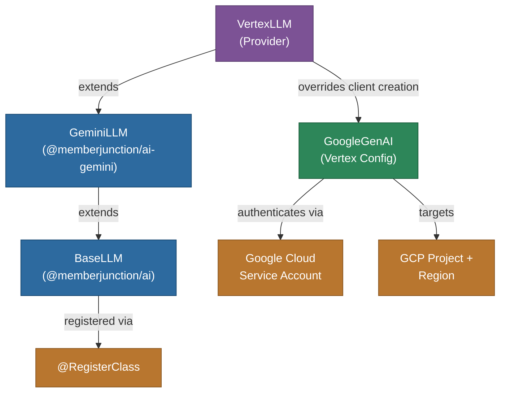

# @memberjunction/ai-vertex

MemberJunction AI provider for Google Cloud Vertex AI. This package extends the Gemini provider to work with Google Cloud's enterprise Vertex AI platform, providing access to Gemini models through GCP authentication and project-based deployments: chat through `VertexLLM`, and Gemini Live, with live avatars, through `GeminiEnterpriseRealtime`.

## Architecture



`GeminiEnterpriseRealtime` follows the same pattern for realtime: it extends `GeminiRealtime` (`@memberjunction/ai-gemini`) and overrides the endpoint, the credentials and how the browser connects.

## Features

- **Gemini on Vertex**: Access Gemini Pro, Flash, and other models through Google Cloud
- **Enterprise Authentication**: an inline service account, a key file, Application Default Credentials, or a Google Cloud API key
- **Project Isolation**: Scoped to GCP project and region
- **All Gemini Features**: Inherits chat, streaming, thinking/reasoning, and multimodal support from GeminiLLM
- **Gemini Live on Gemini Enterprise**: realtime voice sessions with live avatars, run in the browser through MJAPI's realtime relay so no Google credential reaches the browser
- **VPC Service Controls**: Compatible with GCP network security boundaries
- **Regional Deployment**: Deploy to specific GCP regions for data residency

## Installation

```bash
npm install @memberjunction/ai-vertex
```

## Usage

```typescript
import { VertexLLM } from '@memberjunction/ai-vertex';

const llm = new VertexLLM(JSON.stringify({ project: 'my-project', location: 'us-central1' }));

const result = await llm.ChatCompletion({
    model: 'gemini-2.5-pro',
    messages: [
        { role: 'user', content: 'Explain cloud AI architecture.' }
    ],
    temperature: 0.7
});

if (result.success) {
    console.log(result.data.choices[0].message.content);
}
```

## Configuration

Both drivers take one key: a JSON string, usually the environment key `AI_VENDOR_API_KEY__VertexLLM` or `AI_VENDOR_API_KEY__GeminiEnterpriseRealtime`, or a run's key. `ParseVertexAICredentials` reads it in one of five shapes:

| Shape | Fields | Authenticates as |
|---|---|---|
| Application Default Credentials | `project`, `location` | Whatever ADC resolves: workload identity on GKE and Cloud Run, the metadata server on GCE, `GOOGLE_APPLICATION_CREDENTIALS` |
| Service account as a string | `project`, `location`, `serviceAccountJson` (the key file's JSON as a string; its fields win except the top-level project and location) | A JWT client for the service account |
| Service account inline | The key file's own fields (`type: 'service_account'`, `project_id`, `private_key`, `client_email`, …) plus `location` | A JWT client |
| Key file | `keyFilePath`, `project`, `location` | The file's credential type (service account, user, impersonated, workload identity federation, GDCH). **Only the platform's environment key may name a key file**; any other key that names one is refused before the file is touched. Give an absolute path: MJ doesn't expand `~`, and a relative path is read from MJAPI's working directory |
| Google Cloud API key | `apiKey`, optionally `project` and `location` | The key, sent as `x-goog-api-key`. Never beside another credential. Without a project it takes Google's global route (the global host and the model's short name, as `@google/genai`'s API-key mode does); with a project, Gemini Live takes the regional route (the location's host and the model's full name). `VertexLLM` uses the global route with either |

- `project_id` wins over `project`; `location` defaults to `us-central1` (an API key without a project takes no location).
- Gemini Live reads two more optional fields: `liveApiVersion` (the API version in the Live socket's path, `v1` by default, such as `v1beta1`) and `liveHost` (the socket's host instead of the location's, as `host[:port]`, bare or after `https://` or `wss://`). Only the environment key may name a `liveHost`, since the driver sends its bearer token (or the API key) to that host.
- A key that can't be used fails with a `VertexCredentialsError` whose `Problem` (`invalid-json`, `missing-project`, `key-file-not-allowed`, `live-host-not-allowed`, `api-key-with-credentials`, …) names what is wrong without quoting the key.

## Gemini Live on Gemini Enterprise: `GeminiEnterpriseRealtime`

`@RegisterClass(BaseRealtimeModel, 'GeminiEnterpriseRealtime')`, key `AI_VENDOR_API_KEY__GeminiEnterpriseRealtime` (a key in the shapes above). Nothing selects it until a deployment has the key and the catalog's Vertex AI model-vendor row for Gemini 3.8 Live (`DriverClass: GeminiEnterpriseRealtime`, Priority 1, above the Google row): realtime vendor selection takes the highest-priority row whose driver has a key.

Everything but the endpoint, the credentials and the browser connection is `GeminiRealtime`'s: the connect config, the legality rules, the avatar rule and the session translation, resolved on the `'enterprise'` endpoint (see the [Gemini readme](../Gemini/readme.md#gemini-live-realtime)). On that endpoint `gemini-3.8-live` renders a live avatar, and the endpoint accepts only the `audioActivityOnly` turn coverage: a session that asks for all video is sent `audioActivityOnly`, with one log line.

**Browser sessions go through MJAPI's relay.** Gemini Enterprise has no browser-safe Live credential, so `CreateClientSession`:

1. builds the connect config and writes the Live setup from it (`BuildGeminiLiveSetup`: the model under the key's project and location, or by its short name for an API key on the global route; the system prompt, the tools, the voice, the avatar);
2. issues a relay session (`RealtimeProxyRegistry.IssueRelaySession`) whose policy (`GeminiLiveRelayPolicy`) sends that setup on every upstream connection, adds the auth headers on every upstream open (a bearer token from `google-auth-library`, which caches it until shortly before it expires, or the key's API key), and filters what the browser sends;
3. returns `Transport: 'relay'`, the relay URL as `RelayUrl` (the ticket is in its path), an empty `EphemeralToken`, a pact whose config holds only the response modalities and the avatar's name, and the avatar status.

The browser driver is `GeminiEnterpriseRealtimeClient` (`'gemini-enterprise'`) in `@memberjunction/ai-realtime-client`. The Google credential and token never leave MJAPI, and the relay URL is never logged. The Live socket is `wss://<host>/ws/google.cloud.aiplatform.<version>.LlmBidiService/BidiGenerateContent`: the location's host (`<location>-aiplatform.googleapis.com`, or `aiplatform.<us|eu>.rep.googleapis.com` for the multi-regions) and `v1`, unless the key names `liveHost` or `liveApiVersion`.

**Server-side sessions** (meetings, phone calls) connect directly with `@google/genai` in Vertex mode. They run audio only unless the host publishes the avatar into a meeting room (`RealtimeAvatarSettings.Delivery: 'room'`); then the model renders it and the session sends its pieces to the host as `RealtimeVideoFrame`s through `OnVideoFrame`.

**Locations.** A location that can't be part of a host name is refused at the mint or the session start. Google documents Gemini 3.8 Live in `us`, `eu` and `us-central1`; any other location gets one warning, since Google refuses the setup where the model isn't served. Use one of the three; `us-central1` is the one checked live.

## How It Works

`VertexLLM` extends `GeminiLLM` and overrides the `createClient()` method to configure the `GoogleGenAI` client for Vertex AI instead of the public Gemini API, with the options `VertexGenAIOptions` builds from the key: the project, the location and an auth client (or none for Application Default Credentials), or the SDK's API-key mode for an `apiKey`. `google-auth-library` 10 deprecates its loose credential options, so `CreateVertexAuthClient` builds the client itself: a JWT client for an inline service account, the matching client for a key file's type, or none for ADC. `VertexAccessTokenProvider` mints the request headers the realtime relay sends upstream.

## Class Registration

- `VertexLLM` -- Registered via `@RegisterClass(BaseLLM, 'VertexLLM')`
- `GeminiEnterpriseRealtime` -- Registered via `@RegisterClass(BaseRealtimeModel, 'GeminiEnterpriseRealtime')`

## Dependencies

- `@memberjunction/ai` - Core AI abstractions
- `@memberjunction/ai-gemini` - Gemini provider (parent classes)
- `@memberjunction/global` - Class registration
- `@google/genai` - Google GenAI SDK
- `google-auth-library` - Google Cloud authentication
