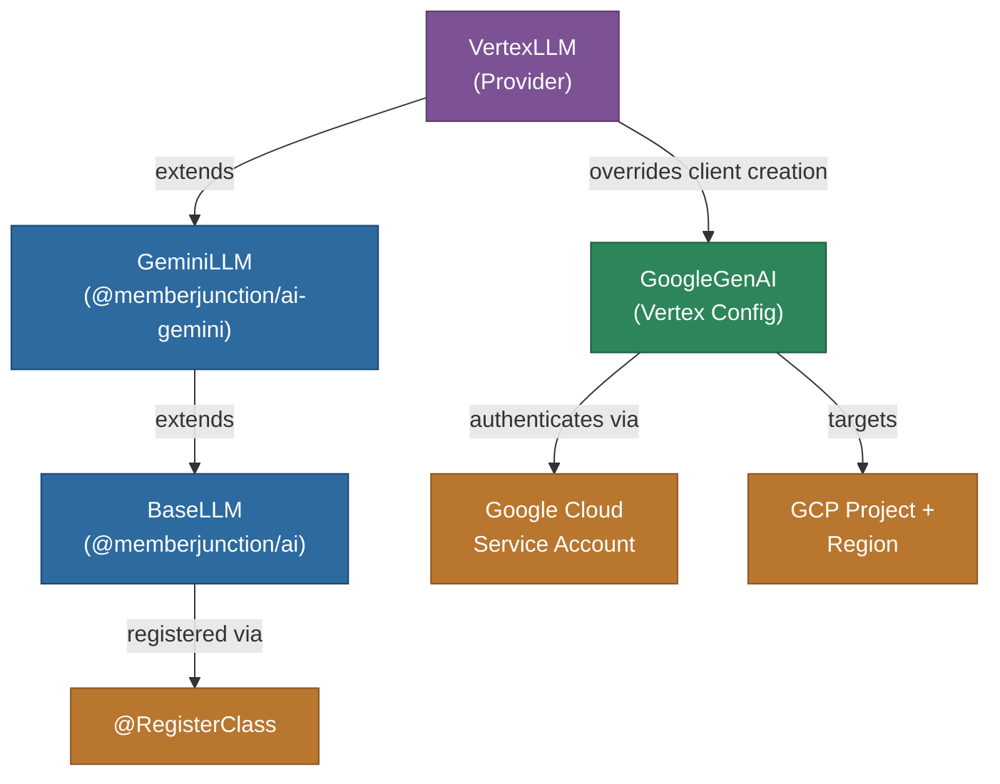

# @memberjunction/ai-vertex

MemberJunction AI provider for Google Cloud Vertex AI. This package extends the Gemini provider to work with Google Cloud's enterprise Vertex AI platform, providing access to Gemini models through GCP authentication and project-based deployments.

## Architecture



## Features

- **Gemini on Vertex**: Access Gemini Pro, Flash, and other models through Google Cloud
- **Enterprise Authentication**: Google Cloud service account credentials
- **Project Isolation**: Scoped to GCP project and region
- **All Gemini Features**: Inherits chat, streaming, thinking/reasoning, and multimodal support from GeminiLLM
- **VPC Service Controls**: Compatible with GCP network security boundaries
- **Regional Deployment**: Deploy to specific GCP regions for data residency

## Installation

```bash
npm install @memberjunction/ai-vertex
```

## Usage

```typescript
import { VertexLLM } from '@memberjunction/ai-vertex';

const llm = new VertexLLM('service-account-json');

const result = await llm.ChatCompletion({
    model: 'gemini-2.5-pro',
    messages: [
        { role: 'user', content: 'Explain cloud AI architecture.' }
    ],
    temperature: 0.7
});

if (result.success) {
    console.log(result.data.choices[0].message.content);
}
```

## Configuration

The API key parameter accepts a JSON string containing GCP service account credentials. Additional settings for project and location are configured via `SetAdditionalSettings`:

| Setting | Description |
|---------|-------------|
| `project` | GCP project ID |
| `location` | GCP region (e.g., `us-central1`) |

## How It Works

`VertexLLM` extends `GeminiLLM` and overrides the `createClient()` method to configure the `GoogleGenAI` client for Vertex AI instead of the public Gemini API. This provides GCP project-scoped access with service account authentication while inheriting all of GeminiLLM's capabilities.

## Class Registration

Registered as `VertexLLM` via `@RegisterClass(BaseLLM, 'VertexLLM')`.

## Dependencies

- `@memberjunction/ai` - Core AI abstractions
- `@memberjunction/ai-gemini` - Gemini provider (parent class)
- `@memberjunction/global` - Class registration
- `@google/genai` - Google GenAI SDK
- `google-auth-library` - Google Cloud authentication
