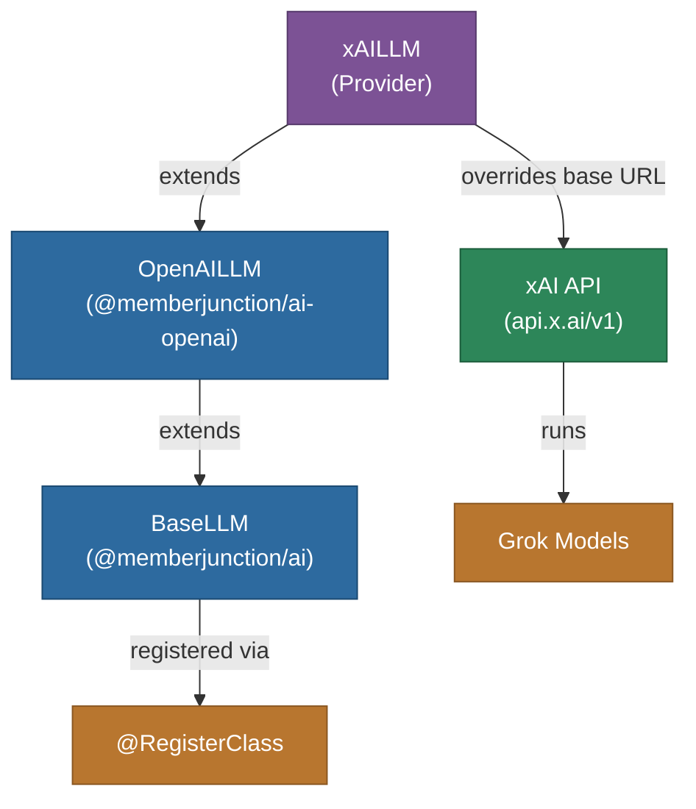

# @memberjunction/ai-xai

MemberJunction AI provider for xAI's Grok models. This package extends the OpenAI provider to work with xAI's OpenAI-compatible API, providing access to Grok models for chat completions and reasoning tasks.

## Architecture



## Features

- **Grok Access**: Access to xAI's Grok language models
- **OpenAI Compatible**: Inherits all features from the OpenAI provider
- **Streaming**: Full streaming support for real-time responses
- **Thinking/Reasoning**: Thinking block extraction for reasoning models
- **All OpenAI Parameters**: Full parameter support inherited from the OpenAI provider

## Installation

```bash
npm install @memberjunction/ai-xai
```

## Usage

```typescript
import { xAILLM } from '@memberjunction/ai-xai';

const llm = new xAILLM('your-xai-api-key');

const result = await llm.ChatCompletion({
    model: 'grok-2',
    messages: [
        { role: 'system', content: 'You are a helpful assistant.' },
        { role: 'user', content: 'What is the meaning of life?' }
    ],
    temperature: 0.7
});

if (result.success) {
    console.log(result.data.choices[0].message.content);
}
```

### Streaming

```typescript
const result = await llm.ChatCompletion({
    model: 'grok-2',
    messages: [{ role: 'user', content: 'Explain deep learning.' }],
    streaming: true,
    streamingCallbacks: {
        OnContent: (content) => process.stdout.write(content),
        OnComplete: () => console.log('\nDone!')
    }
});
```

## How It Works

`xAILLM` is a thin subclass of `OpenAILLM` that redirects API calls to xAI's endpoint at `https://api.x.ai/v1`. Since xAI implements an OpenAI-compatible API, all chat, streaming, and parameter handling logic is inherited from the OpenAI provider.

## Class Registration

Registered as `xAILLM` via `@RegisterClass(BaseLLM, 'xAILLM')`.

## Dependencies

- `@memberjunction/ai` - Core AI abstractions
- `@memberjunction/ai-openai` - OpenAI provider (parent class)
- `@memberjunction/global` - Class registration
