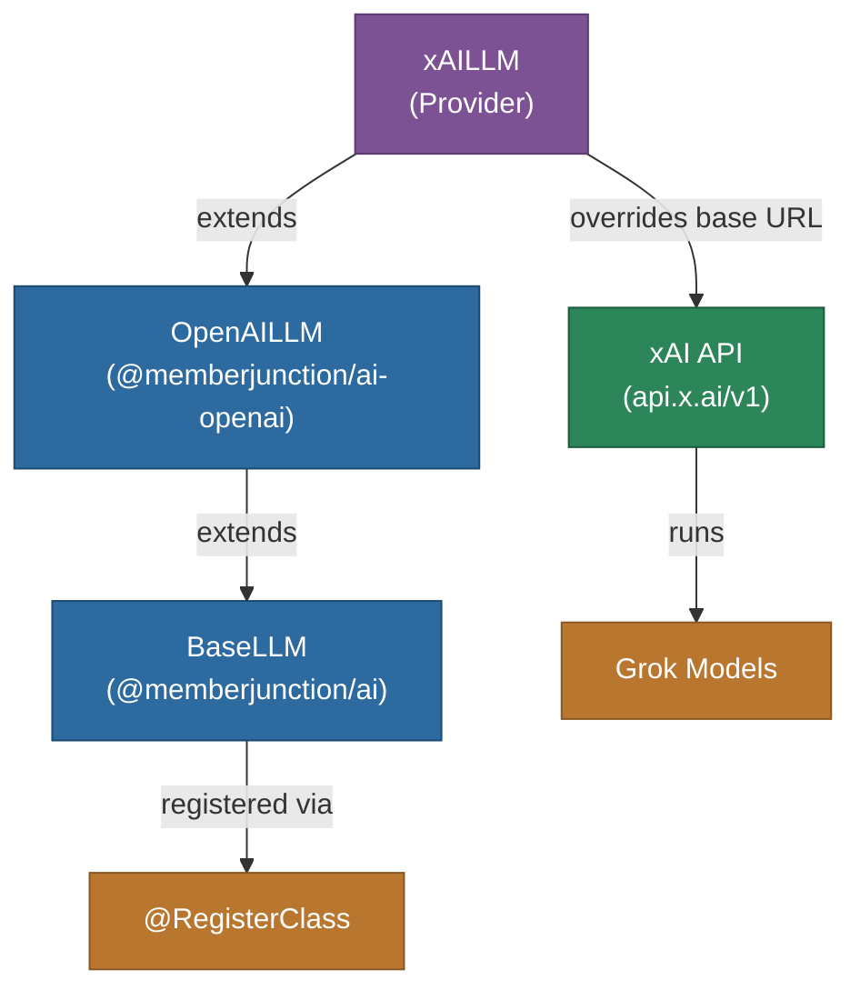

# @memberjunction/ai-xai

MemberJunction AI provider for xAI's Grok models. This package extends the OpenAI provider to work with xAI's OpenAI-compatible API, providing access to Grok models for chat completions and reasoning tasks.

## Architecture


```mermaid
graph TD
    A["xAILLM<br/>(Provider)"] -->|extends| B["OpenAILLM<br/>(@memberjunction/ai-openai)"]
    B -->|extends| C["BaseLLM<br/>(@memberjunction/ai)"]
    A -->|overrides base URL| D["xAI API<br/>(api.x.ai/v1)"]
    D -->|runs| E["Grok Models"]
    C -->|registered via| F["@RegisterClass"]

    style A fill:#7c5295,stroke:#563a6b,color:#fff
    style B fill:#2d6a9f,stroke:#1a4971,color:#fff
    style C fill:#2d6a9f,stroke:#1a4971,color:#fff
    style D fill:#2d8659,stroke:#1a5c3a,color:#fff
    style E fill:#b8762f,stroke:#8a5722,color:#fff
    style F fill:#b8762f,stroke:#8a5722,color:#fff
```

## Features

- **Grok Access**: Access to xAI's Grok language models
- **OpenAI Compatible**: Inherits all features from the OpenAI provider
- **Streaming**: Full streaming support for real-time responses
- **Thinking/Reasoning**: Thinking block extraction for reasoning models
- **All OpenAI Parameters**: Full parameter support inherited from the OpenAI provider

## Installation

```bash
npm install @memberjunction/ai-xai
```

## Usage

```typescript
import { xAILLM } from '@memberjunction/ai-xai';

const llm = new xAILLM('your-xai-api-key');

const result = await llm.ChatCompletion({
    model: 'grok-2',
    messages: [
        { role: 'system', content: 'You are a helpful assistant.' },
        { role: 'user', content: 'What is the meaning of life?' }
    ],
    temperature: 0.7
});

if (result.success) {
    console.log(result.data.choices[0].message.content);
}
```

### Streaming

```typescript
const result = await llm.ChatCompletion({
    model: 'grok-2',
    messages: [{ role: 'user', content: 'Explain deep learning.' }],
    streaming: true,
    streamingCallbacks: {
        OnContent: (content) => process.stdout.write(content),
        OnComplete: () => console.log('\nDone!')
    }
});
```

## How It Works

`xAILLM` is a thin subclass of `OpenAILLM` that redirects API calls to xAI's endpoint at `https://api.x.ai/v1`. Since xAI implements an OpenAI-compatible API, all chat, streaming, and parameter handling logic is inherited from the OpenAI provider.

## Grok Voice Realtime Driver (`xAIRealtime`)

In addition to the chat LLM, this package ships `xAIRealtime` — a `BaseRealtimeModel` driver for xAI's **Grok Voice Agent API**, the streaming, full-duplex, tool-calling speech-to-speech path that powers MemberJunction's `Realtime` agent type and Voice Co-Agent.

### Why it reuses the OpenAI SDK

Grok Voice is **OpenAI-Realtime-API compatible** — same WebSocket event protocol, Base64-encoded PCM16 @ 24 kHz audio, and tool-calling shape, with the endpoint at `wss://api.x.ai/v1/realtime`. The driver therefore constructs the `openai` SDK client pointed at xAI's base URL:

```typescript
new OpenAI({ apiKey, baseURL: 'https://api.x.ai/v1' });
```

The SDK's `buildRealtimeURL()` derives the realtime socket directly from `client.baseURL` (converting `https://…` to `wss://…/realtime?model=…`), so the driver inherits OpenAI's hardened realtime event handling and authentication for free rather than re-implementing the wire protocol against a bare `ws` socket.

### Topology and capabilities

- **Server-bridged only** — the provider socket lives on the server (`StartSession`). `SupportsClientDirect` is `false`; `CreateClientSession` is not supported.
- **Both-role transcripts** — user-side ASR is opted in via `audio.input.transcription` so user and assistant transcripts both flow. Override the transcription model (or any session field) through the per-session `Config` bag.
- **Full tool-call loop** — tool requests surface via `OnToolCall`; results are fed back with `SendToolResult` (`function_call_output` + `response.create`) and are always voiced, never dropped.
- **True barge-in** — `OnInterruption` fires only when user speech cuts off an *active* model response (gated on response-in-flight state), never on a normal user turn.
- **Background narration** — `SendContextNote` (silent system-role item) and `RequestSpokenUpdate` (one brief spoken interim, skipped if a response is already active) support delegated-run progress narration.
- **Fatal vs. recoverable errors** — transport failures and credential/token death surface through `OnError` with `Fatal: true` (plus `OnClose` on unexpected socket close); provider error frames stay `Fatal: false`.

### Usage

```typescript
import { xAIRealtime } from '@memberjunction/ai-xai';

const driver = new xAIRealtime('your-xai-api-key');
const session = await driver.StartSession({
    Model: 'grok-voice',
    SystemPrompt: 'You are a concise, friendly voice assistant.',
    Tools: [{ Name: 'GetWeather', Description: 'Get current weather', ParametersSchema: { type: 'object' } }],
});

session.OnTranscript((t) => console.log(t.Role, t.Text, t.IsFinal));
session.OnToolCall(async (call) => {
    const result = await runTool(call.ToolName, call.Arguments);
    await session.SendToolResult(call.CallID, JSON.stringify(result));
});
session.OnOutput((pcm16) => playAudio(pcm16));
```

### Registration & metadata

Registered as `GrokRealtime` via `@RegisterClass(BaseRealtimeModel, 'GrokRealtime')`. The driver is resolved by `AIModelType = 'Realtime'` + `DriverClass = 'GrokRealtime'`. The **Grok Voice** model (type `Realtime`) and its `MJ: AI Model Vendor` row (vendor `x.ai`, Inference Provider, `DriverClass = GrokRealtime`, `APIName = grok-voice`) are seeded via metadata sync in `metadata/ai-models/.ai-models.json`.

## Class Registration

Registered as `xAILLM` via `@RegisterClass(BaseLLM, 'xAILLM')`.

## Dependencies

- `@memberjunction/ai` - Core AI abstractions
- `@memberjunction/ai-openai` - OpenAI provider (parent class)
- `@memberjunction/global` - Class registration
