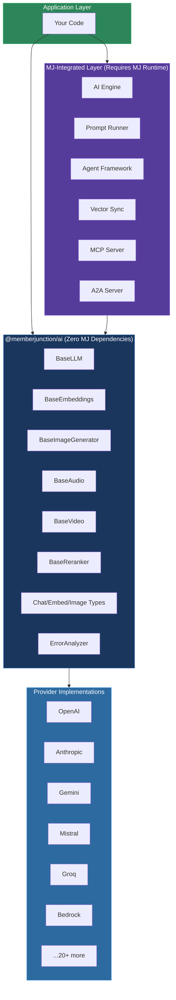

# MemberJunction AI Framework

A unified, provider-agnostic AI abstraction layer for TypeScript. Write your AI logic once; swap providers, models, and capabilities without changing application code.

The framework spans **47 packages** covering LLMs, embeddings, image generation, audio synthesis, video generation, reranking, vector operations, agent orchestration, and protocol servers -- with integrations for **25+ AI services** from OpenAI and Anthropic to local inference engines like Ollama and LM Studio.

---

## Two Ways to Use It

### Standalone (No MemberJunction Required)

Install `@memberjunction/ai` (the Core package) plus any provider. Zero database dependencies. Works in any TypeScript or JavaScript project.

```typescript
import { ChatParams, ChatMessageRole } from "@memberjunction/ai";
import { AnthropicLLM } from "@memberjunction/ai-anthropic";

const llm = new AnthropicLLM(process.env.ANTHROPIC_API_KEY!);
const result = await llm.ChatCompletion({
    model: "claude-sonnet-4-20250514",
    messages: [{ role: ChatMessageRole.user, content: "Explain quantum tunneling." }],
});
console.log(result.data.choices[0].message.content);
```

That is the entire setup. No configuration files, no database, no metadata -- just types and a provider.

### MJ-Integrated (Full Platform)

When running inside MemberJunction, the AI framework gains metadata-driven model selection, prompt template management with hierarchical composition, cost tracking, agent orchestration, and vector synchronization -- all configured through the MJ database and entity system.

```typescript
import { AIPromptRunner } from "@memberjunction/ai-prompts";
import { AIPromptParams } from "@memberjunction/ai-core-plus";

// Model, provider, and prompt template resolved from MJ metadata
const runner = new AIPromptRunner();
const params = new AIPromptParams();
params.promptName = "Summarize Document";
params.data = { content: documentText };

const result = await runner.ExecutePrompt(params);
```

---

## Architecture



---

## Provider Capabilities

Each provider implements one or more capability interfaces from `@memberjunction/ai`. The table below shows what each provider supports.

| Provider | npm Package | LLM | Embeddings | Image Gen | Audio | Video | Reranking |
|----------|-------------|:---:|:----------:|:---------:|:-----:|:-----:|:---------:|
| **OpenAI** | `@memberjunction/ai-openai` | x | x | x | x | | |
| **Anthropic** | `@memberjunction/ai-anthropic` | x | | | | | |
| **Google Gemini** | `@memberjunction/ai-gemini` | x | | x | | | |
| **Mistral** | `@memberjunction/ai-mistral` | x | x | | | | |
| **Groq** | `@memberjunction/ai-groq` | x | | | | | |
| **xAI (Grok)** | `@memberjunction/ai-xai` | x | | | | | |
| **Azure AI** | `@memberjunction/ai-azure` | x | x | | | | |
| **Amazon Bedrock** | `@memberjunction/ai-bedrock` | x | x | | | | |
| **Google Vertex** | `@memberjunction/ai-vertex` | x | | | | | |
| **Fireworks** | `@memberjunction/ai-fireworks` | x | | | | | |
| **OpenRouter** | `@memberjunction/ai-openrouter` | x | | | | | |
| **Cerebras** | `@memberjunction/ai-cerebras` | x | | | | | |
| **MiniMax** | `@memberjunction/ai-minimax` | x | | | | | |
| **Zhipu (Z.AI)** | `@memberjunction/ai-zhipu` | x | | | | | |
| **Ollama** | `@memberjunction/ai-ollama` | x | x | | | | |
| **LM Studio** | `@memberjunction/ai-lmstudio` | x | | | | | |
| **BettyBot** | `@memberjunction/ai-betty-bot` | x | | | | | |
| **Black Forest Labs** | `@memberjunction/ai-blackforestlabs` | | | x | | | |
| **ElevenLabs** | `@memberjunction/ai-elevenlabs` | | | | x | | |
| **HeyGen** | `@memberjunction/ai-heygen` | | | | | x | |
| **Cohere** | `@memberjunction/ai-cohere` | | | | | | x |
| **Local Embeddings** | `@memberjunction/ai-local-embeddings` | | x | | | | |
| **Pinecone** | `@memberjunction/ai-vectors-pinecone` | | | | | | |
| **Rex (rasa.io)** | `@memberjunction/ai-recommendations-rex` | | | | | | |

> Pinecone and Rex implement vector database and recommendation interfaces respectively, not the base AI model interfaces.

---

## Package Directory

### Core Abstractions

| Package | npm | Standalone | Description |
|---------|-----|:----------:|-------------|
| [Core](./Core/README.md) | `@memberjunction/ai` | Yes | Base classes (`BaseLLM`, `BaseEmbeddings`, `BaseImageGenerator`, `BaseAudio`, `BaseVideo`, `BaseReranker`), type definitions, error analysis, API key management |
| [CorePlus](./CorePlus/README.md) | `@memberjunction/ai-core-plus` | | Extended AI types that reference MJ entity concepts; shared by server and client |
| [BaseAIEngine](./BaseAIEngine/README.md) | `@memberjunction/ai-engine-base` | Yes | Base engine class with extended types and data caching |
| [Reranker](./Reranker/README.md) | `@memberjunction/ai-reranker` | | AI reranker service with LLM-based two-stage retrieval |

### Orchestration and Engines

| Package | npm | Standalone | Description |
|---------|-----|:----------:|-------------|
| [Engine](./Engine/README.md) | `@memberjunction/aiengine` | | AI orchestration engine -- automatic execution of Entity AI Actions using configured models |
| [Prompts](./Prompts/README.md) | `@memberjunction/ai-prompts` | | Prompt execution engine with hierarchical template composition, system placeholders, parallel runs, and output validation |
| [Agents](./Agents/README.md) | `@memberjunction/ai-agents` | | Agent execution and management with metadata-driven agent types and sub-agent delegation |

### Agent Management

| Package | npm | Standalone | Description |
|---------|-----|:----------:|-------------|
| [AgentManager/core](./AgentManager/core/README.md) | `@memberjunction/ai-agent-manager` | | Core interfaces, types, and `AgentSpec` for agent metadata management |
| [AgentManager/actions](./AgentManager/actions/README.md) | `@memberjunction/ai-agent-manager-actions` | | Agent management actions (create, update, list, deactivate, export) |

### Protocol Servers

| Package | npm | Standalone | Description |
|---------|-----|:----------:|-------------|
| [MCPServer](./MCPServer/README.md) | `@memberjunction/ai-mcp-server` | | Model Context Protocol server exposing MJ entity CRUD and agent execution to MCP-compatible clients |
| [MCPClient](./MCPClient/README.md) | `@memberjunction/ai-mcp-client` | | MCP client for consuming external MCP tool servers |
| [A2AServer](./A2AServer/README.md) | `@memberjunction/a2aserver` | | Agent-to-Agent (A2A) protocol server for cross-system agent interoperability |

### Vector Operations

| Package | npm | Standalone | Description |
|---------|-----|:----------:|-------------|
| [Vectors/Core](./Vectors/Core/README.md) | `@memberjunction/ai-vectors` | | Core vector operations and abstractions for entity vectorization |
| [Vectors/Database](./Vectors/Database/README.md) | `@memberjunction/ai-vectordb` | | Vector database abstraction layer (index management, query operations) |
| [Vectors/Sync](./Vectors/Sync/README.md) | `@memberjunction/ai-vector-sync` | | Synchronization between MJ entities and vector databases |
| [Vectors/Dupe](./Vectors/Dupe/README.md) | `@memberjunction/ai-vector-dupe` | | Duplicate record detection using vector similarity |
| [Vectors/Memory](./Vectors/Memory/README.md) | `@memberjunction/ai-vectors-memory` | | In-memory vector utilities |

### Recommendations

| Package | npm | Standalone | Description |
|---------|-----|:----------:|-------------|
| [Recommendations/Engine](./Recommendations/Engine/README.md) | `@memberjunction/ai-recommendations` | | Provider-agnostic recommendation engine with run tracking and entity integration |

### Computer Use

| Package | npm | Standalone | Description |
|---------|-----|:----------:|-------------|
| [ComputerUse](./ComputerUse/README.md) | `@memberjunction/computer-use` | Yes | Vision-to-action browser automation engine for LLM-driven web interactions |
| [MJComputerUse](./MJComputerUse/README.md) | `@memberjunction/computer-use-engine` | | MJ-integrated computer use engine with entity-backed configuration |

### CLI

| Package | npm | Standalone | Description |
|---------|-----|:----------:|-------------|
| [AICLI](./AICLI/README.md) | `@memberjunction/ai-cli` | | AI agent, prompt, and action execution CLI integrated with the MJ CLI |

### Provider Implementations

All 25 provider packages are listed in the [Providers README](./Providers/README.md). The meta-package `@memberjunction/ai-provider-bundle` imports all standard providers to prevent tree-shaking in bundled applications.

---

## Quick Start

### 1. Install

```bash
# Core + one provider (pick any from the table above)
npm install @memberjunction/ai @memberjunction/ai-openai
```

### 2. Set Your API Key

```bash
export AI_VENDOR_API_KEY__OPENAILLM=sk-...
```

Or pass the key directly when constructing the provider.

### 3. Chat

```typescript
import { ChatParams, ChatMessageRole } from "@memberjunction/ai";
import { OpenAILLM } from "@memberjunction/ai-openai";

const llm = new OpenAILLM(process.env.AI_VENDOR_API_KEY__OPENAILLM!);

const result = await llm.ChatCompletion({
    model: "gpt-4.1",
    messages: [{ role: ChatMessageRole.user, content: "Hello, world!" }],
});

console.log(result.data.choices[0].message.content);
```

### 4. Stream

```typescript
await llm.ChatCompletion({
    model: "gpt-4.1",
    messages: [{ role: ChatMessageRole.user, content: "Write a haiku about TypeScript." }],
    streaming: true,
    streamingCallbacks: {
        OnContent: (chunk) => process.stdout.write(chunk),
        OnComplete: () => console.log(),
    },
});
```

### 5. Embed

```typescript
import { OpenAIEmbedding } from "@memberjunction/ai-openai";

const embedder = new OpenAIEmbedding(process.env.AI_VENDOR_API_KEY__OPENAILLM!);
const result = await embedder.EmbedText({
    text: "Semantic search is powerful",
    model: "text-embedding-3-small",
});
console.log(`Vector dimensions: ${result.vector.length}`);
```

---

## Switching Providers

Because all providers implement the same `BaseLLM` interface, switching is a one-line change:

```typescript
// Before: OpenAI
import { OpenAILLM } from "@memberjunction/ai-openai";
const llm = new OpenAILLM(openaiKey);

// After: Anthropic
import { AnthropicLLM } from "@memberjunction/ai-anthropic";
const llm = new AnthropicLLM(anthropicKey);

// After: Local (Ollama)
import { OllamaLLM } from "@memberjunction/ai-ollama";
const llm = new OllamaLLM(""); // No API key needed
```

Your `ChatCompletion()` calls, streaming callbacks, and error handling remain identical.

---

## Creating a New Provider

Extend the appropriate base class and register it with the class factory:

```typescript
import { BaseLLM, ChatParams, ChatResult } from "@memberjunction/ai";
import { RegisterClass } from "@memberjunction/global";

@RegisterClass(BaseLLM, "MyCustomLLM")
export class MyCustomLLM extends BaseLLM {
    protected async nonStreamingChatCompletion(params: ChatParams): Promise<ChatResult> {
        // Call your provider API here
    }

    // For streaming, override SupportsStreaming + streaming hooks
}
```

If your provider uses an OpenAI-compatible API, extend `OpenAILLM` instead and override the base URL. See the [Groq](./Providers/Groq/README.md) or [xAI](./Providers/xAI/README.md) providers for examples.

---

## API Key Management

The framework resolves API keys through environment variables using the convention:

```
AI_VENDOR_API_KEY__<DRIVER_CLASS>
```

For example:
- `AI_VENDOR_API_KEY__OPENAILLM` for OpenAI
- `AI_VENDOR_API_KEY__ANTHROPICLLM` for Anthropic
- `AI_VENDOR_API_KEY__GEMINILLM` for Google Gemini

You can also pass keys directly to provider constructors or supply runtime overrides via `GetAIAPIKey()`.

---

## Error Handling

All providers use a unified `ErrorAnalyzer` that classifies failures into structured error types:

```typescript
const result = await llm.ChatCompletion(params);
if (!result.success) {
    console.error(result.errorMessage);
    // result.exception contains the original error
    // ErrorAnalyzer provides: errorType, severity, isRetryable, failoverRecommended
}
```

Error types include rate limiting, authentication failures, context length exceeded, content filtering, and more -- enabling intelligent retry and failover logic.

---

## Further Reading

- **[Core Package README](./Core/README.md)** -- Full API reference for base classes, types, and utilities
- **[Providers README](./Providers/README.md)** -- Complete provider listing with categories
- **[Prompts Package](./Prompts/README.md)** -- Hierarchical prompt template system
- **[Agents Package](./Agents/README.md)** -- Agent framework and sub-agent delegation
- **[MCP Server](./MCPServer/README.md)** -- Expose MJ capabilities via Model Context Protocol
- **[A2A Server](./A2AServer/README.md)** -- Agent-to-Agent interoperability
- **[Computer Use](./ComputerUse/README.md)** -- Vision-driven browser automation
- **[MemberJunction Documentation](https://docs.memberjunction.org)** -- Full platform documentation

---

## License

See the [MemberJunction repository root](../../LICENSE) for license details.
