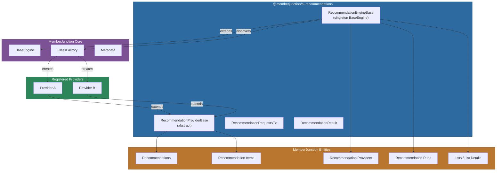
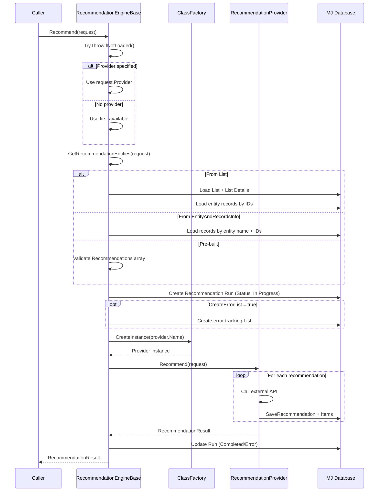
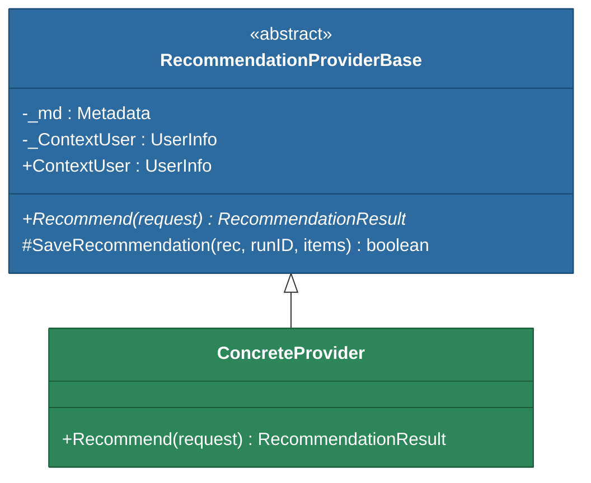
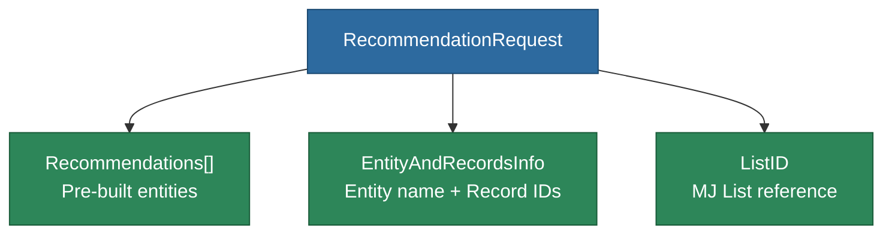
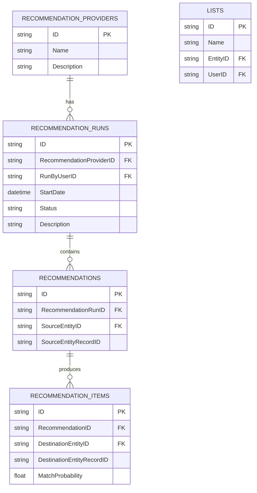

# @memberjunction/ai-recommendations

A provider-based recommendation engine for MemberJunction. Manages recommendation runs, delegates to pluggable providers via the class factory, and tracks results through Recommendation, Recommendation Run, and Recommendation Item entities.

## Architecture



## Installation

```bash
npm install @memberjunction/ai-recommendations
```

## Overview

This package provides the framework for running recommendations in MemberJunction. It follows the engine/provider pattern used throughout the platform:

1. **RecommendationEngineBase** -- a singleton engine (extending `BaseEngine`) that loads provider metadata, selects a provider, creates Recommendation Run tracking records, and delegates the actual recommendation logic
2. **RecommendationProviderBase** -- an abstract class that concrete providers implement to generate recommendations for each source record
3. **RecommendationRequest/RecommendationResult** -- typed request and response objects that flow through the pipeline

Providers are discovered at runtime through MemberJunction's `ClassFactory` using `@RegisterClass(RecommendationProviderBase, 'ProviderName')`.

## Recommendation Flow



## Core Components

### RecommendationEngineBase

A singleton engine that manages the recommendation lifecycle.

```typescript
import { RecommendationEngineBase } from '@memberjunction/ai-recommendations';

// Access the singleton
const engine = RecommendationEngineBase.Instance;

// Initialize (loads Recommendation Providers metadata)
await engine.Config(false, contextUser);

// Run recommendations
const result = await engine.Recommend(request);
```

**Key properties and methods:**

| Member | Description |
|---|---|
| `Instance` | Static getter for the singleton instance |
| `RecommendationProviders` | Array of `RecommendationProviderEntity` loaded from metadata |
| `Config(forceRefresh?, contextUser?, provider?)` | Loads provider metadata into cache |
| `Recommend<T>(request)` | Runs the full recommendation pipeline |

### RecommendationProviderBase

Abstract base class for implementing recommendation providers.



The `SaveRecommendation` helper method handles:
1. Setting the `RecommendationRunID` on the recommendation entity
2. Saving the recommendation record
3. Linking and saving all `RecommendationItemEntity` records

### RecommendationRequest\<T\>

The request object supports three ways to specify source records:



| Field | Type | Description |
|---|---|---|
| `Recommendations` | `RecommendationEntity[]` | Pre-built unsaved recommendation entities |
| `EntityAndRecordsInfo` | `{ EntityName, RecordIDs }` | Entity name and array of record IDs to process |
| `ListID` | `string` | ID of a MJ List whose details become the source records |
| `Provider` | `RecommendationProviderEntity` | Specific provider to use (defaults to first available) |
| `CurrentUser` | `UserInfo` | User context |
| `Options` | `T` | Generic additional options passed to the provider |
| `CreateErrorList` | `boolean` | Whether to create an error tracking list |
| `RunID` | `string` | Set automatically by the engine |
| `ErrorListID` | `string` | Set automatically if error list is created |

### RecommendationResult

```typescript
class RecommendationResult {
    Request: RecommendationRequest;
    RecommendationRun?: RecommendationRunEntity;
    RecommendationItems?: RecommendationItemEntity[];
    Success: boolean;
    ErrorMessage: string;

    AppendWarning(message: string): void;   // Adds warning without setting Success=false
    AppendError(message: string): void;     // Adds error and sets Success=false
    GetErrorMessages(): string[];           // Splits ErrorMessage into array
}
```

## Usage

### Running Recommendations from a List

```typescript
import { RecommendationEngineBase } from '@memberjunction/ai-recommendations';
import { RecommendationRequest } from '@memberjunction/ai-recommendations';

const engine = RecommendationEngineBase.Instance;
await engine.Config(false, contextUser);

const request = new RecommendationRequest();
request.ListID = 'list-uuid';
request.CurrentUser = contextUser;
request.CreateErrorList = true;

const result = await engine.Recommend(request);

if (result.Success) {
    console.log(`Generated ${result.RecommendationItems?.length ?? 0} items`);
} else {
    console.error(result.ErrorMessage);
}
```

### Running Recommendations by Entity and Record IDs

```typescript
const request = new RecommendationRequest();
request.EntityAndRecordsInfo = {
    EntityName: 'Products',
    RecordIDs: ['id-1', 'id-2', 'id-3']
};
request.CurrentUser = contextUser;

const result = await engine.Recommend(request);
```

### Implementing a Provider

```typescript
import { RecommendationProviderBase } from '@memberjunction/ai-recommendations';
import { RecommendationRequest, RecommendationResult } from '@memberjunction/ai-recommendations';
import { RegisterClass } from '@memberjunction/global';
import { Metadata } from '@memberjunction/core';
import { RecommendationItemEntity } from '@memberjunction/core-entities';

@RegisterClass(RecommendationProviderBase, 'My Recommendation Provider')
export class MyProvider extends RecommendationProviderBase {
    async Recommend(request: RecommendationRequest): Promise<RecommendationResult> {
        const result = new RecommendationResult(request);
        const md = new Metadata();

        for (const rec of request.Recommendations) {
            // Call your recommendation API/algorithm
            const suggestions = await this.getSuggestions(rec.SourceEntityRecordID);

            const items: RecommendationItemEntity[] = [];
            for (const suggestion of suggestions) {
                const item = await md.GetEntityObject<RecommendationItemEntity>(
                    'Recommendation Items', request.CurrentUser
                );
                item.NewRecord();
                item.DestinationEntityID = suggestion.entityID;
                item.DestinationEntityRecordID = suggestion.recordID;
                item.MatchProbability = suggestion.score;
                items.push(item);
            }

            await this.SaveRecommendation(rec, request.RunID, items);
        }

        return result;
    }

    private async getSuggestions(recordID: string): Promise<Suggestion[]> {
        // Your recommendation logic here
        return [];
    }
}
```

## Database Entities



## Dependencies

| Package | Purpose |
|---|---|
| `@memberjunction/core` | `BaseEngine`, `Metadata`, `RunView`, `UserInfo`, `LogStatus` |
| `@memberjunction/core-entities` | `RecommendationEntity`, `RecommendationRunEntity`, `RecommendationItemEntity`, `RecommendationProviderEntity`, `ListEntity` |
| `@memberjunction/global` | `MJGlobal` class factory for provider discovery |

## Development

```bash
# Build
npm run build

# Development mode
npm run start
```

## License

ISC
