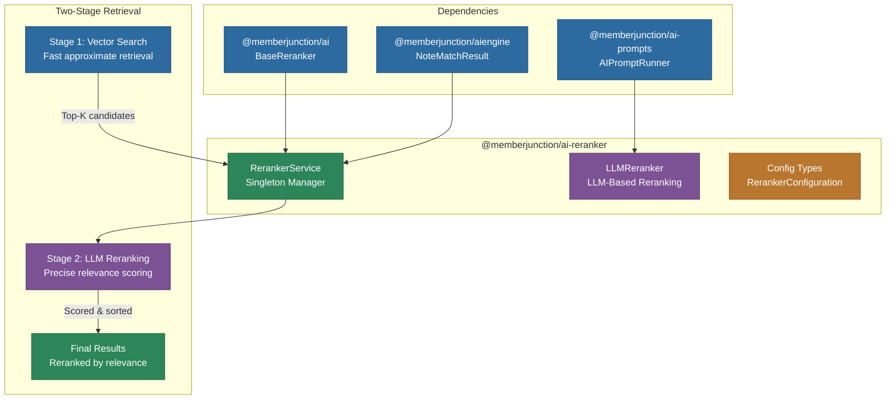

# @memberjunction/ai-reranker

Two-stage retrieval reranking service for MemberJunction's AI agent framework. Provides centralized reranker management and LLM-based reranking capabilities for improving the relevance of vector search results, particularly agent memory notes. Supports configurable reranking models, observability integration, and agent-level configuration.

## Architecture



## Installation

```bash
npm install @memberjunction/ai-reranker
```

## Key Exports

### RerankerService (Singleton)

Centralized service for managing reranker instances and performing note reranking. Caches reranker instances by model for efficient reuse.

```typescript
import { RerankerService, parseRerankerConfiguration } from '@memberjunction/ai-reranker';

// Parse configuration from agent entity
const config = parseRerankerConfiguration(agent.RerankerConfiguration);

if (config?.enabled) {
    const result = await RerankerService.Instance.rerankNotes(
        vectorSearchResults,   // NoteMatchResult[] from vector search
        userQuery,             // The user's query for relevance scoring
        config,                // RerankerConfiguration
        contextUser
    );

    if (result.success) {
        console.log(`Reranked ${result.notes.length} notes in ${result.durationMs}ms`);
    }
}
```

### LLMReranker

LLM-based reranking implementation that uses AI prompts to score document relevance. Extends `BaseReranker` from `@memberjunction/ai`.

```typescript
import { createLLMReranker } from '@memberjunction/ai-reranker';

const reranker = createLLMReranker(modelId, contextUser);
```

### RerankerConfiguration

Configuration type stored as JSON on agent entities:

```typescript
interface RerankerConfiguration {
    /** Whether reranking is enabled for this agent */
    enabled: boolean;
    /** AI model ID to use for reranking */
    modelId?: string;
    /** Maximum number of results to return after reranking */
    topK?: number;
    /** Minimum relevance score threshold (0-1) */
    minScore?: number;
}
```

### RerankServiceResult

```typescript
interface RerankServiceResult {
    notes: NoteMatchResult[];     // Reranked notes sorted by relevance
    success: boolean;             // Whether reranking succeeded
    durationMs: number;           // Time taken in milliseconds
    usage?: {                     // Token usage for cost tracking
        promptTokens?: number;
        completionTokens?: number;
        cost?: number;
    };
    runStepID?: string;           // Created run step ID (if observability enabled)
}
```

### RerankObservabilityOptions

Integration with agent run step tracking:

```typescript
const result = await RerankerService.Instance.rerankNotes(
    notes,
    query,
    config,
    contextUser,
    {
        agentRunID: runId,        // Link to agent run
        parentStepID: stepId,     // Parent step for hierarchy
        stepNumber: 3             // Step sequence number
    }
);
```

## How Two-Stage Retrieval Works

1. **Stage 1 -- Vector Search**: Fast approximate nearest-neighbor search using embeddings to retrieve a broad set of candidate notes (e.g., top 50)
2. **Stage 2 -- LLM Reranking**: An LLM evaluates each candidate note against the query and assigns a precise relevance score
3. **Result**: The top-K most relevant notes are returned, sorted by LLM-determined relevance

This approach combines the speed of vector search with the accuracy of LLM-based understanding, significantly improving retrieval quality for agent memory.

## Dependencies

- `@memberjunction/ai` -- BaseReranker, RerankParams, RerankResult
- `@memberjunction/ai-prompts` -- AIPromptRunner for LLM-based reranking
- `@memberjunction/ai-core-plus` -- Extended entity classes
- `@memberjunction/aiengine` -- AIEngine, NoteMatchResult
- `@memberjunction/core` -- MJ framework core
- `@memberjunction/core-entities` -- Generated entity classes
- `@memberjunction/global` -- Class factory
