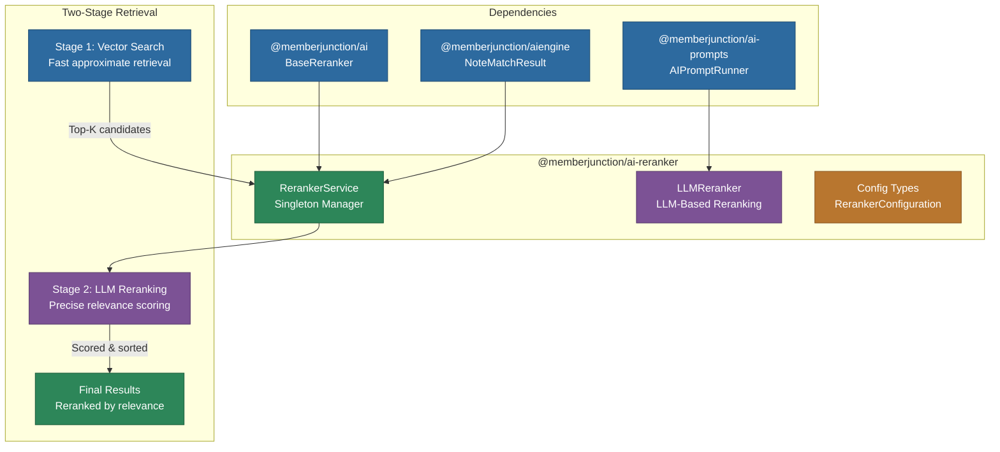

# @memberjunction/ai-reranker

Two-stage retrieval reranking service for MemberJunction's AI agent framework. Provides centralized reranker management and LLM-based reranking capabilities for improving the relevance of vector search results, particularly agent memory notes. Supports configurable reranking models, observability integration, and agent-level configuration.

## Architecture


```mermaid
graph TD
    subgraph "@memberjunction/ai-reranker"
        RS["RerankerService<br/>Singleton Manager"]
        style RS fill:#2d8659,stroke:#1a5c3a,color:#fff

        LR["LLMReranker<br/>LLM-Based Reranking"]
        style LR fill:#7c5295,stroke:#563a6b,color:#fff

        CT["Config Types<br/>RerankerConfiguration"]
        style CT fill:#b8762f,stroke:#8a5722,color:#fff
    end

    subgraph "Two-Stage Retrieval"
        S1["Stage 1: Vector Search<br/>Fast approximate retrieval"]
        style S1 fill:#2d6a9f,stroke:#1a4971,color:#fff

        S2["Stage 2: LLM Reranking<br/>Precise relevance scoring"]
        style S2 fill:#7c5295,stroke:#563a6b,color:#fff

        S3["Final Results<br/>Reranked by relevance"]
        style S3 fill:#2d8659,stroke:#1a5c3a,color:#fff
    end

    S1 -->|"Top-K candidates"| RS
    RS --> S2
    S2 -->|"Scored & sorted"| S3

    subgraph Dependencies
        AI["@memberjunction/ai<br/>BaseReranker"]
        style AI fill:#2d6a9f,stroke:#1a4971,color:#fff

        AIP["@memberjunction/ai-prompts<br/>AIPromptRunner"]
        style AIP fill:#2d6a9f,stroke:#1a4971,color:#fff

        AIE["@memberjunction/aiengine<br/>NoteMatchResult"]
        style AIE fill:#2d6a9f,stroke:#1a4971,color:#fff
    end

    AI --> RS
    AIP --> LR
    AIE --> RS
```

## Installation

```bash
npm install @memberjunction/ai-reranker
```

## Key Exports

### RerankerService (Singleton)

Centralized service for managing reranker instances and performing note reranking. Caches reranker instances by model for efficient reuse.

```typescript
import { RerankerService, parseRerankerConfiguration } from '@memberjunction/ai-reranker';

// Parse configuration from agent entity
const config = parseRerankerConfiguration(agent.RerankerConfiguration);

if (config?.enabled) {
    const result = await RerankerService.Instance.rerankNotes(
        vectorSearchResults,   // NoteMatchResult[] from vector search
        userQuery,             // The user's query for relevance scoring
        config,                // RerankerConfiguration
        contextUser
    );

    if (result.success) {
        console.log(`Reranked ${result.notes.length} notes in ${result.durationMs}ms`);
    }
}
```

### LLMReranker

LLM-based reranking implementation that uses AI prompts to score document relevance. Extends `BaseReranker` from `@memberjunction/ai`.

```typescript
import { createLLMReranker } from '@memberjunction/ai-reranker';

const reranker = createLLMReranker(modelId, contextUser);
```

### DecisionReranker

Scores each document with one typed-decision Likelihood question ("This note bears on the request: <document text>"), asked through `AIDecisionRunner` with the query as the state. A document's score is the answer's probability. An agent opts in by pointing `RerankerConfiguration.rerankerModelId` at the `Decision Reranker` model.

- **Runs:** its decision runs are children of the rerank's `MJ: AI Prompt Runs` row, whose `TotalCost` and token rollups include them, so the agent run counts the rerank.
- **Batching:** a decision call carries at most the smallest `Decision.MaxQuestionsPerCall` its prompt's models declare, or, when none declares one, 20 documents (`decisionMaxDocumentsPerCall`). Larger reranks are split across parallel calls.
- **Time budget:** the calls share one budget, 15 seconds unless `decisionTimeoutMS` sets another. When it runs out the calls are aborted and the rerank fails, so the agent falls back as `fallbackOnError` says.
- **Threshold:** its probabilities are not calibrated, so set `minRelevanceThreshold` low; 0.1 is the recommended start.
- **Failures:** a failed call, or a missing or invalid answer for any document, fails the whole rerank. No score is invented.

### RerankerConfiguration

Configuration type stored as JSON in the agent's `RerankerConfiguration` column:

```typescript
interface RerankerConfiguration {
    /** Master switch for reranking */
    enabled: boolean;
    /** ID of the AI Model (type 'Reranker') to rerank with */
    rerankerModelId: string;
    /** Fetch N * retrievalMultiplier candidates, then rerank to the top N. Default: 3 */
    retrievalMultiplier: number;
    /**
     * Minimum relevance score (0-1) to keep a result. When none reaches it, the agent keeps the
     * vector search results instead. Default: 0.5; for a DecisionReranker, 0.1 is recommended.
     */
    minRelevanceThreshold: number;
    /** The prompt a prompt-backed reranker runs: LLMReranker's chat prompt, or DecisionReranker's decision prompt */
    rerankPromptID?: string;
    /** Extra note fields to include in each document's text */
    contextFields?: string[];
    /** On a failed rerank, use the vector search results (true) or throw (false). Default: true */
    fallbackOnError: boolean;
    /** Rerank examples too, with the same reranker and threshold. Default: false */
    rerankExamples?: boolean;
    /** DecisionReranker's time budget, in milliseconds. Default: 15000 */
    decisionTimeoutMS?: number;
    /** DecisionReranker's documents per call when no model declares a limit. Default: 20 */
    decisionMaxDocumentsPerCall?: number;
}
```

### RerankServiceResult

```typescript
interface RerankServiceResult {
    notes: NoteMatchResult[];     // Reranked notes sorted by relevance
    success: boolean;             // Whether reranking succeeded
    durationMs: number;           // Time taken in milliseconds
    usage?: {                     // Token usage for cost tracking
        promptTokens?: number;
        completionTokens?: number;
        cost?: number;
    };
    runStepID?: string;           // Created run step ID (if observability enabled)
}
```

### RerankObservabilityOptions

Integration with agent run step tracking:

```typescript
const result = await RerankerService.Instance.rerankNotes(
    notes,
    query,
    config,
    contextUser,
    {
        agentRunID: runId,        // Link to agent run
        parentStepID: stepId,     // Parent step for hierarchy
        stepNumber: 3,            // Step sequence number
        OnStepCreated: step => run.Steps.push(step) // Count the rerank in the agent run
    }
);
```

`RerankExamples` takes the same options and records a `Rerank Examples` step. The step's `PromptRun` is the rerank's run, so an agent that adds the step to its run's steps counts the rerank's cost and tokens toward `MaxCostPerRun` and `MaxTokensPerRun`; `BaseAgent` does this.

## How Two-Stage Retrieval Works

1. **Stage 1 -- Vector Search**: Fast approximate nearest-neighbor search using embeddings to retrieve a broad set of candidate notes (e.g., top 50)
2. **Stage 2 -- LLM Reranking**: An LLM evaluates each candidate note against the query and assigns a precise relevance score
3. **Result**: The top-K most relevant notes are returned, sorted by LLM-determined relevance

This approach combines the speed of vector search with the accuracy of LLM-based understanding, significantly improving retrieval quality for agent memory.

### Interaction with Consolidation

The candidate corpus the reranker scores is the in-process vector store (`AIEngine._noteVectorService`). Since v5.30.x, that store is kept in sync with persisted `Status='Active'` (see [`@memberjunction/aiengine` README](../Engine/README.md#vector-store-invariant-preservation)), which has two consequences for reranking:

- **Consolidated source notes drop out immediately.** When MemoryManagerAgent's consolidation pipeline merges a cluster, source notes are revoked in the same operation that removes their vector entries. They stop appearing as rerank candidates without an MJAPI restart.
- **Protection tier is metadata, not a rerank gate.** `ProtectionTier` (`Immutable` / `Protected` / `Standard` / `Ephemeral`) lives on the note entity and flows through to the reranker as part of each candidate's data. The reranker itself does not filter or weight by tier; downstream consumers (MemoryManagerAgent's decay phase, retrieval policies layered on top of `RerankServiceResult`) are responsible for any tier-aware logic.

For the consolidation pipeline mechanics and protection-tier semantics, see [`@memberjunction/ai-agents`](../Agents/README.md#consolidation-pipeline).

## Dependencies

- `@memberjunction/ai` -- BaseReranker, RerankParams, RerankResult
- `@memberjunction/ai-prompts` -- AIPromptRunner for LLM-based reranking
- `@memberjunction/ai-core-plus` -- Extended entity classes
- `@memberjunction/aiengine` -- AIEngine, NoteMatchResult
- `@memberjunction/core` -- MJ framework core
- `@memberjunction/core-entities` -- Generated entity classes
- `@memberjunction/global` -- Class factory
