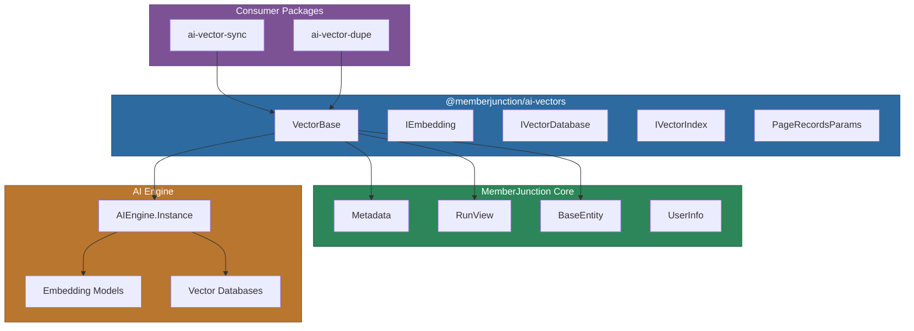
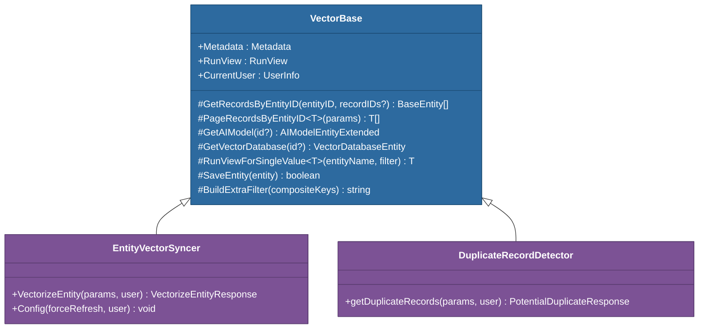

# @memberjunction/ai-vectors

The core foundation package for vector operations in MemberJunction. Provides base classes, interfaces, and type definitions that all other vector packages build upon.

## Architecture



## Installation

```bash
npm install @memberjunction/ai-vectors
```

## Overview

This package serves as the shared foundation for all vector-related operations in MemberJunction. It provides:

- **VectorBase** -- a base class that integrates with MemberJunction metadata, AI models, vector databases, and the entity system
- **Interfaces** -- contracts for embedding generation (`IEmbedding`), vector database management (`IVectorDatabase`), and vector index CRUD (`IVectorIndex`)
- **Type definitions** -- `PageRecordsParams` for paginated data retrieval across entities

All higher-level vector packages (`ai-vector-sync`, `ai-vector-dupe`) extend `VectorBase` to inherit its data access, model lookup, and user context capabilities.

## Core Components

### VectorBase Class

The primary class that downstream packages extend. It wraps MemberJunction's `Metadata`, `RunView`, and `AIEngine` systems into a unified base for vector operations.



**Key capabilities:**

| Method | Purpose |
|---|---|
| `GetRecordsByEntityID` | Load all entity records, optionally filtered by composite keys |
| `PageRecordsByEntityID` | Paginated retrieval with configurable page size, result type, and filter |
| `GetAIModel` | Locate an embedding model from `AIEngine.Instance.Models` by ID or get the first available |
| `GetVectorDatabase` | Locate a vector database from `AIEngine.Instance.VectorDatabases` by ID or get the first available |
| `RunViewForSingleValue` | Query for a single entity record matching a filter |
| `SaveEntity` | Save a `BaseEntity` with the current user context automatically applied |
| `BuildExtraFilter` | Convert an array of `CompositeKey` objects into a SQL filter string |

### Interfaces

#### IEmbedding

Contract for text embedding providers:

```typescript
interface IEmbedding {
    createEmbedding(text: string, options?: unknown): unknown;
    createBatchEmbedding(text: string[], options?: unknown): unknown;
}
```

#### IVectorDatabase

Contract for vector database management operations:

```typescript
interface IVectorDatabase {
    listIndexes(options?: unknown): unknown;
    createIndex(options: unknown): unknown;
    deleteIndex(indexID: unknown, options?: unknown): unknown;
    editIndex(indexID: unknown, options?: unknown): unknown;
}
```

#### IVectorIndex

Contract for CRUD operations on vector records within an index:

```typescript
interface IVectorIndex {
    createRecord(record: unknown, options?: unknown): unknown;
    createRecords(records: unknown[], options?: unknown): unknown;
    getRecord(recordID: unknown, options?: unknown): unknown;
    getRecords(recordIDs: unknown[], options?: unknown): unknown;
    updateRecord(record: unknown, options?: unknown): unknown;
    updateRecords(records: unknown[], options?: unknown): unknown;
    deleteRecord(recordID: unknown, options?: unknown): unknown;
    deleteRecords(recordIDs: unknown[], options?: unknown): unknown;
}
```

### PageRecordsParams Type

Configuration for paginated entity record retrieval:

```typescript
type PageRecordsParams = {
    EntityID: string | number;
    PageNumber: number;
    PageSize: number;
    ResultType: "entity_object" | "simple" | "count_only";
    Filter?: string;
};
```

## Usage

### Extending VectorBase

Create specialized vector processing classes by extending `VectorBase`:

```typescript
import { VectorBase, PageRecordsParams } from '@memberjunction/ai-vectors';
import { BaseEntity } from '@memberjunction/core';

export class MyVectorProcessor extends VectorBase {
    async processEntity(entityId: string): Promise<void> {
        // Retrieve all records for an entity
        const records = await this.GetRecordsByEntityID(entityId);

        // Access configured AI models and vector databases
        const model = this.GetAIModel();
        const vectorDb = this.GetVectorDatabase();

        for (const record of records) {
            // Process each record with the embedding model and vector DB
        }
    }

    async processInPages(entityId: string): Promise<void> {
        let page = 1;
        let hasMore = true;

        while (hasMore) {
            const params: PageRecordsParams = {
                EntityID: entityId,
                PageNumber: page,
                PageSize: 100,
                ResultType: 'simple',
                Filter: "Status = 'Active'"
            };

            const records = await this.PageRecordsByEntityID<Record<string, unknown>>(params);
            hasMore = records.length === 100;
            page++;
        }
    }
}
```

### Filtering with Composite Keys

```typescript
import { VectorBase } from '@memberjunction/ai-vectors';
import { CompositeKey } from '@memberjunction/core';

class FilteredProcessor extends VectorBase {
    async getSpecificRecords(entityId: string): Promise<void> {
        const keys: CompositeKey[] = [
            { KeyValuePairs: [{ FieldName: 'ID', Value: 'abc-123' }] },
            { KeyValuePairs: [{ FieldName: 'ID', Value: 'def-456' }] }
        ];

        // Generates: (ID = 'abc-123') OR (ID = 'def-456')
        const records = await this.GetRecordsByEntityID(entityId, keys);
    }
}
```

## Package Ecosystem

This package sits at the base of the MemberJunction vector package hierarchy:

| Package | Depends On Core | Purpose |
|---|---|---|
| `@memberjunction/ai-vectordb` | No (peer) | Abstract vector database interface |
| `@memberjunction/ai-vector-sync` | Yes | Entity-to-vector synchronization |
| `@memberjunction/ai-vector-dupe` | Yes | Duplicate detection via vector similarity |
| `@memberjunction/ai-vectors-memory` | No | In-memory vector search and clustering |
| `@memberjunction/ai-vectors-pinecone` | No | Pinecone implementation of `VectorDBBase` |

## Dependencies

| Package | Purpose |
|---|---|
| `@memberjunction/core` | Metadata, RunView, BaseEntity, UserInfo |
| `@memberjunction/global` | MJGlobal class factory |
| `@memberjunction/core-entities` | VectorDatabaseEntity and other entity types |
| `@memberjunction/aiengine` | AIEngine singleton for model and database discovery |
| `@memberjunction/ai` | Base AI abstractions |
| `@memberjunction/ai-core-plus` | AIModelEntityExtended |
| `@memberjunction/ai-vectordb` | VectorDBBase and related types |

## Development

```bash
# Build
npm run build

# Development mode
npm run start
```

## License

ISC
