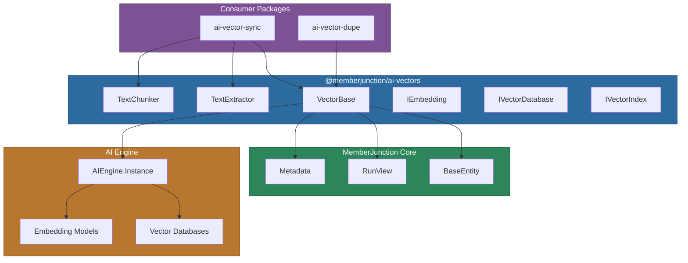
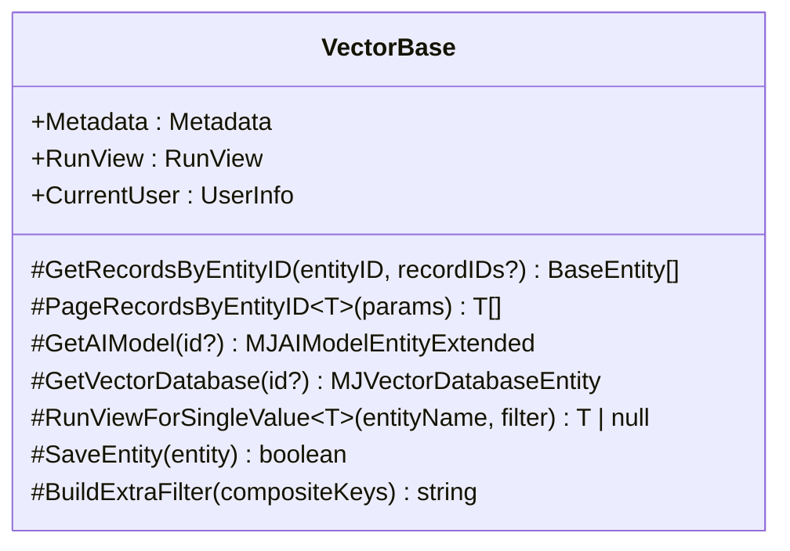

# @memberjunction/ai-vectors

Core foundation package for vector operations in MemberJunction. Provides text processing utilities (chunking, extraction), base classes for vectorization pipelines, and interfaces for embedding providers and vector databases.

## Installation

```bash
npm install @memberjunction/ai-vectors
```

## What's Included

| Export | Type | Purpose |
|---|---|---|
| `TextChunker` | Class | Token-aware text splitting with sentence, paragraph, and fixed strategies |
| `TextExtractor` | Class | HTML stripping, entity decoding, MIME-type routing, token truncation |
| `VectorBase` | Class | Base class providing RunView, Metadata, AIEngine integration for subclasses |
| `IEmbedding` | Interface | Contract for single and batch text embedding generation |
| `IVectorDatabase` | Interface | Contract for vector database management (create/delete/list indexes) |
| `IVectorIndex` | Interface | Contract for CRUD operations on vector records within an index |
| `ChunkTextParams` | Type | Configuration for `TextChunker.ChunkText()` |
| `TextChunk` | Type | Output chunk with text, offsets, token count, and index |
| `PageRecordsParams` | Type | Paginated entity record retrieval configuration. Supports both OFFSET-based pagination (`PageNumber`) and keyset/seek pagination (`AfterKey`) — see [KEYSET_PAGINATION_GUIDE.md](../../../../guides/KEYSET_PAGINATION_GUIDE.md). |

## Architecture


```mermaid
graph TD
    subgraph Core["@memberjunction/ai-vectors"]
        TC["TextChunker"]
        TE["TextExtractor"]
        VB["VectorBase"]
        IE["IEmbedding"]
        IVD["IVectorDatabase"]
        IVI["IVectorIndex"]
    end

    subgraph MJCore["MemberJunction Core"]
        MD["Metadata"]
        RV["RunView"]
        BE["BaseEntity"]
    end

    subgraph AIEngine["AI Engine"]
        AIM["AIEngine.Instance"]
        MOD["Embedding Models"]
        VDB["Vector Databases"]
    end

    subgraph Consumers["Consumer Packages"]
        SYNC["ai-vector-sync"]
        DUPE["ai-vector-dupe"]
    end

    VB --> MD
    VB --> RV
    VB --> BE
    VB --> AIM
    AIM --> MOD
    AIM --> VDB
    SYNC --> VB
    SYNC --> TC
    SYNC --> TE
    DUPE --> VB

    style Core fill:#2d6a9f,stroke:#1a4971,color:#fff
    style MJCore fill:#2d8659,stroke:#1a5c3a,color:#fff
    style AIEngine fill:#b8762f,stroke:#8a5722,color:#fff
    style Consumers fill:#7c5295,stroke:#563a6b,color:#fff
```

## TextChunker

Token-aware text splitting that respects natural language boundaries. All methods are static.

### Strategies

| Strategy | Splits On | Best For |
|---|---|---|
| `sentence` | Sentence-ending punctuation (`.` `!` `?`) | Prose, articles, descriptions |
| `paragraph` | Double newlines (`\n\n`) | Structured documents, Markdown, reports |
| `fixed` | Whitespace boundaries at the character limit | Logs, code, unstructured data |

### Basic Usage

```typescript
import { TextChunker, ChunkTextParams, TextChunk } from '@memberjunction/ai-vectors';

const article = `Machine learning models require training data.
The quality of training data directly impacts model performance.
Data preprocessing is a critical step in any ML pipeline.

Feature engineering transforms raw data into meaningful representations.
Good features can dramatically improve model accuracy.`;

// Sentence strategy (default)
const chunks: TextChunk[] = TextChunker.ChunkText({
    Text: article,
    MaxChunkTokens: 128,
    Strategy: 'sentence'
});

for (const chunk of chunks) {
    console.log(`Chunk ${chunk.Index}: ${chunk.TokenCount} tokens, offset ${chunk.StartOffset}-${chunk.EndOffset}`);
    console.log(chunk.Text);
}
```

### Paragraph Strategy

```typescript
const markdownDoc = `## Introduction

This document covers the architecture of our data pipeline.
It handles ingestion, transformation, and storage.

## Processing

Records are validated against schema constraints.
Invalid records are routed to a dead-letter queue.

## Storage

Processed data is stored in both relational and vector databases.
Vector embeddings enable semantic search across all records.`;

const chunks = TextChunker.ChunkText({
    Text: markdownDoc,
    MaxChunkTokens: 256,
    Strategy: 'paragraph'
});
// Each paragraph becomes a chunk (or paragraphs merge if they fit together)
```

### Fixed Strategy

```typescript
const logData = `2024-01-15T10:00:00Z INFO Server started on port 4000
2024-01-15T10:00:01Z INFO Connected to database
2024-01-15T10:00:02Z WARN High memory usage detected: 85%
2024-01-15T10:00:03Z ERROR Connection timeout after 30000ms`;

const chunks = TextChunker.ChunkText({
    Text: logData,
    MaxChunkTokens: 64,
    Strategy: 'fixed'
});
```

### Configuring Overlap

Overlap repeats trailing content from the previous chunk at the start of the next chunk, preserving context across chunk boundaries. Defaults to 10% of `MaxChunkTokens`.

```typescript
// Explicit overlap: 50 tokens of shared context between chunks
const chunks = TextChunker.ChunkText({
    Text: longDocument,
    MaxChunkTokens: 512,
    OverlapTokens: 50,
    Strategy: 'sentence'
});

// No overlap
const chunks = TextChunker.ChunkText({
    Text: longDocument,
    MaxChunkTokens: 512,
    OverlapTokens: 0,
    Strategy: 'sentence'
});
```

### Token Estimation

`EstimateTokenCount` provides a fast approximation using the ~4 characters per token heuristic for English text. This is suitable for chunking where exact counts are not critical.

```typescript
const tokens = TextChunker.EstimateTokenCount('This is a sample sentence.');
// Returns: 7 (26 characters / 4)

// For production accuracy with specific models, use tiktoken directly
// and pass the result to MaxChunkTokens for precise control
```

### TextChunk Output Shape

Each chunk includes full position metadata for traceability back to the source:

```typescript
interface TextChunk {
    Text: string;        // The chunk text content
    StartOffset: number; // Start character offset in original text
    EndOffset: number;   // End character offset (exclusive)
    TokenCount: number;  // Approximate token count
    Index: number;       // 0-based chunk index
}
```

## TextExtractor

Static utilities for extracting clean plain text from various content formats. Dependency-light (regex-based, no DOM parser required).

### HTML Extraction

```typescript
import { TextExtractor } from '@memberjunction/ai-vectors';

const html = `
<html>
<head><style>body { color: red; }</style></head>
<body>
  <h1>Welcome</h1>
  <p>This is a <strong>formatted</strong> paragraph with &amp; entities.</p>
  <script>alert('removed');</script>
  <ul>
    <li>Item one</li>
    <li>Item two</li>
  </ul>
</body>
</html>`;

const text = TextExtractor.ExtractFromHTML(html);
// "Welcome\nThis is a formatted paragraph with & entities.\nItem one\nItem two"
```

What it does:
- Removes `<script>` and `<style>` elements entirely
- Converts block-level elements (`<p>`, `<div>`, `<h1>`-`<h6>`, `<li>`, `<br>`, etc.) to newlines
- Strips all remaining HTML tags
- Decodes named entities (`&amp;`, `&lt;`, `&gt;`, `&quot;`, `&nbsp;`, `&mdash;`, `&hellip;`, etc.)
- Decodes numeric entities (decimal `&#169;` and hex `&#xA9;`)
- Normalizes whitespace (collapses runs of spaces, limits consecutive newlines to 2)

### Plain Text Normalization

```typescript
const raw = "  Some text\x00with\x07control\x1Fcharacters\n\n\n\n\nand  extra   spaces  ";
const clean = TextExtractor.ExtractFromPlainText(raw);
// "Some textwithcontrolcharacters\n\nand extra spaces"
```

Removes control characters (`\x00`-`\x1F` except `\n` and `\t`), normalizes whitespace, trims.

### MIME-Type Routing

```typescript
// Automatically selects the right extraction method
const fromHTML = TextExtractor.ExtractByMimeType(htmlContent, 'text/html');
const fromPlain = TextExtractor.ExtractByMimeType(plainContent, 'text/plain');
const fromCSV = TextExtractor.ExtractByMimeType(csvContent, 'text/csv');  // Falls back to plain text

// For binary formats (PDF, DOCX), extract text with a dedicated library first,
// then pass through ExtractFromPlainText for normalization:
// const pdfText = await pdfParse(buffer);
// const clean = TextExtractor.ExtractFromPlainText(pdfText);
```

### Token Truncation

```typescript
// Truncate text to fit within a model's context window
const truncated = TextExtractor.TruncateToTokenLimit(veryLongText, 8192);
// Truncates at the last whitespace boundary before the estimated character limit
```

## VectorBase

Abstract base class that downstream vector packages extend. Provides integrated access to MemberJunction's Metadata, RunView, and AIEngine systems.

### Class Diagram


```mermaid
classDiagram
    class VectorBase {
        +Metadata : Metadata
        +RunView : RunView
        +CurrentUser : UserInfo
        #GetRecordsByEntityID(entityID, recordIDs?) BaseEntity[]
        #PageRecordsByEntityID~T~(params) T[]
        #GetAIModel(id?) MJAIModelEntityExtended
        #GetVectorDatabase(id?) MJVectorDatabaseEntity
        #RunViewForSingleValue~T~(entityName, filter) T | null
        #SaveEntity(entity) boolean
        #BuildExtraFilter(compositeKeys) string
    }
```

### Extending VectorBase

```typescript
import { VectorBase, PageRecordsParams } from '@memberjunction/ai-vectors';
import { BaseEntity } from '@memberjunction/core';

export class MyVectorProcessor extends VectorBase {
    async ProcessEntity(entityId: string): Promise<void> {
        // Load all records for an entity
        const records = await this.GetRecordsByEntityID(entityId);

        // Access configured AI models and vector databases
        const model = this.GetAIModel();       // First available embedding model
        const vectorDb = this.GetVectorDatabase(); // First available vector DB

        for (const record of records) {
            // Generate embeddings, upsert into vector DB
        }
    }

    async ProcessInPages(entityId: string): Promise<void> {
        let page = 1;
        let hasMore = true;

        while (hasMore) {
            const records = await this.PageRecordsByEntityID<Record<string, unknown>>({
                EntityID: entityId,
                PageNumber: page,
                PageSize: 100,
                ResultType: 'simple',
                Filter: "Status = 'Active'"
            });
            hasMore = records.length === 100;
            page++;
        }
    }

    // Preferred for deep iteration: keyset (seek) pagination via AfterKey.
    // O(log N) per page regardless of depth — `PageNumber`-based OFFSET pagination
    // gets progressively slower as pages climb into the thousands.
    async ProcessInKeysetPages(entityId: string): Promise<void> {
        // Check upfront — falls back to PageNumber path if the entity has a composite PK.
        if (!this.CanUseKeysetPagination(entityId)) {
            // ... use the PageNumber loop above
            return;
        }
        const entity = this.Metadata.Entities.find(e => e.ID === entityId)!;
        const pkField = entity.FirstPrimaryKey!;

        let lastSeenKey: CompositeKey | undefined; // undefined => first page
        while (true) {
            const records = await this.PageRecordsByEntityID<Record<string, unknown>>({
                EntityID: entityId,
                PageNumber: 0, // ignored when AfterKey is set
                PageSize: 500,
                ResultType: 'simple',
                Filter: "Status = 'Active'",
                AfterKey: lastSeenKey,
            });
            if (records.length === 0) break;
            for (const r of records) { /* process */ }
            if (records.length < 500) break;
            lastSeenKey = CompositeKey.FromKeyValuePair(pkField.Name, records[records.length - 1][pkField.Name]);
        }
    }
}
```

### Keyset Pagination Helpers

`VectorBase` exposes two helpers for keyset (seek) pagination:

- **`PageRecordsParams.AfterKey?: CompositeKey`** — optional cursor that switches `PageRecordsByEntityID` from OFFSET (`PageNumber`) mode to keyset mode. When set, the query uses `WHERE pk > @lastSeen ORDER BY pk LIMIT N` and stays O(log N) per page.
- **`CanUseKeysetPagination(entityID)`** — returns true if the entity has a single-column PK on an orderable type (i.e. it's safe to pass `AfterKey`). Use it to choose between the keyset and OFFSET paths.

See **[KEYSET_PAGINATION_GUIDE.md](../../../../guides/KEYSET_PAGINATION_GUIDE.md)** for the full pattern, constraints (composite-PK entities throw `AfterKeyNotSupportedError`), and reference implementations across the framework.

### Filtering with Composite Keys

```typescript
import { VectorBase } from '@memberjunction/ai-vectors';
import { CompositeKey } from '@memberjunction/core';

class FilteredProcessor extends VectorBase {
    async GetSpecificRecords(entityId: string): Promise<void> {
        const keys: CompositeKey[] = [
            { KeyValuePairs: [{ FieldName: 'ID', Value: 'abc-123' }] },
            { KeyValuePairs: [{ FieldName: 'ID', Value: 'def-456' }] }
        ];

        // Generates: (ID = 'abc-123') OR (ID = 'def-456')
        const records = await this.GetRecordsByEntityID(entityId, keys);
    }
}
```

## API Reference

### TextChunker (Static Methods)

| Method | Parameters | Returns | Description |
|---|---|---|---|
| `ChunkText` | `params: ChunkTextParams` | `TextChunk[]` | Split text into token-bounded chunks using the specified strategy |
| `EstimateTokenCount` | `text: string` | `number` | Fast token count approximation (~4 chars/token) |

### TextExtractor (Static Methods)

| Method | Parameters | Returns | Description |
|---|---|---|---|
| `ExtractFromHTML` | `html: string` | `string` | Strip tags, decode entities, normalize whitespace |
| `ExtractFromPlainText` | `text: string` | `string` | Remove control characters, normalize whitespace |
| `ExtractByMimeType` | `content: string, mimeType: string` | `string` | Route to the appropriate extraction method by MIME type |
| `TruncateToTokenLimit` | `text: string, maxTokens: number` | `string` | Truncate at whitespace boundary within the token budget |

### VectorBase (Protected Methods for Subclasses)

| Method | Returns | Description |
|---|---|---|
| `GetRecordsByEntityID(entityID, recordIDs?)` | `Promise<BaseEntity[]>` | Load entity records, optionally filtered by composite keys |
| `PageRecordsByEntityID<T>(params)` | `Promise<T[]>` | Paginated retrieval with configurable page size and filter |
| `GetAIModel(id?)` | `MJAIModelEntityExtended` | Locate an embedding model by ID or get the first available |
| `GetVectorDatabase(id?)` | `MJVectorDatabaseEntity` | Locate a vector database by ID or get the first available |
| `RunViewForSingleValue<T>(entityName, filter)` | `Promise<T \| null>` | Query for a single entity record matching a filter |
| `SaveEntity(entity)` | `Promise<boolean>` | Save a BaseEntity with CurrentUser context applied |
| `BuildExtraFilter(compositeKeys)` | `string` | Convert CompositeKey array to a SQL filter string |

### Interfaces

| Interface | Methods | Purpose |
|---|---|---|
| `IEmbedding` | `createEmbedding`, `createBatchEmbedding` | Text embedding generation |
| `IVectorDatabase` | `listIndexes`, `createIndex`, `deleteIndex`, `editIndex` | Vector database management |
| `IVectorIndex` | `createRecord(s)`, `getRecord(s)`, `updateRecord(s)`, `deleteRecord(s)` | Vector record CRUD |

## Package Ecosystem

| Package | Depends On Core | Purpose |
|---|---|---|
| `@memberjunction/ai-vectordb` | No (peer) | Abstract vector database interface |
| `@memberjunction/ai-vector-sync` | Yes | Entity-to-vector synchronization |
| `@memberjunction/ai-vector-dupe` | Yes | Duplicate detection via vector similarity |
| `@memberjunction/ai-vectors-memory` | No | In-memory vector search and clustering |
| `@memberjunction/ai-vectors-pinecone` | No | Pinecone implementation of VectorDBBase |

## Further Reading

- [Text Processing Guide](docs/TEXT_PROCESSING_GUIDE.md) -- in-depth guide on chunking strategies, overlap tuning, HTML edge cases, and integration with vectorization/autotagging pipelines

## Development

```bash
# Build
npm run build

# Run tests
npm run test

# Watch mode
npm run test:watch
```

## License

ISC
