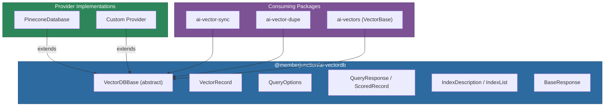
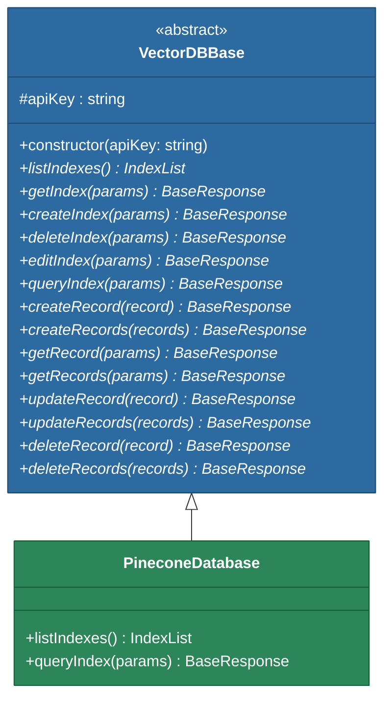
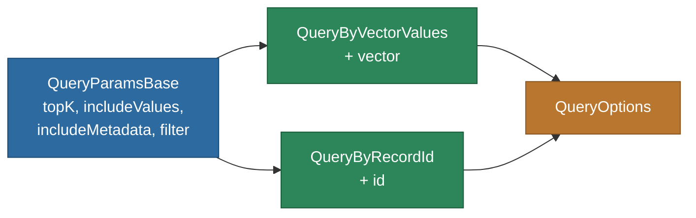

# @memberjunction/ai-vectordb

A provider-agnostic abstraction layer for vector databases in MemberJunction. This package defines the abstract base class, type system, and query interfaces that concrete vector database implementations (such as Pinecone) must fulfill.

## Architecture



## Installation

```bash
npm install @memberjunction/ai-vectordb
```

## Overview

This package provides:

- **VectorDBBase** -- an abstract class that defines a complete API for vector database operations (index management + record CRUD + similarity queries)
- **Record types** -- `VectorRecord`, `RecordValues`, `RecordSparseValues`, `RecordMetadata` for representing vectors and their metadata
- **Query types** -- `QueryOptions`, `QueryResponse`, `ScoredRecord` for similarity search
- **Index types** -- `IndexDescription`, `IndexList`, `IndexModelMetricEnum` for index configuration
- **Response types** -- `BaseResponse` for standardized success/failure responses

Concrete implementations like `@memberjunction/ai-vectors-pinecone` extend `VectorDBBase` to connect to specific vector database services.

## Core Components

### VectorDBBase (Abstract Class)

All vector database providers must extend this class. The constructor requires an API key, which is validated and stored for subclass access via a protected getter.



The abstract methods support both synchronous and asynchronous return types via union types (`BaseResponse | Promise<BaseResponse>`), allowing implementations to choose the appropriate pattern.

### Type System

#### Vector Records

```typescript
// Core vector record with generic metadata support
type VectorRecord<T extends RecordMetadata = RecordMetadata> = {
    id: string;                          // Unique record identifier
    values: RecordValues;                // Dense vector (array of numbers)
    sparseValues?: RecordSparseValues;   // Optional sparse representation for hybrid search
    metadata?: T;                        // Arbitrary filterable metadata
};

type RecordValues = Array<number>;

type RecordSparseValues = {
    indices: Array<number>;   // Non-zero positions
    values: Array<number>;    // Corresponding values
};

type RecordMetadataValue = string | boolean | number | Array<string>;
type RecordMetadata = Record<string, RecordMetadataValue>;
```

#### Index Configuration

```typescript
type IndexDescription = {
    name: string;                       // Index name (max 45 chars)
    dimension: number;                  // Vector dimensionality
    metric: IndexModelMetricEnum;       // 'cosine' | 'euclidean' | 'dotproduct'
    host: string;                       // Hosting URL
};
```

#### Query Types



```typescript
// Base query parameters shared by all query types
type QueryParamsBase = {
    topK: number;               // Number of results to return
    includeValues?: boolean;    // Include vector values in results
    includeMetadata?: boolean;  // Include metadata in results
    filter?: object;            // Metadata filter
};

// Query by providing a vector directly
type QueryByVectorValues = QueryParamsBase & { vector: RecordValues };

// Query using an existing record's vector
type QueryByRecordId = QueryParamsBase & { id: string };

// Union type for all query configurations
type QueryOptions = QueryByRecordId | QueryByVectorValues;
```

#### Query Response

```typescript
type QueryResponse<T extends RecordMetadata = RecordMetadata> = {
    matches: Array<ScoredRecord<T>>;  // Sorted by similarity
    namespace: string;                 // Execution namespace
    usage?: OperationUsage;            // Read unit consumption
};

interface ScoredRecord<T> extends VectorRecord<T> {
    score?: number;  // Similarity score (interpretation depends on metric)
}
```

#### Standardized Response

All operations return a `BaseResponse`:

```typescript
type BaseResponse = {
    success: boolean;
    message: string;
    data: unknown;
};
```

## Usage

### Implementing a Provider

```typescript
import {
    VectorDBBase,
    VectorRecord,
    BaseResponse,
    CreateIndexParams,
    QueryOptions,
    IndexList
} from '@memberjunction/ai-vectordb';

export class MyVectorDB extends VectorDBBase {
    constructor(apiKey: string) {
        super(apiKey); // Validates and stores the API key
    }

    async listIndexes(): Promise<IndexList> {
        // Call your vector DB API using this.apiKey
        return { indexes: [] };
    }

    async createIndex(params: CreateIndexParams): Promise<BaseResponse> {
        return { success: true, message: 'Created', data: { id: params.id } };
    }

    async queryIndex(params: QueryOptions): Promise<BaseResponse> {
        // Perform similarity search
        return { success: true, message: 'OK', data: { matches: [] } };
    }

    // ... implement remaining abstract methods
}
```

### Consuming a Provider

```typescript
import { VectorDBBase, VectorRecord } from '@memberjunction/ai-vectordb';

async function searchSimilar(vectorDB: VectorDBBase, embedding: number[]): Promise<void> {
    // Insert a record
    const record: VectorRecord = {
        id: 'doc-001',
        values: embedding,
        metadata: { entity: 'Products', recordId: '12345' }
    };
    await vectorDB.createRecord(record);

    // Query for similar vectors
    const result = await vectorDB.queryIndex({
        vector: embedding,
        topK: 10,
        includeMetadata: true
    });

    if (result.success) {
        for (const match of result.data.matches) {
            console.log(`Match: ${match.id} (score: ${match.score})`);
        }
    }
}
```

## Distance Metrics

The `IndexModelMetricEnum` supports three metrics for similarity comparison:

| Metric | Description | Use Case |
|---|---|---|
| `cosine` | Measures angle between vectors (direction similarity) | Text embeddings, semantic search |
| `euclidean` | Straight-line distance between points | Numeric features, specifications |
| `dotproduct` | Measures both direction and magnitude alignment | Recommendation systems, weighted scoring |

## Available Implementations

| Package | Vector Database |
|---|---|
| `@memberjunction/ai-vectors-pinecone` | Pinecone |

Create additional implementations by extending `VectorDBBase` and registering with MemberJunction's class factory.

## Dependencies

| Package | Purpose |
|---|---|
| `@memberjunction/core` | Core MemberJunction functionality |
| `@memberjunction/global` | Global utilities |

## Development

```bash
# Build
npm run build

# Development mode
npm run start
```

## License

ISC
