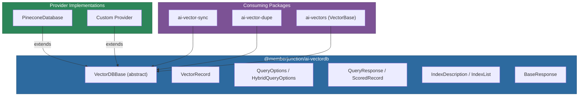
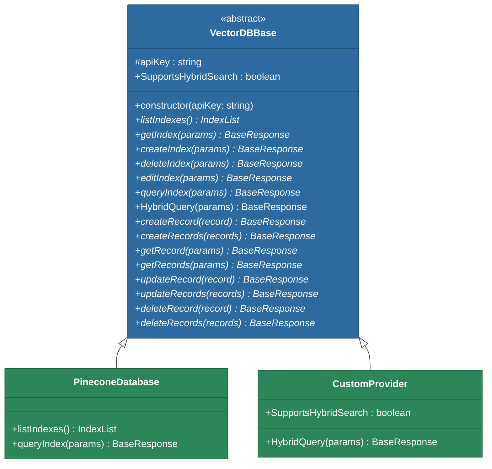
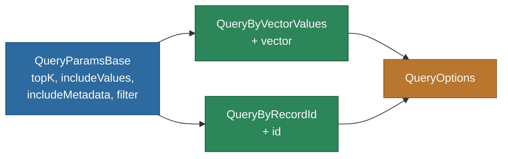

# @memberjunction/ai-vectordb

A provider-agnostic abstraction layer for vector databases in MemberJunction. This package defines the `VectorDBBase` abstract class and all associated types that concrete vector database implementations must fulfill. It contains no provider-specific logic -- only the contracts, data structures, and query interfaces shared across all implementations.

## Architecture


```mermaid
graph TD
    subgraph Abstraction["@memberjunction/ai-vectordb"]
        VDBB["VectorDBBase (abstract)"]
        VR["VectorRecord"]
        QO["QueryOptions / HybridQueryOptions"]
        QR["QueryResponse / ScoredRecord"]
        IDX["IndexDescription / IndexList"]
        BR["BaseResponse"]
    end

    subgraph Implementations["Provider Implementations"]
        PC["PineconeDatabase"]
        CUSTOM["Custom Provider"]
    end

    subgraph Consumers["Consuming Packages"]
        SYNC["ai-vector-sync"]
        DUPE["ai-vector-dupe"]
        CORE["ai-vectors (VectorBase)"]
    end

    PC -->|extends| VDBB
    CUSTOM -->|extends| VDBB
    SYNC --> VDBB
    DUPE --> VDBB
    CORE --> VDBB

    style Abstraction fill:#2d6a9f,stroke:#1a4971,color:#fff
    style Implementations fill:#2d8659,stroke:#1a5c3a,color:#fff
    style Consumers fill:#7c5295,stroke:#563a6b,color:#fff
```

All vector database providers extend `VectorDBBase` and implement its abstract methods. Consumer code programs against the base class, making it straightforward to swap providers without changing application logic.

## Installation

```bash
npm install @memberjunction/ai-vectordb
```

## Quick Start

```typescript
import { VectorDBBase, VectorRecord } from '@memberjunction/ai-vectordb';

// Use any concrete provider that extends VectorDBBase
const db: VectorDBBase = new PineconeDatabase(apiKey);

// Insert a vector record
const record: VectorRecord = {
    id: 'doc-001',
    values: [0.1, 0.2, 0.3 /* ... */],
    metadata: { entity: 'Products', recordId: '12345' }
};
await db.createRecord(record);

// Query for similar vectors
const result = await db.queryIndex({
    vector: [0.1, 0.2, 0.3 /* ... */],
    topK: 10,
    includeMetadata: true
});

if (result.success) {
    for (const match of result.data.matches) {
        console.log(`Match: ${match.id} (score: ${match.score})`);
    }
}
```

## VectorDBBase Abstract Class

All vector database providers must extend this class. The constructor requires an API key, which is validated (must be non-empty) and stored for subclass access via a protected getter.


```mermaid
classDiagram
    class VectorDBBase {
        <<abstract>>
        #apiKey : string
        +constructor(apiKey: string)
        +SupportsHybridSearch : boolean
        +listIndexes()* IndexList
        +getIndex(params)* BaseResponse
        +createIndex(params)* BaseResponse
        +deleteIndex(params)* BaseResponse
        +editIndex(params)* BaseResponse
        +queryIndex(params)* BaseResponse
        +HybridQuery(params) BaseResponse
        +createRecord(record)* BaseResponse
        +createRecords(records)* BaseResponse
        +getRecord(params)* BaseResponse
        +getRecords(params)* BaseResponse
        +updateRecord(record)* BaseResponse
        +updateRecords(records)* BaseResponse
        +deleteRecord(record)* BaseResponse
        +deleteRecords(records)* BaseResponse
    }

    class PineconeDatabase {
        +listIndexes() IndexList
        +queryIndex(params) BaseResponse
    }

    class CustomProvider {
        +SupportsHybridSearch : boolean
        +HybridQuery(params) BaseResponse
    }

    VectorDBBase <|-- PineconeDatabase
    VectorDBBase <|-- CustomProvider

    style VectorDBBase fill:#2d6a9f,stroke:#1a4971,color:#fff
    style PineconeDatabase fill:#2d8659,stroke:#1a5c3a,color:#fff
    style CustomProvider fill:#2d8659,stroke:#1a5c3a,color:#fff
```

All abstract methods use union return types (`BaseResponse | Promise<BaseResponse>`) so subclasses can implement them as either synchronous or asynchronous.

## Abstract Methods Reference

### Index Operations

| Method | Parameters | Returns | Description |
|---|---|---|---|
| `listIndexes()` | none | `IndexList` | List all indexes in the project. |
| `getIndex(params)` | `BaseRequestParams` | `BaseResponse` | Retrieve configuration details for a single index by ID. |
| `createIndex(params)` | `CreateIndexParams` | `BaseResponse` | Create a new vector index with specified dimension, metric, and optional provider-specific params. |
| `deleteIndex(params)` | `BaseRequestParams` | `BaseResponse` | Permanently delete an index and all its records. |
| `editIndex(params)` | `EditIndexParams` | `BaseResponse` | Modify an existing index's configuration. |
| `queryIndex(params)` | `QueryOptions` | `BaseResponse` | Execute a similarity search against an index by vector values or by record ID. |

### Record Operations

| Method | Parameters | Returns | Description |
|---|---|---|---|
| `createRecord(record)` | `VectorRecord` | `BaseResponse` | Insert a single vector record into an index. |
| `createRecords(records)` | `VectorRecord[]` | `BaseResponse` | Insert multiple vector records in batch. |
| `getRecord(params)` | `BaseRequestParams` | `BaseResponse` | Fetch a single record by ID. |
| `getRecords(params)` | `BaseRequestParams` | `BaseResponse` | Fetch multiple records (IDs passed via `data`). |
| `updateRecord(record)` | `UpdateOptions` | `BaseResponse` | Update a single record's vector values and/or metadata. |
| `updateRecords(records)` | `UpdateOptions` | `BaseResponse` | Update multiple records in batch. |
| `deleteRecord(record)` | `VectorRecord` | `BaseResponse` | Delete a single record from an index. |
| `deleteRecords(records)` | `VectorRecord[]` | `BaseResponse` | Delete multiple records in batch. |

### Virtual Methods (Non-Abstract)

| Method | Parameters | Returns | Description |
|---|---|---|---|
| `SupportsHybridSearch` (getter) | none | `boolean` | Returns `false` by default. Override to return `true` in providers that implement `HybridQuery()`. |
| `HybridQuery(params)` | `HybridQueryOptions` | `BaseResponse` | Perform a hybrid search combining vector similarity with keyword matching. Default implementation falls back to `queryIndex()`. |

## Hybrid Search

Hybrid search combines dense vector similarity (semantic search) with sparse keyword matching (BM25) to produce more relevant results than either technique alone. This is particularly useful when queries contain specific terms (product names, codes, identifiers) that benefit from exact text matching alongside semantic understanding.

### How It Works

1. **Check support**: Read the `SupportsHybridSearch` getter before calling `HybridQuery()`.
2. **Call HybridQuery**: Pass both a vector embedding and an optional keyword query string.
3. **Fallback behavior**: If the provider does not override `HybridQuery()`, the base class automatically falls back to a pure vector `queryIndex()` call, ignoring keyword-specific parameters (`KeywordQuery`, `Alpha`, `FusionMethod`). This means consumer code does not need to branch on provider capability -- it is always safe to call `HybridQuery()`.

### HybridQueryOptions

`HybridQueryOptions` extends `QueryParamsBase` with the following additional fields:

| Property | Type | Required | Description |
|---|---|---|---|
| `vector` | `RecordValues` | Yes | Embedding vector for the semantic similarity component. |
| `KeywordQuery` | `string` | No | Keyword query string for BM25/text search. |
| `Alpha` | `number` | No | Balance between vector and keyword results. `0.0` = pure keyword, `1.0` = pure vector. Default: `0.7`. |
| `FusionMethod` | `'rrf' \| 'weighted'` | No | Strategy for fusing vector and keyword result lists. Default: `'rrf'` (Reciprocal Rank Fusion). |

Plus the inherited `QueryParamsBase` fields: `topK`, `includeValues`, `includeMetadata`, `filter`.

### Implementing Hybrid Search in a Provider

```typescript
import { VectorDBBase, HybridQueryOptions, BaseResponse } from '@memberjunction/ai-vectordb';

export class WeaviateDB extends VectorDBBase {
    public override get SupportsHybridSearch(): boolean {
        return true;
    }

    public override async HybridQuery(params: HybridQueryOptions): Promise<BaseResponse> {
        const results = await this.client.hybridSearch({
            vector: params.vector,
            query: params.KeywordQuery,
            alpha: params.Alpha ?? 0.7,
            fusionType: params.FusionMethod ?? 'rrf',
            limit: params.topK,
            includeMetadata: params.includeMetadata
        });
        return { success: true, message: 'Hybrid query complete', data: results };
    }

    // ... remaining abstract method implementations
}
```

### Consumer Usage

```typescript
const db: VectorDBBase = getVectorProvider();

// Safe to call regardless of provider -- falls back to pure vector search
const results = await db.HybridQuery({
    vector: embedding,
    KeywordQuery: 'quarterly revenue report',
    Alpha: 0.6,
    topK: 20,
    includeMetadata: true
});

// Or check support for conditional UI behavior
if (db.SupportsHybridSearch) {
    showKeywordSearchInput();
}
```

## Implementing a Custom Provider

Follow these steps to add support for a new vector database (e.g., Weaviate, Qdrant, Milvus).

### Step 1: Create the Provider Class

```typescript
import {
    VectorDBBase,
    BaseRequestParams,
    BaseResponse,
    CreateIndexParams,
    EditIndexParams,
    IndexList,
    QueryOptions,
    UpdateOptions,
    VectorRecord
} from '@memberjunction/ai-vectordb';

export class QdrantDB extends VectorDBBase {
    private client: QdrantClient;

    constructor(apiKey: string, host: string) {
        super(apiKey); // Validates the API key
        this.client = new QdrantClient({ apiKey: this.apiKey, host });
    }

    async listIndexes(): Promise<IndexList> {
        const collections = await this.client.getCollections();
        return {
            indexes: collections.map(c => ({
                name: c.name,
                dimension: c.vectors.size,
                metric: c.vectors.distance,
                host: this.host
            }))
        };
    }

    async getIndex(params: BaseRequestParams): Promise<BaseResponse> {
        const info = await this.client.getCollection(params.id);
        return { success: true, message: 'Index retrieved', data: info };
    }

    async createIndex(params: CreateIndexParams): Promise<BaseResponse> {
        await this.client.createCollection(params.id, {
            vectors: { size: params.dimension, distance: params.metric }
        });
        return { success: true, message: 'Index created', data: null };
    }

    async deleteIndex(params: BaseRequestParams): Promise<BaseResponse> {
        await this.client.deleteCollection(params.id);
        return { success: true, message: 'Index deleted', data: null };
    }

    async editIndex(params: EditIndexParams): Promise<BaseResponse> {
        await this.client.updateCollection(params.id, params.data);
        return { success: true, message: 'Index updated', data: null };
    }

    async queryIndex(params: QueryOptions): Promise<BaseResponse> {
        const results = await this.client.search(params);
        return { success: true, message: 'Query complete', data: results };
    }

    async createRecord(record: VectorRecord): Promise<BaseResponse> {
        await this.client.upsert([record]);
        return { success: true, message: 'Record created', data: null };
    }

    async createRecords(records: VectorRecord[]): Promise<BaseResponse> {
        await this.client.upsert(records);
        return { success: true, message: `${records.length} records created`, data: null };
    }

    async getRecord(params: BaseRequestParams): Promise<BaseResponse> {
        const record = await this.client.retrieve(params.id);
        return { success: true, message: 'Record retrieved', data: record };
    }

    async getRecords(params: BaseRequestParams): Promise<BaseResponse> {
        const records = await this.client.retrieveMany(params.data);
        return { success: true, message: 'Records retrieved', data: records };
    }

    async updateRecord(record: UpdateOptions): Promise<BaseResponse> {
        await this.client.update(record);
        return { success: true, message: 'Record updated', data: null };
    }

    async updateRecords(records: UpdateOptions): Promise<BaseResponse> {
        await this.client.updateMany(records);
        return { success: true, message: 'Records updated', data: null };
    }

    async deleteRecord(record: VectorRecord): Promise<BaseResponse> {
        await this.client.delete(record.id);
        return { success: true, message: 'Record deleted', data: null };
    }

    async deleteRecords(records: VectorRecord[]): Promise<BaseResponse> {
        await this.client.deleteMany(records.map(r => r.id));
        return { success: true, message: 'Records deleted', data: null };
    }
}
```

### Step 2: Register with MemberJunction Class Factory (Optional)

If you want MemberJunction's class factory to discover your provider automatically:

```typescript
import { RegisterClass } from '@memberjunction/global';

@RegisterClass(VectorDBBase, 'QdrantDB')
export class QdrantDB extends VectorDBBase {
    // ... implementation
}
```

### Step 3: Add Hybrid Search Support (Optional)

If your vector database supports hybrid search natively, override the getter and method:

```typescript
export class QdrantDB extends VectorDBBase {
    public override get SupportsHybridSearch(): boolean {
        return true;
    }

    public override async HybridQuery(params: HybridQueryOptions): Promise<BaseResponse> {
        // Use your provider's native hybrid search API
        const results = await this.client.hybridSearch({
            vector: params.vector,
            keyword: params.KeywordQuery,
            alpha: params.Alpha ?? 0.7,
            limit: params.topK
        });
        return { success: true, message: 'Hybrid query complete', data: results };
    }
}
```

## QueryOptions Reference

`QueryOptions` is a union type supporting two query strategies:


```mermaid
graph LR
    QPB["QueryParamsBase<br/>topK, includeValues,<br/>includeMetadata, filter"]
    QBV["QueryByVectorValues<br/>+ vector"]
    QBID["QueryByRecordId<br/>+ id"]
    QO["QueryOptions"]

    QPB --> QBV
    QPB --> QBID
    QBV --> QO
    QBID --> QO

    style QPB fill:#2d6a9f,stroke:#1a4971,color:#fff
    style QBV fill:#2d8659,stroke:#1a5c3a,color:#fff
    style QBID fill:#2d8659,stroke:#1a5c3a,color:#fff
    style QO fill:#b8762f,stroke:#8a5722,color:#fff
```

### QueryParamsBase

Shared query parameters inherited by both query strategies.

| Property | Type | Required | Description |
|---|---|---|---|
| `topK` | `number` | Yes | Number of results to return. |
| `includeValues` | `boolean` | No | Whether to include embedding vectors in results. Default: `false`. |
| `includeMetadata` | `boolean` | No | Whether to include metadata in results. Default: `false`. |
| `filter` | `object` | No | Metadata filter to narrow the search scope. |

### QueryByVectorValues

Query by providing a vector directly. Extends `QueryParamsBase`.

| Property | Type | Required | Description |
|---|---|---|---|
| `vector` | `RecordValues` | Yes | Vector values output from an embedding model. |

### QueryByRecordId

Query using an existing record's stored vector. Extends `QueryParamsBase`.

| Property | Type | Required | Description |
|---|---|---|---|
| `id` | `string` | Yes | ID of an existing record whose vector to use for the query. |

### Usage Examples

```typescript
// Query by vector values
const resultByVector = await db.queryIndex({
    vector: [0.1, 0.2, 0.3],
    topK: 5,
    includeMetadata: true,
    filter: { category: 'finance' }
});

// Query by record ID (find similar to an existing record)
const resultById = await db.queryIndex({
    id: 'doc-001',
    topK: 10,
    includeMetadata: true
});
```

## Type Reference

### Core Types

| Type | Description |
|---|---|
| `VectorRecord<T>` | A vector record with `id`, `values` (dense embedding), optional `sparseValues`, and optional `metadata`. Generic over metadata type. |
| `RecordValues` | `Array<number>` -- a dense embedding vector. |
| `RecordSparseValues` | Sparse vector representation with parallel `indices` and `values` arrays for non-zero positions. |
| `RecordMetadata` | `Record<string, RecordMetadataValue>` -- arbitrary key-value metadata attached to records. |
| `RecordMetadataValue` | `string \| boolean \| number \| Array<string>` -- valid metadata value types. |
| `BaseResponse` | Standard response envelope: `success` (boolean), `message` (string), `data` (result payload). |

### Index Types

| Type | Description |
|---|---|
| `IndexDescription` | Describes an index: `name` (max 45 chars), `dimension`, `metric`, and `host` URL. |
| `IndexList` | Container with an optional `indexes` array of `IndexDescription`. |
| `IndexModelMetricEnum` | `'cosine' \| 'euclidean' \| 'dotproduct'` distance metrics for similarity comparison. |

### Request/Options Types

| Type | Description |
|---|---|
| `BaseRequestParams` | Base request with `id` (string) and optional `data`. |
| `CreateIndexParams` | Extends `BaseRequestParams` with `dimension` (number), `metric` (IndexModelMetricEnum), and optional `additionalParams`. |
| `EditIndexParams` | Extends `BaseRequestParams` for index configuration changes. |
| `UpdateOptions<T>` | Record update with `id`, optional `values`, optional `sparseValues`, and optional `metadata`. Values are optional to support metadata-only updates. |

### Query Types

| Type | Description |
|---|---|
| `QueryParamsBase` | Shared query parameters: `topK`, `includeValues`, `includeMetadata`, `filter`. |
| `QueryByRecordId` | Extends `QueryParamsBase` with `id` -- query using an existing record's vector. |
| `QueryByVectorValues` | Extends `QueryParamsBase` with `vector` -- query using a raw embedding array. |
| `QueryOptions` | Union of `QueryByRecordId \| QueryByVectorValues`. |
| `HybridQueryOptions` | Extends `QueryParamsBase` with `vector`, `KeywordQuery`, `Alpha`, and `FusionMethod` for combined vector + keyword search. |
| `QueryResponse<T>` | Query result containing `matches` (sorted `ScoredRecord` array), `namespace`, and optional `usage`. |
| `ScoredRecord<T>` | Extends `VectorRecord` with a `score` field. Score interpretation depends on the index metric. |
| `OperationUsage` | Usage metrics with optional `readUnits` count. |

## Distance Metrics

The `IndexModelMetricEnum` supports three metrics for similarity comparison:

| Metric | Value | Description | Score Interpretation |
|---|---|---|---|
| Cosine | `'cosine'` | Measures angle between vectors (direction similarity) | Higher = more similar |
| Euclidean | `'euclidean'` | Straight-line distance between vector endpoints | Lower = more similar |
| Dot Product | `'dotproduct'` | Measures both direction and magnitude alignment | Higher = more similar |

## Available Implementations

| Package | Provider | Hybrid Search |
|---|---|---|
| `@memberjunction/ai-vectors-pinecone` | Pinecone | No |

Create additional implementations by extending `VectorDBBase` and optionally registering with MemberJunction's class factory.

## Dependencies

| Package | Purpose |
|---|---|
| `@memberjunction/core` | Core MemberJunction functionality |
| `@memberjunction/global` | Global utilities and class registration |

## Development

```bash
# Build
cd packages/AI/Vectors/Database
npm run build

# Run tests
npm run test

# Watch mode
npm run test:watch
```

## License

ISC
