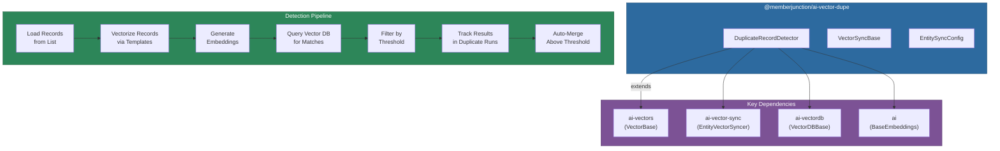
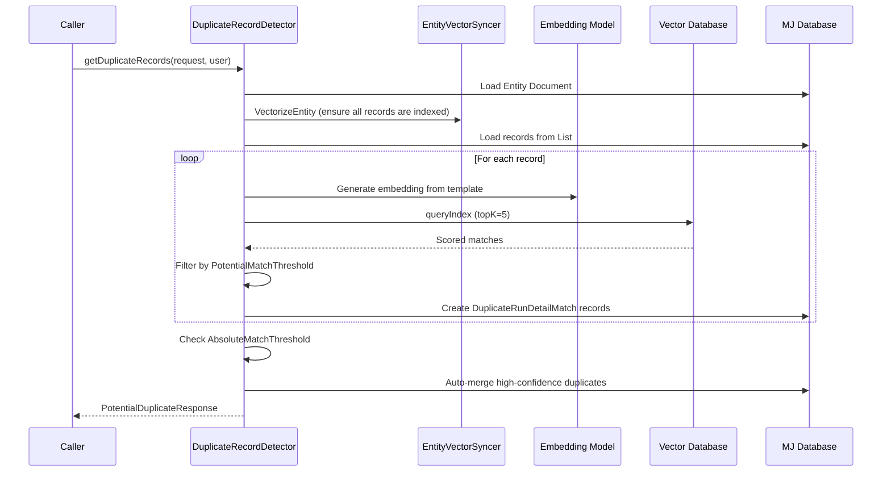
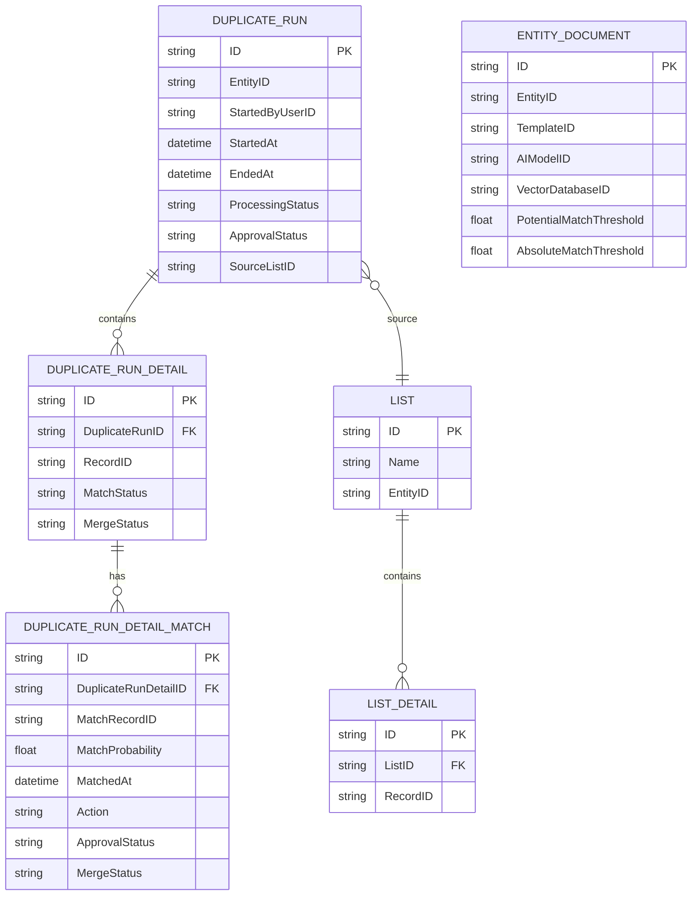

# @memberjunction/ai-vector-dupe

AI-powered duplicate record detection for MemberJunction entities. This package uses vector embeddings and similarity search to find potential duplicate records, track detection runs, and optionally auto-merge high-confidence matches.

## Architecture



## Installation

```bash
npm install @memberjunction/ai-vector-dupe
```

## Overview

The package provides the `DuplicateRecordDetector` class, which orchestrates a complete duplicate detection workflow:

1. Loads records from a MemberJunction List
2. Vectorizes them using a configured Entity Document template and embedding model
3. Queries the vector database for similarity matches
4. Filters results against configurable thresholds
5. Creates Duplicate Run, Duplicate Run Detail, and Duplicate Run Detail Match records for tracking
6. Optionally auto-merges records that exceed the absolute match threshold

## Duplicate Detection Flow



## Core Components

### DuplicateRecordDetector

The main class that extends `VectorBase` from `@memberjunction/ai-vectors`.

**Key method:**

```typescript
getDuplicateRecords(
    params: PotentialDuplicateRequest,
    contextUser?: UserInfo
): Promise<PotentialDuplicateResponse>
```

**Parameters in `PotentialDuplicateRequest`:**

| Field | Type | Description |
|---|---|---|
| `ListID` | `string` | ID of the List containing records to check |
| `EntityID` | `string` | ID of the entity type |
| `EntityDocumentID` | `string` | ID of the Entity Document with vectorization template |
| `Options.DuplicateRunID` | `string` (optional) | Resume an existing duplicate run |

**Thresholds (configured on Entity Document):**

| Threshold | Purpose |
|---|---|
| `PotentialMatchThreshold` | Minimum similarity score to report as potential duplicate |
| `AbsoluteMatchThreshold` | Minimum similarity score for automatic record merge |

### VectorSyncBase

A utility base class providing helper methods for vector synchronization operations:

- `parseStringTemplate(str, obj)` -- simple template variable substitution
- `timer(ms)` -- async delay
- `start()` / `end()` / `timeDiff()` -- execution timing
- `saveJSONData(data, path)` -- JSON file output

### EntitySyncConfig

Configuration type for entity synchronization scheduling:

```typescript
type EntitySyncConfig = {
    EntityDocumentID: string;     // Entity Document to use
    Interval: number;             // Sync interval in seconds
    RunViewParams: RunViewParams; // View parameters for fetching
    IncludeInSync: boolean;       // Whether to include in sync
    LastRunDate: string;          // Last sync timestamp
    VectorIndexID: number;        // Vector index ID
    VectorID: number;             // Vector database ID
};
```

## Usage

### Basic Duplicate Detection

```typescript
import { DuplicateRecordDetector } from '@memberjunction/ai-vector-dupe';
import { PotentialDuplicateRequest, UserInfo } from '@memberjunction/core';

const detector = new DuplicateRecordDetector();

const request: PotentialDuplicateRequest = {
    ListID: 'list-uuid',
    EntityID: 'entity-uuid',
    EntityDocumentID: 'doc-uuid'
};

const response = await detector.getDuplicateRecords(request, currentUser);

if (response.Status === 'Success') {
    for (const result of response.PotentialDuplicateResult) {
        console.log(`Record: ${result.RecordCompositeKey.ToString()}`);
        for (const dupe of result.Duplicates) {
            console.log(`  Match: ${dupe.ToString()} (${(dupe.ProbabilityScore * 100).toFixed(1)}%)`);
        }
    }
}
```

### Resuming an Existing Run

```typescript
const request: PotentialDuplicateRequest = {
    ListID: 'list-uuid',
    EntityID: 'entity-uuid',
    EntityDocumentID: 'doc-uuid',
    Options: {
        DuplicateRunID: 'existing-run-uuid'
    }
};

const response = await detector.getDuplicateRecords(request, currentUser);
```

## Database Entities Used

The package reads from and writes to these MemberJunction entities:



## Environment Variables

```env
# AI Model API Keys
OPENAI_API_KEY=your-openai-key
MISTRAL_API_KEY=your-mistral-key

# Vector Database
PINECONE_API_KEY=your-pinecone-key
PINECONE_HOST=your-pinecone-host
PINECONE_DEFAULT_INDEX=your-index-name

# Database Connection
DB_HOST=your-sql-server
DB_PORT=1433
DB_USERNAME=your-username
DB_PASSWORD=your-password
DB_DATABASE=your-database

# User Context
CURRENT_USER_EMAIL=user@example.com
```

## Dependencies

| Package | Purpose |
|---|---|
| `@memberjunction/ai` | `BaseEmbeddings`, `GetAIAPIKey` |
| `@memberjunction/ai-vectordb` | `VectorDBBase`, `BaseResponse` |
| `@memberjunction/ai-vectors` | `VectorBase` base class |
| `@memberjunction/ai-vectors-pinecone` | Pinecone implementation |
| `@memberjunction/ai-vector-sync` | `EntityVectorSyncer`, `EntityDocumentTemplateParser` |
| `@memberjunction/aiengine` | AI engine integration |
| `@memberjunction/core` | Core MJ types and data access |
| `@memberjunction/core-entities` | Entity type definitions |
| `@memberjunction/global` | MJGlobal class factory |

## Limitations

- Duplicate detection operates within a single entity type
- Requires pre-configured Entity Documents with templates
- Currently supports Pinecone as the vector database provider
- Records must be added to a List before detection can run

## Development

```bash
# Build
npm run build

# Development mode
npm run start
```

## License

ISC
