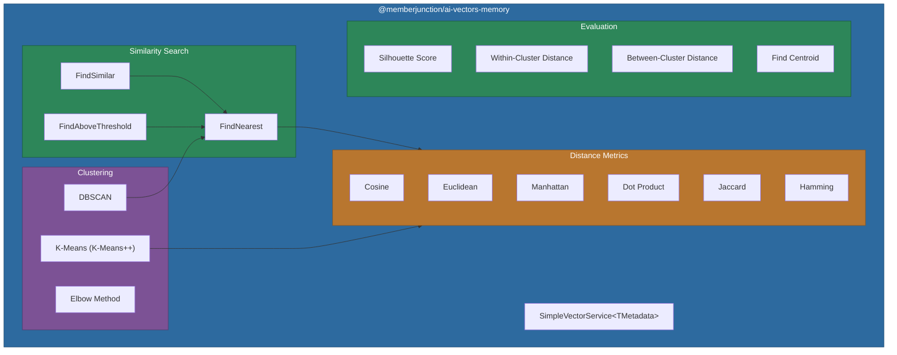
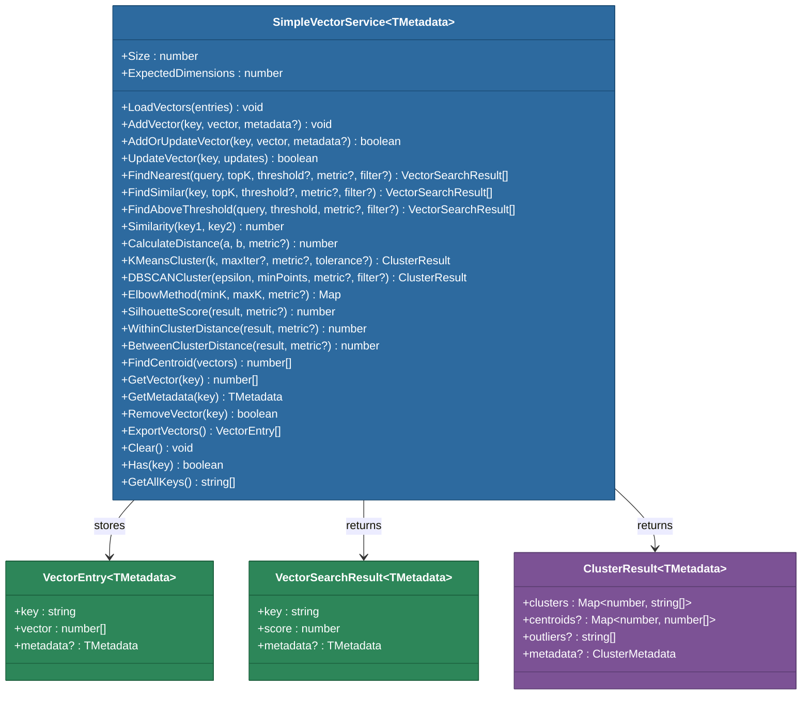
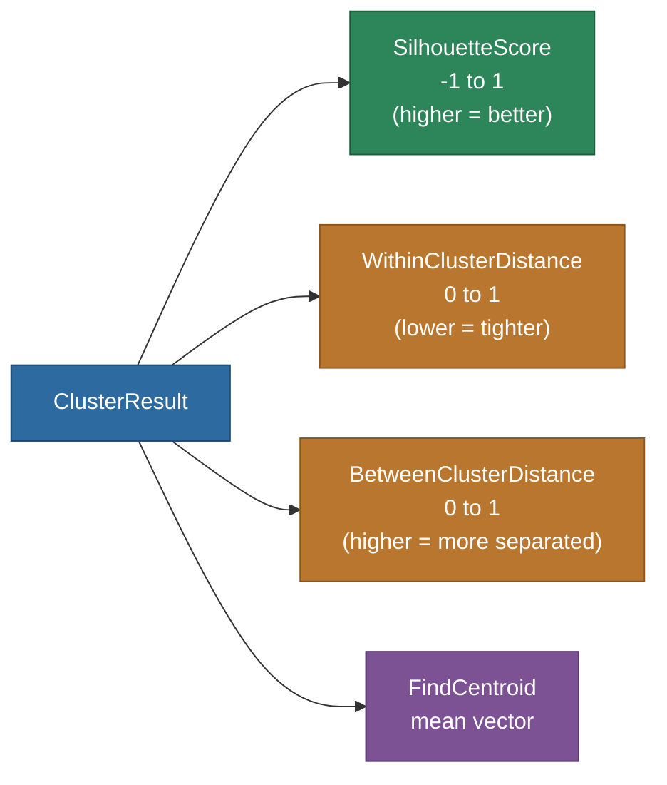

# @memberjunction/ai-vectors-memory

An in-memory vector similarity search and clustering service for MemberJunction. Provides six distance metrics, two clustering algorithms (K-Means and DBSCAN), and comprehensive utility methods for vector analysis -- all without requiring an external vector database.

## Architecture


```mermaid
graph TD
    subgraph MemoryPkg["@memberjunction/ai-vectors-memory"]
        SVS["SimpleVectorService&lt;TMetadata&gt;"]

        subgraph Search["Similarity Search"]
            FN["FindNearest"]
            FS["FindSimilar"]
            FAT["FindAboveThreshold"]
        end

        subgraph Metrics["Distance Metrics"]
            COS["Cosine"]
            EUC["Euclidean"]
            MAN["Manhattan"]
            DOT["Dot Product"]
            JAC["Jaccard"]
            HAM["Hamming"]
        end

        subgraph Clustering["Clustering"]
            KM["K-Means (K-Means++)"]
            DBS["DBSCAN"]
            EM["Elbow Method"]
        end

        subgraph Evaluation["Evaluation"]
            SIL["Silhouette Score"]
            WCD["Within-Cluster Distance"]
            BCD["Between-Cluster Distance"]
            CENT["Find Centroid"]
        end
    end

    FN --> Metrics
    FS --> FN
    FAT --> FN
    KM --> Metrics
    DBS --> FN

    style MemoryPkg fill:#2d6a9f,stroke:#1a4971,color:#fff
    style Search fill:#2d8659,stroke:#1a5c3a,color:#fff
    style Metrics fill:#b8762f,stroke:#8a5722,color:#fff
    style Clustering fill:#7c5295,stroke:#563a6b,color:#fff
    style Evaluation fill:#2d8659,stroke:#1a5c3a,color:#fff
```

## Installation

```bash
npm install @memberjunction/ai-vectors-memory
```

## Overview

Unlike the other vector packages that depend on external vector databases (Pinecone, etc.), this package operates entirely in-memory. It is ideal for:

- Lightweight similarity search without infrastructure overhead
- AI agent note retrieval and session memory
- Clustering analysis and data exploration
- Prototyping and testing before deploying to a full vector database
- Scenarios where the vector count fits comfortably in memory (tens of thousands)

The `SimpleVectorService` class is generic (`SimpleVectorService<TMetadata>`) for type-safe metadata access.

## Quick Start

```typescript
import { SimpleVectorService, VectorEntry } from '@memberjunction/ai-vectors-memory';

const service = new SimpleVectorService();

// Load vectors
service.LoadVectors([
    { key: 'doc1', vector: [0.1, 0.2, 0.3], metadata: { title: 'Document 1' } },
    { key: 'doc2', vector: [0.4, 0.5, 0.6], metadata: { title: 'Document 2' } },
    { key: 'doc3', vector: [0.7, 0.8, 0.9], metadata: { title: 'Document 3' } }
]);

// Find nearest neighbors
const results = service.FindNearest([0.15, 0.25, 0.35], 2);
results.forEach(r => console.log(`${r.key}: ${r.score.toFixed(3)}`));
```

## Core Types


```mermaid
classDiagram
    class SimpleVectorService~TMetadata~ {
        +LoadVectors(entries) void
        +AddVector(key, vector, metadata?) void
        +AddOrUpdateVector(key, vector, metadata?) boolean
        +UpdateVector(key, updates) boolean
        +FindNearest(query, topK, threshold?, metric?, filter?) VectorSearchResult[]
        +FindSimilar(key, topK, threshold?, metric?, filter?) VectorSearchResult[]
        +FindAboveThreshold(query, threshold, metric?, filter?) VectorSearchResult[]
        +Similarity(key1, key2) number
        +CalculateDistance(a, b, metric?) number
        +KMeansCluster(k, maxIter?, metric?, tolerance?) ClusterResult
        +DBSCANCluster(epsilon, minPoints, metric?, filter?) ClusterResult
        +ElbowMethod(minK, maxK, metric?) Map
        +SilhouetteScore(result, metric?) number
        +WithinClusterDistance(result, metric?) number
        +BetweenClusterDistance(result, metric?) number
        +FindCentroid(vectors) number[]
        +Size : number
        +ExpectedDimensions : number
        +GetVector(key) number[]
        +GetMetadata(key) TMetadata
        +RemoveVector(key) boolean
        +ExportVectors() VectorEntry[]
        +Clear() void
        +Has(key) boolean
        +GetAllKeys() string[]
    }

    class VectorEntry~TMetadata~ {
        +key : string
        +vector : number[]
        +metadata? : TMetadata
    }

    class VectorSearchResult~TMetadata~ {
        +key : string
        +score : number
        +metadata? : TMetadata
    }

    class ClusterResult~TMetadata~ {
        +clusters : Map~number, string[]~
        +centroids? : Map~number, number[]~
        +outliers? : string[]
        +metadata? : ClusterMetadata
    }

    SimpleVectorService --> VectorEntry : stores
    SimpleVectorService --> VectorSearchResult : returns
    SimpleVectorService --> ClusterResult : returns

    style SimpleVectorService fill:#2d6a9f,stroke:#1a4971,color:#fff
    style VectorEntry fill:#2d8659,stroke:#1a5c3a,color:#fff
    style VectorSearchResult fill:#2d8659,stroke:#1a5c3a,color:#fff
    style ClusterResult fill:#7c5295,stroke:#563a6b,color:#fff
```

### DistanceMetric Type

```typescript
type DistanceMetric = 'cosine' | 'euclidean' | 'manhattan' | 'dotproduct' | 'jaccard' | 'hamming';
```

## Distance Metrics

All metrics are normalized to a 0-1 range where **1 = most similar**.

| Metric | Best For | Formula |
|---|---|---|
| `cosine` (default) | Text embeddings, semantic search | `(dot(A,B) / (norm(A) * norm(B)) + 1) / 2` |
| `euclidean` | Physical measurements, specs | `1 / (1 + sqrt(sum((a-b)^2)))` |
| `manhattan` | Grid navigation, time series | `1 / (1 + sum(abs(a-b)))` |
| `dotproduct` | Recommendations, weighted scoring | `(tanh(dot(A,B) / sqrt(n)) + 1) / 2` |
| `jaccard` | Categorical/binary data, set comparison | `intersection / union` |
| `hamming` | Configuration drift, error detection | `1 - (differences / length)` |

## Similarity Search

### FindNearest

K-nearest neighbor search with optional threshold and metadata pre-filtering.

```typescript
const results = service.FindNearest(
    queryVector,    // vector to search for
    10,             // topK results
    0.7,            // minimum similarity threshold
    'cosine',       // distance metric
    (meta) => meta.status === 'active'  // pre-filter by metadata
);
```

Pre-filtering happens **before** similarity calculation, making filtered searches significantly faster than post-filtering.

### FindSimilar

Find vectors similar to an existing stored vector (excludes the source vector from results).

```typescript
const similar = service.FindSimilar('doc-123', 5, 0.8, 'cosine');
```

### FindAboveThreshold

Return all vectors above a similarity threshold (no topK limit).

```typescript
const matches = service.FindAboveThreshold(queryVector, 0.9, 'cosine');
```

## Vector Management

```typescript
// Add individual vectors
service.AddVector('key1', [0.1, 0.2, 0.3], { category: 'A' });

// Add or update (upsert)
const wasUpdate = service.AddOrUpdateVector('key1', [0.4, 0.5, 0.6]);

// Update in place (vector, metadata, or both)
service.UpdateVector('key1', { metadata: { category: 'B' } });

// Remove
service.RemoveVector('key1');

// Bulk load from array or Map
service.LoadVectors(new Map([['k1', [1, 2, 3]], ['k2', [4, 5, 6]]]));

// Export for persistence
const allVectors = service.ExportVectors();
```

Dimension validation is automatic -- all vectors must have the same dimensionality.

Every input accepts a `VectorValues` value — `number[]`, `Float32Array` or `Float64Array` — and is copied into the packed store, so a vector decoded from a binary column (below) can be loaded without converting it to an array first.

## Clustering Algorithms

### K-Means (with K-Means++ Initialization)

Partitions vectors into K clusters by minimizing within-cluster variance.

```typescript
const result = service.KMeansCluster(3, 100, 'euclidean', 0.0001);

result.clusters.forEach((members, clusterId) => {
    const centroid = result.centroids.get(clusterId);
    console.log(`Cluster ${clusterId}: ${members.length} members`);
});

console.log(`Silhouette: ${result.metadata.silhouetteScore.toFixed(3)}`);
console.log(`Converged in ${result.metadata.iterations} iterations`);
```

### DBSCAN

Density-based clustering that automatically determines the number of clusters and identifies outliers.

```typescript
const result = service.DBSCANCluster(
    0.3,            // epsilon (max distance for neighbors)
    3,              // minPoints (minimum cluster density)
    'euclidean',    // metric
    (meta) => meta.active  // optional pre-filter
);

console.log(`Found ${result.clusters.size} clusters`);
console.log(`Outliers: ${result.outliers?.length ?? 0}`);
```

### Elbow Method

Find the optimal number of clusters by testing a range of K values.

```typescript
const elbowData = service.ElbowMethod(2, 10, 'euclidean');
elbowData.forEach((inertia, k) => {
    console.log(`k=${k}: inertia=${inertia.toFixed(2)}`);
});
```

## Clustering Evaluation


```mermaid
graph LR
    CR["ClusterResult"] --> SIL["SilhouetteScore<br/>-1 to 1<br/>(higher = better)"]
    CR --> WCD["WithinClusterDistance<br/>0 to 1<br/>(lower = tighter)"]
    CR --> BCD["BetweenClusterDistance<br/>0 to 1<br/>(higher = more separated)"]
    CR --> CENT["FindCentroid<br/>mean vector"]

    style CR fill:#2d6a9f,stroke:#1a4971,color:#fff
    style SIL fill:#2d8659,stroke:#1a5c3a,color:#fff
    style WCD fill:#b8762f,stroke:#8a5722,color:#fff
    style BCD fill:#b8762f,stroke:#8a5722,color:#fff
    style CENT fill:#7c5295,stroke:#563a6b,color:#fff
```

| Method | Returns | Interpretation |
|---|---|---|
| `SilhouetteScore` | -1 to 1 | > 0.7 strong, 0.5-0.7 reasonable, < 0.25 no structure |
| `WithinClusterDistance` | 0 to 1 | Lower = tighter clusters (more cohesive) |
| `BetweenClusterDistance` | 0 to 1 | Higher = better separated clusters |
| `FindCentroid` | number[] | Mean position of a vector set |

## Typed Metadata

Use TypeScript generics for type-safe metadata access:

```typescript
interface ProductMetadata {
    name: string;
    category: string;
    price: number;
}

const service = new SimpleVectorService<ProductMetadata>();

service.AddVector('prod1', embedding, { name: 'Widget', category: 'Tools', price: 29.99 });

const results = service.FindNearest(queryVector, 5);
results.forEach(r => {
    // TypeScript knows r.metadata is ProductMetadata
    console.log(`${r.metadata.name}: $${r.metadata.price}`);
});
```

## Storage and Precision

Vectors are stored packed — one contiguous typed array for the whole service, with each row's sum of squares cached — rather than one `number[]` per key. Searches allocate nothing per row, cosine needs only a dot product, and top-K selection is a bounded insertion instead of a full sort.

```typescript
// Default: float64. Every value and score is exactly as before.
const general = new SimpleVectorService();

// Model embeddings: float32 halves memory. Embeddings are float32 at the source,
// so scores differ from float64 only around the 7th significant digit.
const embeddings = new SimpleVectorService({ Precision: 'float32' });
embeddings.ReserveCapacity(rowCount, 1536); // optional: one allocation for a bulk load
```

Behaviour is unchanged from the `Map`-based implementation: same scores (bit-for-bit at float64), same tie-breaking (insertion order), same `topK` / threshold / filter semantics. `GetVector` and `ExportVectors` now return **copies**, so mutating a returned array no longer changes the stored vector. Subclasses that override a metric method (`CalculateDistance`, `CosineSimilarity`, …) keep working — the service detects the override and scores row by row through it.

## Reading Persisted Embeddings

MemberJunction stores each persisted embedding twice: a JSON column (`VectorJSON`, `EmbeddingVector`, …) and a binary companion (`VectorBinary`, `EmbeddingVectorBinary`, …) holding the same vector as little-endian float32 bytes, base64-encoded in a `BaseEntity`. Decoding the binary column is a copy; parsing the JSON builds a string per number (20,000 × 1,536 vectors on Node 22: 0.28 s vs 3.9 s). These helpers read either form:

| Function | Returns |
|---|---|
| `ReadStoredVector(binary, json)` | The binary vector when it is valid, otherwise the parsed JSON vector, otherwise `null` |
| `DecodeVectorBinary(binary)` | `Float32Array`, or `null` when missing, not base64, not a whole number of float32 values, or non-finite |
| `ParseVectorJSON(json)` | `number[]`, or `null` when missing, malformed, empty, or containing anything but finite numbers |

```typescript
import { ReadStoredVector } from '@memberjunction/ai-vectors-memory';

const vector = ReadStoredVector(note.EmbeddingVectorBinary, note.EmbeddingVector);
if (vector) service.AddOrUpdateVector(note.ID, vector, metadata);
```

The JSON fallback covers rows written before the binary column existed, browser code that did not fetch binary fields (`RunView` omits them unless asked), and a corrupt binary value. The helpers are browser-safe. See the [Binary Fields Guide](../../../../guides/BINARY_FIELDS_GUIDE.md).

## Async Search and Server Acceleration

`FindNearestAsync`, `KMeansClusterAsync` and `DBSCANClusterAsync` take the same arguments and return the same results as their synchronous forms. In a browser, or anywhere no accelerator is registered, they run in-process. On a server that loads [`@memberjunction/ai-vectors-memory-server`](../MemoryServer/README.md), large searches and every clustering run move to a worker-thread pool reading the store through shared memory, optionally using a native SIMD backend — so the event loop keeps serving other requests.

```typescript
const matches = await service.FindNearestAsync(queryVector, 10, 0.5, 'cosine', m => m.agentId === id);
const clusters = await service.KMeansClusterAsync(5);
```

The seam is `BaseVectorAccelerator`, resolved through the ClassFactory (`VECTOR_ACCELERATOR_KEY`). An accelerator only proposes candidate rows; the service re-scores them against its live store, so an accelerator — or a write racing a worker — can never surface a wrong score. Prefer the async forms in server code paths that handle requests.

## Performance Characteristics

| Operation | Complexity | Notes |
|---|---|---|
| AddVector / LoadVectors | O(1) amortized per vector | Packed storage; LoadVectors pre-sizes |
| RemoveVector | O(1) amortized | Tombstone; order-preserving compaction when >25% removed |
| FindNearest (no filter) | O(n·d) | Single pass, bounded top-K buffer, no sort |
| FindNearest (with filter) | O(n + m·d), m < n | Filter runs first; only matches are scored |
| KMeansCluster | O(n · k · d · iterations) | K-Means++ initialization |
| DBSCANCluster | O(n² · d) | Neighborhood pre-computation |

**Memory usage**: `dimensions × 8 bytes` per vector at float64, `× 4 bytes` at float32, plus a few bytes of bookkeeping. Example: 20,000 embeddings at 1,536 dimensions is about 123 MB at float32.

## VectorDBBase Providers

This package ships **two `VectorDBBase` driver implementations** so the in-memory primitive can be consumed by the broader vector-sync / EntityDocument infrastructure without standing up a remote store:

### `SimpleVectorDatabase`

In-process VectorDBBase driver that reads from an `MJ: Vector Indexes` row configured to point at any entity and field. Use when you have arbitrary entity rows with embeddings stored in a column and want to make them queryable through the `SearchEngine` cross-scope fusion path.

Rows are read on every query, as the calling user, so row-level security always applies. The parsed vectors are reused only when the index config and the rows just read (their keys, `__mj_UpdatedAt` values and vector presence) match what they were built from, so one user never receives another user's rows. After writing vectors by a path that bypasses `BaseEntity`, call `DeleteAllRecords(indexName)` to drop the cached vectors.

When the index's ProviderConfig names a `binaryVectorField`, the driver fetches that column too (setting `IncludeBinaryFields`) and prefers it over `vectorField`, falling back to the JSON for rows whose binary value is empty or invalid:

```json
{ "entityName": "MJ: AI Agent Notes", "vectorField": "EmbeddingVector", "binaryVectorField": "EmbeddingVectorBinary" }
```

### `SimpleVectorServiceProvider` (new in v5.38)

**EntityDocument-keyed** in-process driver, purpose-built for `Provider.SearchEntities()` and any other `EntityDocument`-backed search. Each "index" corresponds to one `MJ: Entity Documents` row; vectors come from `MJ: Entity Record Documents` rows filtered by `EntityDocumentID` — `VectorBinary` when valid, falling back to `VectorJSON` (both are fetched), and matches surface the **underlying entity record's RecordID** in their metadata (not the EntityRecordDocument PK).

```typescript
import { SimpleVectorServiceProvider } from '@memberjunction/ai-vectors-memory';

const provider = new SimpleVectorServiceProvider();
const result = await provider.QueryIndex(
    { id: entityDocumentId, vector: queryEmbedding, topK: 10 },
    contextUser
);
// result.data.matches[i].metadata.RecordID is the parent record's ID
```

**Incrementally maintained cache:** one loaded index per `EntityDocumentID`, held at float32. Saves and deletes of `MJ: Entity Record Documents` rows — local, or on another server via `remote-invalidate` — are applied to the loaded index **row by row**; the index is never thrown away because one row changed. Remote changes use the broadcast record when the host opts the entity into record-data broadcast, otherwise only the changed rows are re-read (batched), once per user an index was loaded as, and each read is applied only to that user's indexes. Once the TTL (default 15 minutes) passes, the index keeps serving while it reloads in the background. Call `SimpleVectorServiceProvider.InvalidateIndex(entityDocumentId)` only after writing `VectorBinary` / `VectorJSON` by a path that bypasses `BaseEntity` (raw SQL, external tools); it forces the next query to reload first, even if a load was already running when you called it.

**Read-only:** ingestion methods (`CreateRecord`, `UpdateRecord`, etc.) throw via the `unsupported()` path. The vector-sync pipeline writes `EntityRecordDocument.VectorBinary` and `VectorJSON` directly; this driver just rehydrates from those rows.

**When NOT to use:** many hundreds of thousands of `EntityRecordDocument` rows per `EntityDocument`, or scenarios that need a persistent ANN index. For those, configure a colocated or remote provider (pgvector, SQL Server, Qdrant, Pinecone) on the `EntityDocument`'s `VectorDatabaseID` instead. (A server running `@memberjunction/ai-vectors-memory-server` can opt into an in-memory HNSW index for large stores.)

## Dependencies

| Package | Purpose |
|---|---|
| `@memberjunction/core` | `LogError`, `RunView`, `UserInfo`, `BaseEntityEvent` |
| `@memberjunction/global` | `RegisterClass` / ClassFactory for VectorDBBase and accelerator registrations, `BaseSingleton`, `EscapeSQLString` |
| `@memberjunction/ai-vectordb` | `VectorDBBase` contract that the two providers implement |

This package has minimal dependencies, making it lightweight and suitable for both server-side and client-side use.

## Development

```bash
# Build
npm run build

# Development mode
npm run start
```

## License

Business Source License 1.1 — see [LICENSE](../../../../LICENSE) for details.
