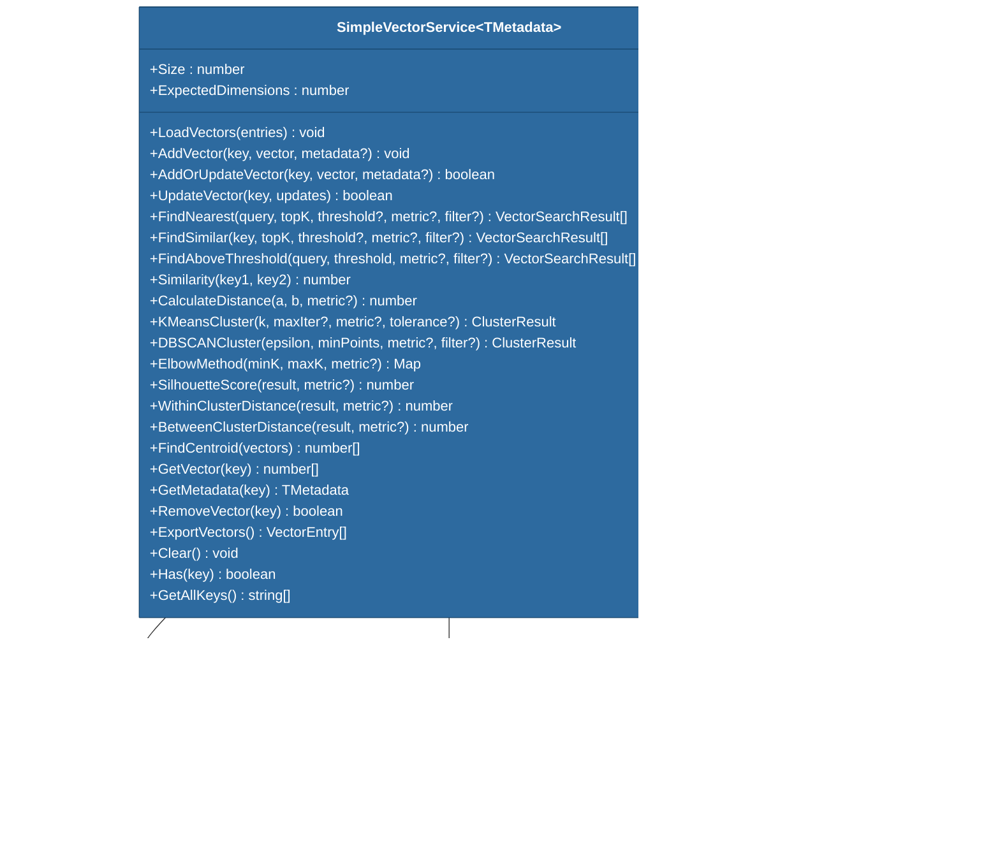

# @memberjunction/ai-vectors-memory

An in-memory vector similarity search and clustering service for MemberJunction. Provides six distance metrics, two clustering algorithms (K-Means and DBSCAN), and comprehensive utility methods for vector analysis -- all without requiring an external vector database.

## Architecture


## Installation

```bash
npm install @memberjunction/ai-vectors-memory
```

## Overview

Unlike the other vector packages that depend on external vector databases (Pinecone, etc.), this package operates entirely in-memory. It is ideal for:

- Lightweight similarity search without infrastructure overhead
- AI agent note retrieval and session memory
- Clustering analysis and data exploration
- Prototyping and testing before deploying to a full vector database
- Scenarios where the vector count fits comfortably in memory (tens of thousands)

The `SimpleVectorService` class is generic (`SimpleVectorService<TMetadata>`) for type-safe metadata access.

## Quick Start

```typescript
import { SimpleVectorService, VectorEntry } from '@memberjunction/ai-vectors-memory';

const service = new SimpleVectorService();

// Load vectors
service.LoadVectors([
    { key: 'doc1', vector: [0.1, 0.2, 0.3], metadata: { title: 'Document 1' } },
    { key: 'doc2', vector: [0.4, 0.5, 0.6], metadata: { title: 'Document 2' } },
    { key: 'doc3', vector: [0.7, 0.8, 0.9], metadata: { title: 'Document 3' } }
]);

// Find nearest neighbors
const results = service.FindNearest([0.15, 0.25, 0.35], 2);
results.forEach(r => console.log(`${r.key}: ${r.score.toFixed(3)}`));
```

## Core Types



### DistanceMetric Type

```typescript
type DistanceMetric = 'cosine' | 'euclidean' | 'manhattan' | 'dotproduct' | 'jaccard' | 'hamming';
```

## Distance Metrics

All metrics are normalized to a 0-1 range where **1 = most similar**.

| Metric | Best For | Formula |
|---|---|---|
| `cosine` (default) | Text embeddings, semantic search | `(dot(A,B) / (norm(A) * norm(B)) + 1) / 2` |
| `euclidean` | Physical measurements, specs | `1 / (1 + sqrt(sum((a-b)^2)))` |
| `manhattan` | Grid navigation, time series | `1 / (1 + sum(abs(a-b)))` |
| `dotproduct` | Recommendations, weighted scoring | `(tanh(dot(A,B) / sqrt(n)) + 1) / 2` |
| `jaccard` | Categorical/binary data, set comparison | `intersection / union` |
| `hamming` | Configuration drift, error detection | `1 - (differences / length)` |

## Similarity Search

### FindNearest

K-nearest neighbor search with optional threshold and metadata pre-filtering.

```typescript
const results = service.FindNearest(
    queryVector,    // vector to search for
    10,             // topK results
    0.7,            // minimum similarity threshold
    'cosine',       // distance metric
    (meta) => meta.status === 'active'  // pre-filter by metadata
);
```

Pre-filtering happens **before** similarity calculation, making filtered searches significantly faster than post-filtering.

### FindSimilar

Find vectors similar to an existing stored vector (excludes the source vector from results).

```typescript
const similar = service.FindSimilar('doc-123', 5, 0.8, 'cosine');
```

### FindAboveThreshold

Return all vectors above a similarity threshold (no topK limit).

```typescript
const matches = service.FindAboveThreshold(queryVector, 0.9, 'cosine');
```

## Vector Management

```typescript
// Add individual vectors
service.AddVector('key1', [0.1, 0.2, 0.3], { category: 'A' });

// Add or update (upsert)
const wasUpdate = service.AddOrUpdateVector('key1', [0.4, 0.5, 0.6]);

// Update in place (vector, metadata, or both)
service.UpdateVector('key1', { metadata: { category: 'B' } });

// Remove
service.RemoveVector('key1');

// Bulk load from array or Map
service.LoadVectors(new Map([['k1', [1, 2, 3]], ['k2', [4, 5, 6]]]));

// Export for persistence
const allVectors = service.ExportVectors();
```

Dimension validation is automatic -- all vectors must have the same dimensionality.

## Clustering Algorithms

### K-Means (with K-Means++ Initialization)

Partitions vectors into K clusters by minimizing within-cluster variance.

```typescript
const result = service.KMeansCluster(3, 100, 'euclidean', 0.0001);

result.clusters.forEach((members, clusterId) => {
    const centroid = result.centroids.get(clusterId);
    console.log(`Cluster ${clusterId}: ${members.length} members`);
});

console.log(`Silhouette: ${result.metadata.silhouetteScore.toFixed(3)}`);
console.log(`Converged in ${result.metadata.iterations} iterations`);
```

### DBSCAN

Density-based clustering that automatically determines the number of clusters and identifies outliers.

```typescript
const result = service.DBSCANCluster(
    0.3,            // epsilon (max distance for neighbors)
    3,              // minPoints (minimum cluster density)
    'euclidean',    // metric
    (meta) => meta.active  // optional pre-filter
);

console.log(`Found ${result.clusters.size} clusters`);
console.log(`Outliers: ${result.outliers?.length ?? 0}`);
```

### Elbow Method

Find the optimal number of clusters by testing a range of K values.

```typescript
const elbowData = service.ElbowMethod(2, 10, 'euclidean');
elbowData.forEach((inertia, k) => {
    console.log(`k=${k}: inertia=${inertia.toFixed(2)}`);
});
```

## Clustering Evaluation


| Method | Returns | Interpretation |
|---|---|---|
| `SilhouetteScore` | -1 to 1 | > 0.7 strong, 0.5-0.7 reasonable, < 0.25 no structure |
| `WithinClusterDistance` | 0 to 1 | Lower = tighter clusters (more cohesive) |
| `BetweenClusterDistance` | 0 to 1 | Higher = better separated clusters |
| `FindCentroid` | number[] | Mean position of a vector set |

## Typed Metadata

Use TypeScript generics for type-safe metadata access:

```typescript
interface ProductMetadata {
    name: string;
    category: string;
    price: number;
}

const service = new SimpleVectorService<ProductMetadata>();

service.AddVector('prod1', embedding, { name: 'Widget', category: 'Tools', price: 29.99 });

const results = service.FindNearest(queryVector, 5);
results.forEach(r => {
    // TypeScript knows r.metadata is ProductMetadata
    console.log(`${r.metadata.name}: $${r.metadata.price}`);
});
```

## Performance Characteristics

| Operation | Complexity | Notes |
|---|---|---|
| AddVector / LoadVectors | O(1) per vector | Map-based storage |
| FindNearest (no filter) | O(n) | Linear scan with sort |
| FindNearest (with filter) | O(m) where m < n | Filter reduces candidate set |
| KMeansCluster | O(n * k * iterations) | K-Means++ initialization |
| DBSCANCluster | O(n^2) | Neighborhood pre-computation |

**Memory usage**: approximately `8 bytes * dimensions + ~100 bytes` per vector. Example: 10,000 vectors at 384 dimensions is roughly 31 MB.

## Dependencies

| Package | Purpose |
|---|---|
| `@memberjunction/core` | `LogError` for error reporting |
| `@memberjunction/global` | Global utilities |

This package has minimal dependencies, making it lightweight and suitable for both server-side and client-side use.

## Development

```bash
# Build
npm run build

# Development mode
npm run start
```

## License

ISC
