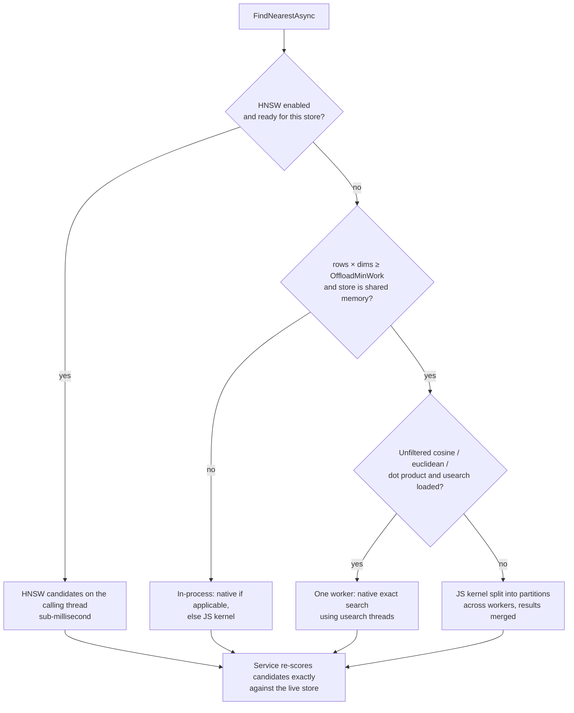

# @memberjunction/ai-vectors-memory-server

Server-side acceleration for [`@memberjunction/ai-vectors-memory`](../Memory/README.md). Load it once in a server process and every `SimpleVectorService` there gets:

- **A worker-thread pool** for search and clustering, reading vector stores through `SharedArrayBuffer`s (no copying), so a large scan or a clustering run no longer blocks the event loop that serves every other request.
- **An optional native backend** ([usearch](https://github.com/unum-cloud/usearch), prebuilt SIMD binaries for Linux, macOS and Windows) for exact search several times faster than JavaScript.
- **Opt-in approximate search** (HNSW) for very large cosine indexes.

No consumer code changes: the package registers a `BaseVectorAccelerator` subclass through the ClassFactory, and `SimpleVectorService` resolves it. `@memberjunction/server-bootstrap` loads it automatically, so a standard MJAPI gets it for free.

> **Server only.** It uses `node:worker_threads` and a native addon. Never add it to a browser bundle — the browser-manifest leakage gate denies it. The browser-safe package is `@memberjunction/ai-vectors-memory`, which runs everything in-process when this one is absent.

## How work is routed



`FindNearest` (synchronous) uses the native backend on the calling thread when it applies, and JavaScript otherwise. `KMeansClusterAsync` and `DBSCANClusterAsync` run the whole algorithm — including the O(n²) silhouette score — on a worker once a store has `ClusterOffloadMinRows` rows.

## Correctness guarantees

- **Results are identical to in-process search** for every exact path. Accelerators only propose candidate rows; `SimpleVectorService` re-scores them against its live store with the same kernels it uses itself.
- **Native exact search proves its candidates complete.** usearch computes in float32 SIMD, so near-ties can be ordered differently. The backend fetches extra candidates, re-scores them exactly, and accepts the result only if no row it skipped could tie or beat the K-th. Otherwise it falls back to the JavaScript scan.
- **Concurrent writes are safe.** Growth and compaction allocate new buffers, so a worker always reads a consistent snapshot. Results are mapped through the row→key array captured at dispatch, and rows removed in the meantime are dropped.
- **Failures degrade, never fail.** If the pool can't start, a worker crashes, or the native binary is missing, the work runs in-process and the cause is logged. Five worker failures within a minute disable the pool for the process.
- **HNSW is the one approximate path**, and it is opt-in. It can miss a true neighbour; the scores it returns are still exact.

## Configuration

Defaults suit a stock MJAPI. Change them in code:

```typescript
import { VectorAccelerationSettings } from '@memberjunction/ai-vectors-memory-server';

VectorAccelerationSettings.Instance.Configure({
    PoolSize: 2,
    ANN: { Enabled: true, MinRows: 100_000 },
});
```

| Option | Default | Meaning |
|---|---|---|
| `PoolSize` | `min(4, cores − 1)` | Worker threads. `0` keeps everything in-process. |
| `OffloadMinWork` | 2,000,000 | Smallest search (rows × dimensions) sent to a worker. Below this, a round trip costs more than the scan. |
| `PartitionWork` | 8,000,000 | Rows × dimensions per partition when a JavaScript scan is split across workers. |
| `ClusterOffloadMinRows` | 200 | Smallest store whose clustering runs on a worker. |
| `TaskTimeoutMs` | 120,000 | A worker task running longer is abandoned and its worker replaced. |
| `UseNative` | `true` | Use usearch when it is installed. |
| `NativeMinWork` | 100,000 | Smallest unfiltered search (rows × dimensions) routed to native code. |
| `ANN.Enabled` | `false` | Build HNSW indexes for large cosine stores. |
| `ANN.MinRows` | 50,000 | Live rows before a store gets an HNSW index. |
| `ANN.Connectivity` / `ANN.ExpansionSearch` | 16 / 64 | HNSW graph parameters. |
| `ANN.Oversample` | 4 | Candidates fetched per requested result before exact re-ranking and filtering. |
| `ANN.BuildSliceMs` | 8 | Longest stretch of index building per event-loop turn. |

Environment overrides: `MJ_VECTOR_WORKERS` (pool size), `MJ_VECTOR_NATIVE=0` (disable native), `MJ_VECTOR_ANN=1` (enable HNSW).

## The native backend

`usearch` is an **optional dependency**. If it is missing, or its binary can't load on a platform, everything still works in JavaScript. Two of its quirks shape the code:

- **It is loaded with `require`, not `import()`.** Its ESM build locates the native binary by stack inspection, gets a `file://` URL its path walk can't handle, and recurses until the stack overflows. The CommonJS build uses `__dirname` and loads reliably.
- **It ignores a typed array's `byteOffset`.** A subarray that starts part-way into its buffer is searched as if it started at byte 0. So native search always covers a whole store from row 0, and is never partitioned; inputs with an offset are refused.

pnpm does not run usearch's install script (it isn't in `onlyBuiltDependencies`), and doesn't need to: the package ships prebuilt binaries, which `node-gyp-build` finds at load time.

## HNSW (approximate search)

When `ANN.Enabled` is on, the first cosine search of a store with at least `ANN.MinRows` live rows starts building an HNSW index in the background, in `BuildSliceMs` time slices. Searches stay exact until the index is ready. After that the index follows the store through its change log: rows written or removed since the last search are patched in on the next search. A large burst of changes, or a compaction, triggers a background rebuild instead. Filtered searches are served from oversampled candidates, and fall back to an exact scan when too few candidates pass the filter. Up to 8 indexes are kept, least recently used first out.

Memory: an HNSW index holds its own float32 copy of the vectors plus the graph — roughly `rows × (dims × 4 + connectivity × 16)` bytes.

## Benchmark

```bash
pnpm run build   # in this package and in ../Memory
node scripts/benchmark.mjs 20000 1536 32
```

Reports single-search latency for in-process JS, native, and worker paths, then the wall time and the **longest event-loop stall** while 32 searches run concurrently. The stall is the number that decides whether vector search slows down unrelated requests.

One run on a 4-core Linux container (20,000 × 1,536 float32 vectors, top 10, default settings — 3 workers):

| Path | Single search | 32 concurrent: wall / longest stall |
|---|---|---|
| Before this package (old `Map` implementation, JS) | 84 ms | — |
| In-process JS (packed storage) | 53 ms | 1,663 ms / 1,663 ms |
| `FindNearest`, native on the calling thread | 7.6 ms | 275 ms / 275 ms |
| `FindNearestAsync`, worker pool | 25 ms | 540 ms / **8 ms** |

A single worker search is slower than native on the calling thread, because each worker gives usearch a share of the cores rather than all of them. In exchange, the event loop stays responsive under load: while 32 searches run, no other request waits more than about 8 ms.

## Development

```bash
pnpm run build
pnpm run test    # worker tests use the compiled worker script — build first
```
