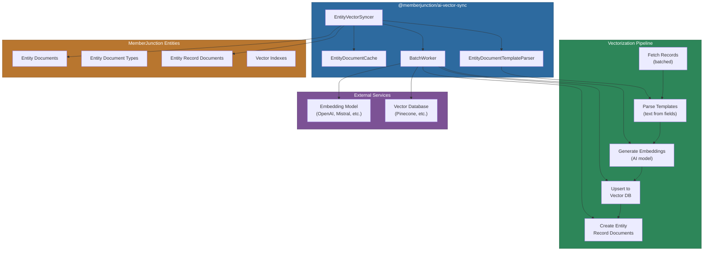
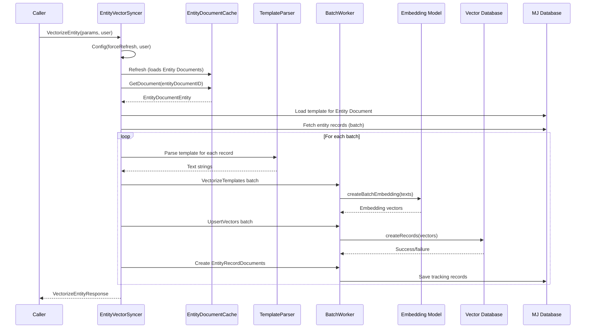
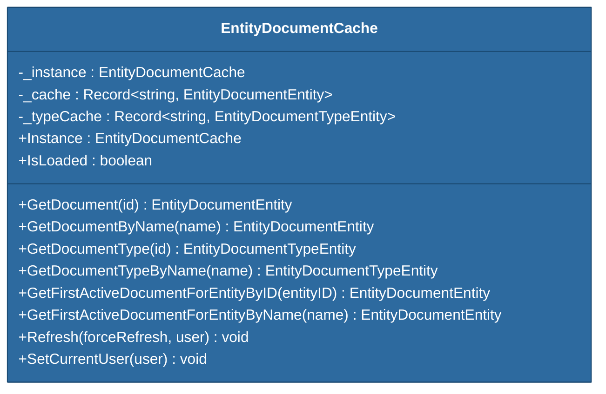
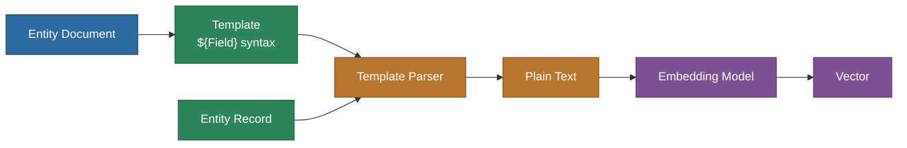

# @memberjunction/ai-vector-sync

Synchronizes MemberJunction entity records with vector databases by transforming records into embeddings through a template-based pipeline. Handles batch processing, worker-based parallelism, Entity Document management, and Entity Record Document tracking.

## Architecture



## Installation

```bash
npm install @memberjunction/ai-vector-sync
```

## Overview

This package converts MemberJunction entity records into vector embeddings stored in a vector database. The process is driven by **Entity Documents** -- metadata records that define which entity to vectorize, how to generate text from it (via templates), which embedding model to use, and where to store the results.

Key capabilities:

- **Batch processing** with configurable sizes for fetching, embedding, and upserting
- **Template-based text generation** using Entity Document templates that reference entity fields
- **Worker architecture** for concurrent embedding and upsert operations
- **Entity Document caching** via a singleton cache to avoid repeated database lookups
- **Default Entity Document creation** for entities that lack one
- **Resume support** via `StartingOffset` for interrupted processes
- **Entity Record Document tracking** to record which records have been vectorized

## Vectorization Flow



## Core Components

### EntityVectorSyncer

The main class that orchestrates the entire vectorization process. Extends `VectorBase` from `@memberjunction/ai-vectors`.

**Key methods:**

| Method | Description |
|---|---|
| `Config(forceRefresh, contextUser)` | Initializes engines and caches; must be called before vectorization |
| `VectorizeEntity(params, contextUser)` | Runs the full vectorization pipeline for an entity |
| `GetEntityDocument(id)` | Retrieves an Entity Document by ID |
| `GetEntityDocumentByName(name, user)` | Retrieves an Entity Document by name |
| `GetActiveEntityDocuments(entityNames?)` | Gets all active Entity Documents, optionally filtered |
| `CreateDefaultEntityDocument(entityID, vectorDB, aiModel)` | Creates a default Entity Document when one does not exist |

### EntityDocumentCache

A singleton cache that loads all Entity Document and Entity Document Type records into memory for fast lookup.



### EntityDocumentTemplateParser

Converts entity records into text strings by evaluating Entity Document templates. Templates use `${FieldName}` syntax to reference entity field values.

```typescript
// Template example: "${FirstName} ${LastName} works at ${Company} as ${Title}"
// With record { FirstName: 'Jane', LastName: 'Doe', Company: 'Acme', Title: 'Engineer' }
// Result: "Jane Doe works at Acme as Engineer"
```

### BatchWorker

Handles the parallel execution of embedding generation, vector database upserts, and Entity Record Document creation. Configurable batch sizes allow tuning for memory and API rate limits.

## Usage

### Basic Vectorization

```typescript
import { EntityVectorSyncer } from '@memberjunction/ai-vector-sync';
import { UserInfo } from '@memberjunction/core';

const syncer = new EntityVectorSyncer();

// Initialize (required once)
await syncer.Config(false, contextUser);

// Vectorize all records for an entity
await syncer.VectorizeEntity({
    entityID: 'entity-uuid',
    entityDocumentID: 'doc-uuid',
    listBatchCount: 50,
    VectorizeBatchCount: 50,
    UpsertBatchCount: 50
}, contextUser);
```

### Vectorize a Specific List

```typescript
await syncer.VectorizeEntity({
    entityID: 'entity-uuid',
    entityDocumentID: 'doc-uuid',
    listID: 'list-uuid'     // Only records in this list
}, contextUser);
```

### Resume Interrupted Processing

```typescript
await syncer.VectorizeEntity({
    entityID: 'entity-uuid',
    entityDocumentID: 'doc-uuid',
    StartingOffset: 5000     // Skip first 5000 records
}, contextUser);
```

### Manage Entity Documents

```typescript
// Look up by name
const doc = await syncer.GetEntityDocumentByName('Contacts Vectorization', contextUser);

// Get all active documents
const activeDocs = await syncer.GetActiveEntityDocuments();

// Get active documents for specific entities only
const filtered = await syncer.GetActiveEntityDocuments(['Contacts', 'Companies']);

// Create a default document when none exists
const newDoc = await syncer.CreateDefaultEntityDocument(
    entityID, vectorDatabase, aiModel
);
```

## Configuration Types

### VectorizeEntityParams

```typescript
type VectorizeEntityParams = {
    entityID: string;               // Entity to vectorize
    entityDocumentID?: string;      // Entity Document configuration
    listID?: string;                // Optional: vectorize only this list
    listBatchCount?: number;        // Records per fetch batch (default: 50)
    VectorizeBatchCount?: number;   // Embedding batch size (default: 50)
    UpsertBatchCount?: number;      // DB upsert batch size (default: 50)
    StartingOffset?: number;        // Skip records for resume
    CurrentUser?: UserInfo;         // User context
};
```

### EntitySyncConfig

```typescript
type EntitySyncConfig = {
    EntityDocumentID: string;
    Interval: number;               // Seconds between syncs
    RunViewParams: RunViewParams;
    IncludeInSync: boolean;
    LastRunDate: string;
    VectorIndexID: number;
    VectorID: number;
};
```

## Entity Document Templates

Templates define how entity records are transformed into text for embedding generation.



## Environment Variables

```env
# Database
DB_HOST=your-sql-server
DB_PORT=1433
DB_USERNAME=your-username
DB_PASSWORD=your-password
DB_DATABASE=your-database

# AI Models
OPENAI_API_KEY=your-openai-key
MISTRAL_API_KEY=your-mistral-key

# Vector Database
PINECONE_API_KEY=your-pinecone-key
PINECONE_HOST=your-pinecone-host
PINECONE_DEFAULT_INDEX=your-default-index

# User Context
CURRENT_USER_EMAIL=user@example.com
```

## Dependencies

| Package | Purpose |
|---|---|
| `@memberjunction/ai` | `BaseEmbeddings`, `GetAIAPIKey`, `EmbedTextsResult` |
| `@memberjunction/ai-vectordb` | `VectorDBBase`, `VectorRecord` |
| `@memberjunction/ai-vectors` | `VectorBase` base class |
| `@memberjunction/aiengine` | `AIEngine` singleton |
| `@memberjunction/core` | `Metadata`, `RunView`, `BaseEntity`, `UserInfo` |
| `@memberjunction/core-entities` | Entity type definitions |
| `@memberjunction/global` | MJGlobal class factory |
| `@memberjunction/templates` | Template engine for text generation |

## Performance Considerations

- **Batch sizes**: Adjust `listBatchCount`, `VectorizeBatchCount`, and `UpsertBatchCount` based on available memory and API rate limits
- **Long-running**: Full vectorization of large entities can take hours; use `StartingOffset` to resume
- **Worker concurrency**: The BatchWorker processes embedding and upsert operations concurrently within each batch
- **Caching**: `EntityDocumentCache` reduces database lookups for document metadata

## Development

```bash
# Build
npm run build

# Development mode
npm run start
```

## License

ISC
